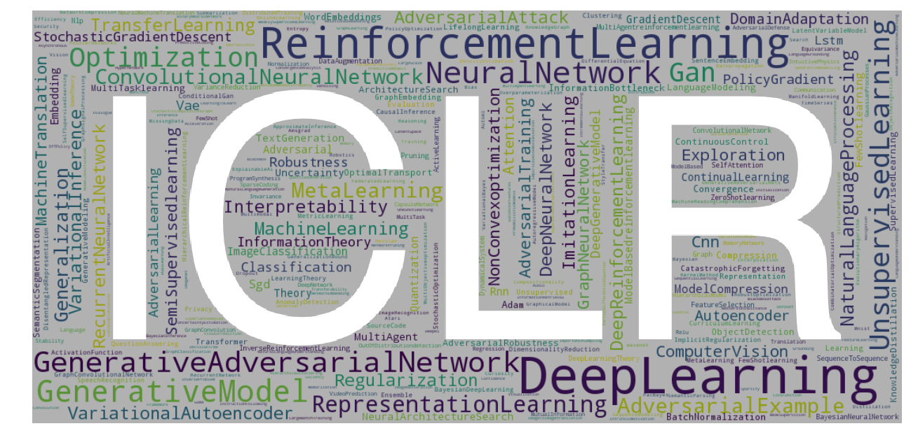
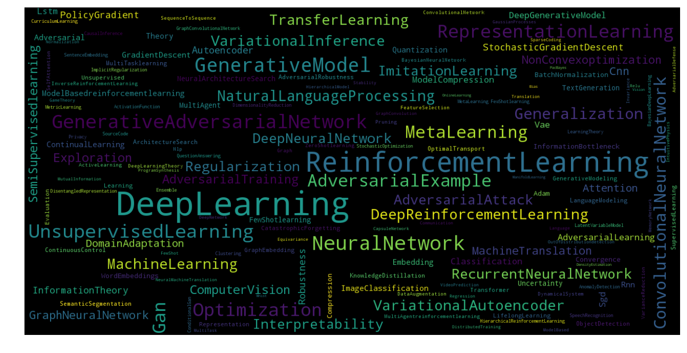
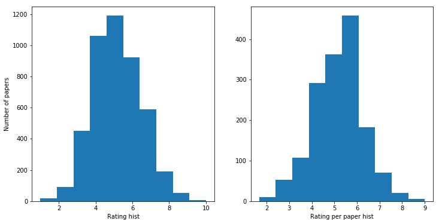
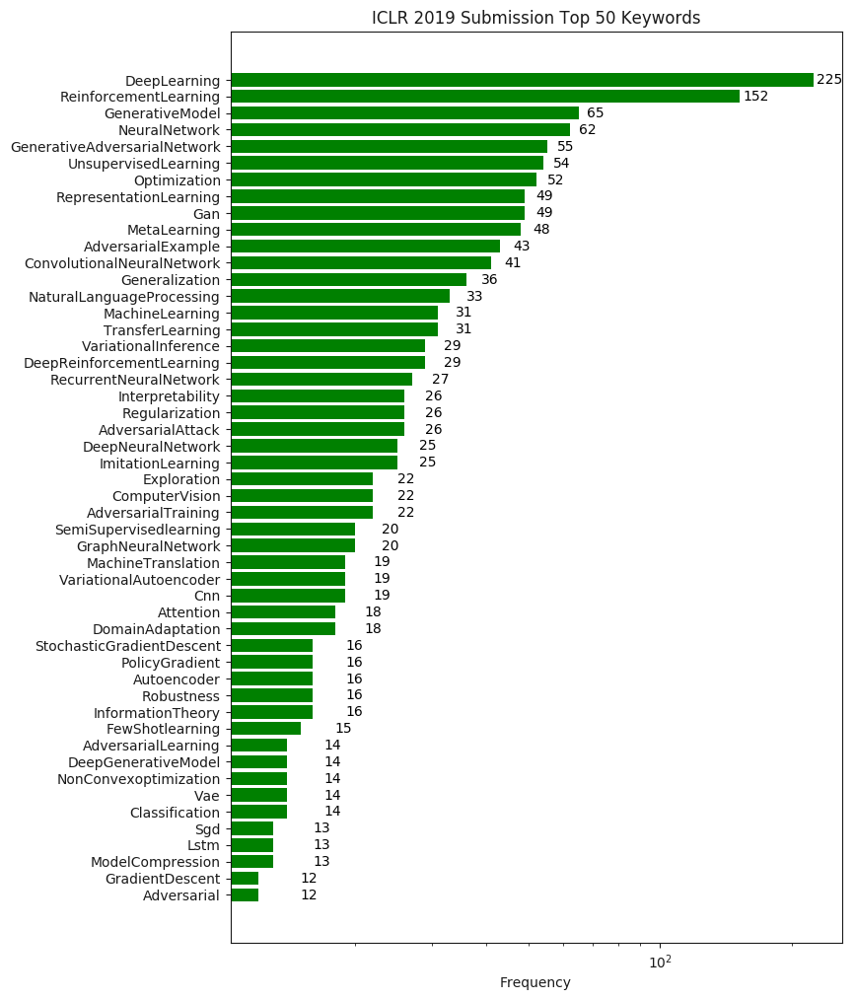
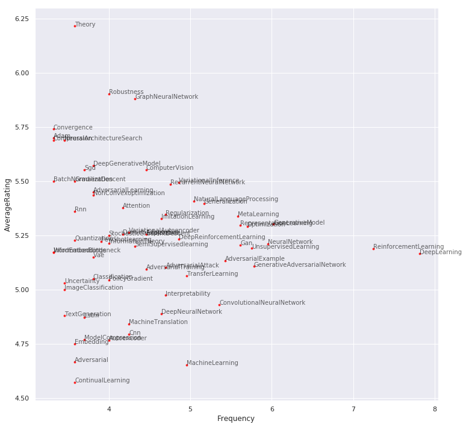

# Crawl and Visualize ICLR 2019 OpenReview Data

<p align="center">
    
</p>

## Descriptions

This Jupyter Notebook contains the data and visualizations that are crawled ICLR 2019 OpenReview webpages. As some of the reviews are still missing (1.0061\% by the time the data is crawled), the results might not be accurate.  All the crawled data (sorted by the average ratings) can be found [here](#Data).

## Prerequisites

- Python3.5
- [selenium](https://selenium-python.readthedocs.io/)
- [pyvirtualdisplay](https://pypi.org/project/PyVirtualDisplay/) (run on a headless device)
- [wordcloud](https://pypi.org/project/wordcloud/)
- [imageio](https://imageio.github.io/)

## Visualizations 


The word clouds formed by keywords of submissions show the hot topics including **reinforcement learning**, **generative adversarial networks**, **generative models**, **imitation learning**, **representation learning**, etc.
<p align="center">
    
</p>

This figure is plotted with python [word cloud generator](https://github.com/amueller/word_cloud) 

```python
from wordcloud import WordCloud
wordcloud = WordCloud(max_font_size=64, max_words=160, 
                      width=1280, height=640,
                      background_color="black").generate(' '.join(keywords))
plt.figure(figsize=(16, 8))
plt.imshow(wordcloud, interpolation="bilinear")
plt.axis("off")
plt.show()
```

The distributions of reviewer ratings center around 5 to 6 (mean: 5.15).

<p align="center">
    
</p>

You can compute how many papers are beaten by yours with

```python
def PR(rating_mean, your_rating):
    pr = np.sum(your_rating >= np.array(rating_mean))/len(rating_mean)*100
    return pr
my_rating = (5+6+7)/3  # your average rating here
print('Your papar beats {:.2f}% of submission '
      '(well, jsut based on the ratings...)'.format(PR(rating_mean, my_rating)))
# ICLR 2017: accept rate 39.1% (198/507) (15 orals and 183 posters)
# ICLR 2018: accept rate 32% (314/981) (23 orals and 291 posters)
# ICLR 2018: accept rate ?% (?/1580)
```

The top 50 common keywrods and their frequency.

<p align="center">
    
</p>

The average reviewer ratings and the frequency of keywords indicate that to maximize your chance to get higher ratings would be using the keywords such as **theory**, **robustness**, or **graph neural network**.

<p align="center">
    
</p>

## How it works

See [How to install Selenium and ChromeDriver on Ubuntu](#Install).

To crawl data from dynamic websites such as OpenReview, a headless web simulator is created by

```
from selenium import webdriver
from selenium.webdriver.chrome.options import Options
executable_path = '/Users/waltersun/Desktop/chromedriver'  # path to your executable browser
options = Options()
options.add_argument("--headless")
browser = webdriver.Chrome(options=options, executable_path=executable_path)  
```

Then, we can get the content of a webpage

```
browser.get(url)
```

To know what content we can crawl, we will need to inspect the webpage layout.

<p align="center">
    
</p>

I chose to get the content by

```
key = browser.find_elements_by_class_name("note_content_field")
value = browser.find_elements_by_class_name("note_content_value")
```

The data includes the abstract, keywords, TL; DR, comments.

## <a id="Install"></a>Installing Selenium and ChromeDriver on Ubuntu
The following content is hugely borrowed from a nice [post](https://christopher.su/2015/selenium-chromedriver-ubuntu/) written by Christopher Su.

- Install Google Chrome for Debian/Ubuntu

```
sudo apt-get install libxss1 libappindicator1 libindicator7
wget https://dl.google.com/linux/direct/google-chrome-stable_current_amd64.deb

sudo dpkg -i google-chrome*.deb
sudo apt-get install -f
```

- Install `xvfb` to run Chrome on a headless device

```
sudo apt-get install xvfb
```

- Install ChromeDriver for 64-bit Linux

```
sudo apt-get install unzip  # If you don't have unzip package

wget -N http://chromedriver.storage.googleapis.com/2.26/chromedriver_linux64.zip
unzip chromedriver_linux64.zip
chmod +x chromedriver

sudo mv -f chromedriver /usr/local/share/chromedriver
sudo ln -s /usr/local/share/chromedriver /usr/local/bin/chromedriver
sudo ln -s /usr/local/share/chromedriver /usr/bin/chromedriver
```

If your systme is 32-bit, please find the ChromeDriver releases [here](http://chromedriver.storage.googleapis.com/) and modify the above download command.

- Install Python dependencies (Selenium and pyvirtualdisplay)

```
pip install pyvirtualdisplay selenium
```

- Test your setup in Python

```python
from pyvirtualdisplay import Display
from selenium import webdriver

display = Display(visible=0, size=(1024, 1024))
display.start()
browser = webdriver.Chrome()
browser.get('http://shaohua0116.github.io/')
print(browser.title)
print(browser.find_element_by_class_name('bio').text)
```

## <a id="Data"></a>All ICLR 2019 OpenReview data
Collected at 2018-11-19 03:04:16.454018

| Rank | Average Rating | Title | Ratings | Variance | 
| --- | --- | --- | --- | --- | 
| 1 | 8.33 | [Large Scale Gan Training For High Fidelity Natural Image Synthesis](https://openreview.net/forum?id=B1xsqj09Fm) | 8, 7, 10 | 1.25 |
| 2 | 8.33 | [Alista: Analytic Weights Are As Good As Learned Weights In Lista](https://openreview.net/forum?id=B1lnzn0ctQ) | 10, 6, 9 | 1.70 |
| 3 | 8.33 | [Benchmarking Neural Network Robustness To Common Corruptions And Perturbations](https://openreview.net/forum?id=HJz6tiCqYm) | 7, 9, 9 | 0.94 |
| 4 | 8.00 | [Ordered Neurons: Integrating Tree Structures Into Recurrent Neural Networks](https://openreview.net/forum?id=B1l6qiR5F7) | 9, 7, 8 | 0.82 |
| 5 | 8.00 | [Enabling Factorized Piano Music Modeling And Generation With The Maestro Dataset](https://openreview.net/forum?id=r1lYRjC9F7) | 8, 8, 8 | 0.00 |
| 6 | 8.00 | [Generating High Fidelity Images With Subscale Pixel Networks And Multidimensional Upscaling](https://openreview.net/forum?id=HylzTiC5Km) | 7, 10, 7 | 1.41 |
| 7 | 8.00 | [Temporal Difference Variational Auto-encoder](https://openreview.net/forum?id=S1x4ghC9tQ) | 8, 9, 7 | 0.82 |
| 8 | 8.00 | [Unsupervised Learning Of The Set Of Local Maxima](https://openreview.net/forum?id=H1lqZhRcFm) | 8, 8, 8 | 0.00 |
| 9 | 8.00 | [Variational Discriminator Bottleneck: Improving Imitation Learning, Inverse Rl, And Gans By Constraining Information Flow](https://openreview.net/forum?id=HyxPx3R9tm) | 6, 10, 8 | 1.63 |
| 10 | 8.00 | [Slimmable Neural Networks](https://openreview.net/forum?id=H1gMCsAqY7) | 8, 9, 7 | 0.82 |
| 11 | 8.00 | [Posterior Attention Models For Sequence To Sequence Learning](https://openreview.net/forum?id=BkltNhC9FX) | 8, 9, 7 | 0.82 |
| 12 | 7.67 | [A Variational Inequality Perspective On Generative Adversarial Networks](https://openreview.net/forum?id=r1laEnA5Ym) | 8, 8, 7 | 0.47 |
| 13 | 7.67 | [Critical Learning Periods In Deep Networks](https://openreview.net/forum?id=BkeStsCcKQ) | 9, 8, 6 | 1.25 |
| 14 | 7.67 | [Smoothing The Geometry Of Probabilistic Box Embeddings](https://openreview.net/forum?id=H1xSNiRcF7) | 8, 8, 7 | 0.47 |
| 15 | 7.67 | [Pay Less Attention With Lightweight And Dynamic Convolutions](https://openreview.net/forum?id=SkVhlh09tX) | 8, 7, 8 | 0.47 |
| 16 | 7.67 | [Knockoffgan: Generating Knockoffs For Feature Selection Using Generative Adversarial Networks](https://openreview.net/forum?id=ByeZ5jC5YQ) | 6, 10, 7 | 1.70 |
| 17 | 7.67 | [A2bcd: Asynchronous Acceleration With Optimal Complexity](https://openreview.net/forum?id=rylIAsCqYm) | 7, 7, 9 | 0.94 |
| 18 | 7.67 | [Slalom: Fast, Verifiable And Private Execution Of Neural Networks In Trusted Hardware](https://openreview.net/forum?id=rJVorjCcKQ) | 7, 7, 9 | 0.94 |
| 19 | 7.67 | [Identifying And Controlling Important Neurons In Neural Machine Translation](https://openreview.net/forum?id=H1z-PsR5KX) | 7, 10, 6 | 1.70 |
| 20 | 7.67 | [Supervised Community Detection With Line Graph Neural Networks](https://openreview.net/forum?id=H1g0Z3A9Fm) | 6, 9, 8 | 1.25 |
| 21 | 7.67 | [On Random Deep Autoencoders: Exact Asymptotic Analysis, Phase Transitions, And Implications To Training](https://openreview.net/forum?id=HJx54i05tX) | 9, 6, 8 | 1.25 |
| 22 | 7.67 | [Robustness May Be At Odds With Accuracy](https://openreview.net/forum?id=SyxAb30cY7) | 8, 7, 8 | 0.47 |
| 23 | 7.67 | [Learning Unsupervised Learning Rules](https://openreview.net/forum?id=HkNDsiC9KQ) | 8, 7, 8 | 0.47 |
| 24 | 7.67 | [Composing Complex Skills By Learning Transition Policies With Proximity Reward Induction](https://openreview.net/forum?id=rygrBhC5tQ) | 7, 9, 7 | 0.94 |
| 25 | 7.67 | [Kernel Change-point Detection With Auxiliary Deep Generative Models](https://openreview.net/forum?id=r1GbfhRqF7) | 8, 8, 7 | 0.47 |
| 26 | 7.67 | [Sparse Dictionary Learning By Dynamical Neural Networks](https://openreview.net/forum?id=B1gstsCqt7) | 6, 9, 8 | 1.25 |
| 27 | 7.67 | [Adaptive Input Representations For Neural Language Modeling](https://openreview.net/forum?id=ByxZX20qFQ) | 7, 8, 8 | 0.47 |
| 28 | 7.67 | [Learning Robust Representations By Projecting Superficial Statistics Out](https://openreview.net/forum?id=rJEjjoR9K7) | 7, 7, 9 | 0.94 |
| 29 | 7.50 | [Exploration By Random Distillation](https://openreview.net/forum?id=H1lJJnR5Ym) | 4, 9, 10, 7 | 2.29 |
| 30 | 7.50 | [On The Minimal Supervision For Training Any Binary Classifier From Only Unlabeled Data](https://openreview.net/forum?id=B1xWcj0qYm) | 7, 8, 8, 7 | 0.50 |
| 31 | 7.50 | [Diffusion Scattering Transforms On Graphs](https://openreview.net/forum?id=BygqBiRcFQ) | 9, 6 | 1.50 |
| 32 | 7.33 | [Differentiable Learning-to-normalize Via Switchable Normalization](https://openreview.net/forum?id=ryggIs0cYQ) | 7, 7, 8 | 0.47 |
| 33 | 7.33 | [Biologically-plausible Learning Algorithms Can Scale To Large Datasets](https://openreview.net/forum?id=SygvZ209F7) | 9, 9, 4 | 2.36 |
| 34 | 7.33 | [Small Nonlinearities In Activation Functions Create Bad Local Minima In Neural Networks](https://openreview.net/forum?id=rke_YiRct7) | 7, 7, 8 | 0.47 |
| 35 | 7.33 | [Gradient Descent Aligns The Layers Of Deep Linear Networks](https://openreview.net/forum?id=HJflg30qKX) | 7, 9, 6 | 1.25 |
| 36 | 7.33 | [Large-scale Study Of Curiosity-driven Learning](https://openreview.net/forum?id=rJNwDjAqYX) | 6, 9, 7 | 1.25 |
| 37 | 7.33 | [Towards Metamerism Via Foveated Style Transfer](https://openreview.net/forum?id=BJzbG20cFQ) | 7, 8, 7 | 0.47 |
| 38 | 7.33 | [Approximability Of Discriminators Implies Diversity In Gans](https://openreview.net/forum?id=rJfW5oA5KQ) | 8, 7, 7 | 0.47 |
| 39 | 7.33 | [Learning To Remember More With Less Memorization](https://openreview.net/forum?id=r1xlvi0qYm) | 7, 8, 7 | 0.47 |
| 40 | 7.33 | [Efficient Training On Very Large Corpora Via Gramian Estimation](https://openreview.net/forum?id=Hke20iA9Y7) | 7, 8, 7 | 0.47 |
| 41 | 7.33 | [Visualizing And Understanding Generative Adversarial Networks](https://openreview.net/forum?id=Hyg_X2C5FX) | 7, 7, 8 | 0.47 |
| 42 | 7.33 | [Understanding And Improving Interpolation In Autoencoders Via An Adversarial Regularizer](https://openreview.net/forum?id=S1fQSiCcYm) | 5, 8, 9 | 1.70 |
| 43 | 7.33 | [Improving Differentiable Neural Computers Through Memory Masking, De-allocation, And Link Distribution Sharpness Control](https://openreview.net/forum?id=HyGEM3C9KQ) | 8, 7, 7 | 0.47 |
| 44 | 7.33 | [Label Super-resolution Networks](https://openreview.net/forum?id=rkxwShA9Ym) | 7, 6, 9 | 1.25 |
| 45 | 7.33 | [Deep Decoder: Concise Image Representations From Untrained Non-convolutional Networks](https://openreview.net/forum?id=rylV-2C9KQ) | 8, 8, 6 | 0.94 |
| 46 | 7.33 | [Diversity Is All You Need: Learning Skills Without A Reward Function](https://openreview.net/forum?id=SJx63jRqFm) | 8, 7, 7 | 0.47 |
| 47 | 7.33 | [Lanczosnet: Multi-scale Deep Graph Convolutional Networks](https://openreview.net/forum?id=BkedznAqKQ) | 7, 7, 8 | 0.47 |
| 48 | 7.33 | [Time-agnostic Prediction: Predicting Predictable Video Frames](https://openreview.net/forum?id=SyzVb3CcFX) | 7, 8, 7 | 0.47 |
| 49 | 7.33 | [Evaluating Robustness Of Neural Networks With Mixed Integer Programming](https://openreview.net/forum?id=HyGIdiRqtm) | 7, 8, 7 | 0.47 |
| 50 | 7.33 | [Promp: Proximal Meta-policy Search](https://openreview.net/forum?id=SkxXCi0qFX) | 6, 7, 9 | 1.25 |
| 51 | 7.00 | [How Important Is A Neuron](https://openreview.net/forum?id=SylKoo0cKm) | 7, 7, 7 | 0.00 |
| 52 | 7.00 | [Wizard Of Wikipedia: Knowledge-powered Conversational Agents](https://openreview.net/forum?id=r1l73iRqKm) | 7, 6, 8 | 0.82 |
| 53 | 7.00 | [Meta-learning Probabilistic Inference For Prediction](https://openreview.net/forum?id=HkxStoC5F7) | 7, 6, 8 | 0.82 |
| 54 | 7.00 | [Gansynth: Adversarial Neural Audio Synthesis](https://openreview.net/forum?id=H1xQVn09FX) | 6, 7, 8 | 0.82 |
| 55 | 7.00 | [Learning A Sat Solver From Single-bit Supervision](https://openreview.net/forum?id=HJMC_iA5tm) | 7, 7, 7 | 0.00 |
| 56 | 7.00 | [Learning Sparse Relational Transition Models](https://openreview.net/forum?id=SJxsV2R5FQ) | 6, 7, 8 | 0.82 |
| 57 | 7.00 | [Learning Self-imitating Diverse Policies](https://openreview.net/forum?id=HyxzRsR9Y7) | 8, 5, 8 | 1.41 |
| 58 | 7.00 | [Deep Online Learning Via Meta-learning: Continual Adaptation For Model-based Rl](https://openreview.net/forum?id=HyxAfnA5tm) | 7, 7, 7 | 0.00 |
| 59 | 7.00 | [An Empirical Study Of Example Forgetting During Deep Neural Network Learning](https://openreview.net/forum?id=BJlxm30cKm) | 9, 6, 6 | 1.41 |
| 60 | 7.00 | [Adversarial Domain Adaptation For Stable Brain-machine Interfaces](https://openreview.net/forum?id=Hyx6Bi0qYm) | 9, 5, 7 | 1.63 |
| 61 | 7.00 | [Near-optimal Representation Learning For Hierarchical Reinforcement Learning](https://openreview.net/forum?id=H1emus0qF7) | 6, 9, 6 | 1.41 |
| 62 | 7.00 | [Unsupervised Domain Adaptation For Distance Metric Learning](https://openreview.net/forum?id=BklhAj09K7) | 8, 5, 8 | 1.41 |
| 63 | 7.00 | [The Comparative Power Of Relu Networks And Polynomial Kernels In The Presence Of Sparse Latent Structure](https://openreview.net/forum?id=rJgTTjA9tX) | 7, 7, 7 | 0.00 |
| 64 | 7.00 | [Auxiliary Variational Mcmc](https://openreview.net/forum?id=r1NJqsRctX) | 7, 7, 7 | 0.00 |
| 65 | 7.00 | [An Analytic Theory Of Generalization Dynamics And Transfer Learning In Deep Linear Networks](https://openreview.net/forum?id=ryfMLoCqtQ) | 8, 7, 6 | 0.82 |
| 66 | 7.00 | [On The Universal Approximability And Complexity Bounds Of Quantized Relu Neural Networks](https://openreview.net/forum?id=SJe9rh0cFX) | 7, 6, 8 | 0.82 |
| 67 | 7.00 | [Feature Intertwiners](https://openreview.net/forum?id=SyxZJn05YX) | 5, 9, 7 | 1.63 |
| 68 | 7.00 | [The Neuro-symbolic Concept Learner: Interpreting Scenes, Words, And Sentences From Natural Supervision](https://openreview.net/forum?id=rJgMlhRctm) | 7, 5, 9 | 1.63 |
| 69 | 7.00 | [Quasi-hyperbolic Momentum And Adam For Deep Learning](https://openreview.net/forum?id=S1fUpoR5FQ) | 7, 6, 8 | 0.82 |
| 70 | 7.00 | [Greedy Attack And Gumbel Attack: Generating Adversarial Examples For Discrete Data](https://openreview.net/forum?id=ByghKiC5YX) | 6, 8, 7 | 0.82 |
| 71 | 7.00 | [Detecting Egregious Responses In Neural Sequence-to-sequence Models](https://openreview.net/forum?id=HyNA5iRcFQ) | 6, 7, 8 | 0.82 |
| 72 | 7.00 | [Cot: Cooperative Training For Generative Modeling Of Discrete Data](https://openreview.net/forum?id=SkxxIs0qY7) | 7, 7, 7 | 0.00 |
| 73 | 7.00 | [What Do You Learn From Context? Probing For Sentence Structure In Contextualized Word Representations](https://openreview.net/forum?id=SJzSgnRcKX) | 7, 7, 7 | 0.00 |
| 74 | 7.00 | [Don't Settle For Average, Go For The Max: Fuzzy Sets And Max-pooled Word Vectors](https://openreview.net/forum?id=SkxXg2C5FX) | 8, 8, 5 | 1.41 |
| 75 | 7.00 | [Darts: Differentiable Architecture Search](https://openreview.net/forum?id=S1eYHoC5FX) | 6, 7, 8 | 0.82 |
| 76 | 7.00 | [Unsupervised Speech Recognition Via Segmental Empirical Output Distribution Matching](https://openreview.net/forum?id=Bylmkh05KX) | 7, 7, 7 | 0.00 |
| 77 | 7.00 | [Deep Learning 3d Shapes Using Alt-az Anisotropic 2-sphere Convolution](https://openreview.net/forum?id=rkeSiiA5Fm) | 6, 8, 7 | 0.82 |
| 78 | 7.00 | [Learning Neural Pde Solvers With Convergence Guarantees](https://openreview.net/forum?id=rklaWn0qK7) | 7, 8, 6 | 0.82 |
| 79 | 7.00 | [Global-to-local Memory Pointer Networks For Task-oriented Dialogue](https://openreview.net/forum?id=ryxnHhRqFm) | 8, 8, 5 | 1.41 |
| 80 | 7.00 | [Learning To Screen For Fast Softmax Inference On Large Vocabulary Neural Networks](https://openreview.net/forum?id=ByeMB3Act7) | 7, 6, 8 | 0.82 |
| 81 | 7.00 | [The Lottery Ticket Hypothesis: Finding Sparse, Trainable Neural Networks](https://openreview.net/forum?id=rJl-b3RcF7) | 5, 8, 8 | 1.41 |
| 82 | 7.00 | [Deep Graph Infomax](https://openreview.net/forum?id=rklz9iAcKQ) | 9, 5, 7 | 1.63 |
| 83 | 7.00 | [Deep, Skinny Neural Networks Are Not Universal Approximators](https://openreview.net/forum?id=ryGgSsAcFQ) | 6, 8, 7 | 0.82 |
| 84 | 7.00 | [Lagging Inference Networks And Posterior Collapse In Variational Autoencoders](https://openreview.net/forum?id=rylDfnCqF7) | 7, 6, 8 | 0.82 |
| 85 | 7.00 | [Towards Robust, Locally Linear Deep Networks](https://openreview.net/forum?id=SylCrnCcFX) | 8, 6, 7 | 0.82 |
| 86 | 7.00 | [Relaxed Quantization For Discretized Neural Networks](https://openreview.net/forum?id=HkxjYoCqKX) | 7, 7, 7 | 0.00 |
| 87 | 7.00 | [Local Sgd Converges Fast And Communicates Little](https://openreview.net/forum?id=S1g2JnRcFX) | 8, 5, 8 | 1.41 |
| 88 | 7.00 | [Clarinet: Parallel Wave Generation In End-to-end Text-to-speech](https://openreview.net/forum?id=HklY120cYm) | 9, 5, 7 | 1.63 |
| 89 | 7.00 | [Learning Implicitly Recurrent Cnns Through Parameter Sharing](https://openreview.net/forum?id=rJgYxn09Fm) | 8, 7, 6 | 0.82 |
| 90 | 7.00 | [Scalable Reversible Generative Models With Free-form Continuous Dynamics](https://openreview.net/forum?id=rJxgknCcK7) | 7, 7, 7 | 0.00 |
| 91 | 7.00 | [Snip: Single-shot Network Pruning Based On Connection Sensitivity](https://openreview.net/forum?id=B1VZqjAcYX) | 6, 6, 9 | 1.41 |
| 92 | 7.00 | [Riemannian Adaptive Optimization Methods](https://openreview.net/forum?id=r1eiqi09K7) | 7, 7, 7 | 0.00 |
| 93 | 7.00 | [Invariant And Equivariant Graph Networks](https://openreview.net/forum?id=Syx72jC9tm) | 8, 4, 9 | 2.16 |
| 94 | 7.00 | [The Role Of Over-parametrization In Generalization Of Neural Networks](https://openreview.net/forum?id=BygfghAcYX) | 7, 7 | 0.00 |
| 95 | 7.00 | [Neural Network Gradient-based Learning Of Black-box Function Interfaces](https://openreview.net/forum?id=r1e13s05YX) | 7, 7, 7 | 0.00 |
| 96 | 7.00 | [The Effects Of Neural Resource Constraints On Early Visual Representations](https://openreview.net/forum?id=S1xq3oR5tQ) | 5, 8, 8 | 1.41 |
| 97 | 7.00 | [Learning To Navigate The Web](https://openreview.net/forum?id=BJemQ209FQ) | 7, 7, 7 | 0.00 |
| 98 | 6.67 | [Learning To Infer And Execute 3d Shape Programs](https://openreview.net/forum?id=rylNH20qFQ) | 6, 7, 7 | 0.47 |
| 99 | 6.67 | [Off-policy Evaluation And Learning From Logged Bandit Feedback: Error Reduction Via Surrogate Policy](https://openreview.net/forum?id=HklKui0ct7) | 6, 8, 6 | 0.94 |
| 100 | 6.67 | [Padam: Closing The Generalization Gap Of Adaptive Gradient Methods In Training Deep Neural Networks](https://openreview.net/forum?id=BJll6o09tm) | 6, 5, 9 | 1.70 |
| 101 | 6.67 | [Recurrent Experience Replay In Distributed Reinforcement Learning](https://openreview.net/forum?id=r1lyTjAqYX) | 7, 6, 7 | 0.47 |
| 102 | 6.67 | [Towards The First Adversarially Robust Neural Network Model On Mnist](https://openreview.net/forum?id=S1EHOsC9tX) | 7, 7, 6 | 0.47 |
| 103 | 6.67 | [Automatically Composing Representation Transformations As A Means For Generalization](https://openreview.net/forum?id=B1ffQnRcKX) | 6, 7, 7 | 0.47 |
| 104 | 6.67 | [Learning Two-layer Neural Networks With Symmetric Inputs](https://openreview.net/forum?id=H1xipsA5K7) | 7, 6, 7 | 0.47 |
| 105 | 6.67 | [Provable Online Dictionary Learning And Sparse Coding](https://openreview.net/forum?id=HJeu43ActQ) | 7, 6, 7 | 0.47 |
| 106 | 6.67 | [Meta-learning For Stochastic Gradient Mcmc](https://openreview.net/forum?id=HkeoOo09YX) | 7, 7, 6 | 0.47 |
| 107 | 6.67 | [Bounce And Learn: Modeling Scene Dynamics With Real-world Bounces](https://openreview.net/forum?id=BJxssoA5KX) | 5, 7, 8 | 1.25 |
| 108 | 6.67 | [Non-vacuous Generalization Bounds At The Imagenet Scale: A Pac-bayesian Compression Approach](https://openreview.net/forum?id=BJgqqsAct7) | 6, 6, 8 | 0.94 |
| 109 | 6.67 | [Doubly Reparameterized Gradient Estimators For Monte Carlo Objectives](https://openreview.net/forum?id=HkG3e205K7) | 7, 7, 6 | 0.47 |
| 110 | 6.67 | [Adashift: Decorrelation And Convergence Of Adaptive Learning Rate Methods](https://openreview.net/forum?id=HkgTkhRcKQ) | 6, 5, 9 | 1.70 |
| 111 | 6.67 | [Woulda, Coulda, Shoulda: Counterfactually-guided Policy Search](https://openreview.net/forum?id=BJG0voC9YQ) | 6, 7, 7 | 0.47 |
| 112 | 6.67 | [Disjoint Mapping Network For Cross-modal Matching Of Voices And Faces](https://openreview.net/forum?id=B1exrnCcF7) | 7, 6, 7 | 0.47 |
| 113 | 6.67 | [Big-little Net: An Efficient Multi-scale Feature Representation For Visual And Speech Recognition](https://openreview.net/forum?id=HJMHpjC9Ym) | 7, 6, 7 | 0.47 |
| 114 | 6.67 | [Hyperbolic Attention Networks](https://openreview.net/forum?id=rJxHsjRqFQ) | 6, 7, 7 | 0.47 |
| 115 | 6.67 | [Beyond Pixel Norm-balls: Parametric Adversaries Using An Analytically Differentiable Renderer](https://openreview.net/forum?id=SJl2niR9KQ) | 7, 7, 6 | 0.47 |
| 116 | 6.67 | [Minimal Random Code Learning: Getting Bits Back From Compressed Model Parameters](https://openreview.net/forum?id=r1f0YiCctm) | 7, 6, 7 | 0.47 |
| 117 | 6.67 | [Deep Layers As Stochastic Solvers](https://openreview.net/forum?id=ryxxCiRqYX) | 7, 5, 8 | 1.25 |
| 118 | 6.67 | [Phase-aware Speech Enhancement With Deep Complex U-net](https://openreview.net/forum?id=SkeRTsAcYm) | 6, 7, 7 | 0.47 |
| 119 | 6.67 | [Adef: An Iterative Algorithm To Construct Adversarial Deformations](https://openreview.net/forum?id=Hk4dFjR5K7) | 7, 7, 6 | 0.47 |
| 120 | 6.67 | [Learning From Incomplete Data With Generative Adversarial Networks](https://openreview.net/forum?id=S1lDV3RcKm) | 7, 6, 7 | 0.47 |
| 121 | 6.67 | [Training For Faster Adversarial Robustness Verification Via Inducing Relu Stability](https://openreview.net/forum?id=BJfIVjAcKm) | 8, 7, 5 | 1.25 |
| 122 | 6.67 | [No Training Required: Exploring Random Encoders For Sentence Classification](https://openreview.net/forum?id=BkgPajAcY7) | 7, 5, 8 | 1.25 |
| 123 | 6.67 | [Generalized Tensor Models For Recurrent Neural Networks](https://openreview.net/forum?id=r1gNni0qtm) | 6, 7, 7 | 0.47 |
| 124 | 6.67 | [Detecting Adversarial Examples Via Neural Fingerprinting](https://openreview.net/forum?id=SJekyhCctQ) | 5, 9, 6 | 1.70 |
| 125 | 6.67 | [Learning A Meta-solver For Syntax-guided Program Synthesis](https://openreview.net/forum?id=Syl8Sn0cK7) | 7, 6, 7 | 0.47 |
| 126 | 6.67 | [Learning Factorized Multimodal Representations](https://openreview.net/forum?id=rygqqsA9KX) | 7, 7, 6 | 0.47 |
| 127 | 6.67 | [Adversarial Attacks On Graph Neural Networks Via Meta Learning](https://openreview.net/forum?id=Bylnx209YX) | 7, 7, 6 | 0.47 |
| 128 | 6.67 | [Flowqa: Grasping Flow In History For Conversational Machine Comprehension](https://openreview.net/forum?id=ByftGnR9KX) | 7, 6, 7 | 0.47 |
| 129 | 6.67 | [Learning To Learn Without Forgetting By Maximizing Transfer And Minimizing Interference](https://openreview.net/forum?id=B1gTShAct7) | 5, 8, 7 | 1.25 |
| 130 | 6.67 | [Episodic Curiosity Through Reachability](https://openreview.net/forum?id=SkeK3s0qKQ) | 6, 6, 8 | 0.94 |
| 131 | 6.67 | [Optimal Completion Distillation For Sequence Learning](https://openreview.net/forum?id=rkMW1hRqKX) | 7, 7, 6 | 0.47 |
| 132 | 6.67 | [Glue: A Multi-task Benchmark And Analysis Platform For Natural Language Understanding](https://openreview.net/forum?id=rJ4km2R5t7) | 7, 5, 8 | 1.25 |
| 133 | 6.67 | [Deep Self-organization: Interpretable Discrete Representation Learning On Time Series](https://openreview.net/forum?id=rygjcsR9Y7) | 9, 5, 6 | 1.70 |
| 134 | 6.67 | [Complement Objective Training](https://openreview.net/forum?id=HyM7AiA5YX) | 5, 8, 7 | 1.25 |
| 135 | 6.67 | [Deep Frank-wolfe For Neural Network Optimization](https://openreview.net/forum?id=SyVU6s05K7) | 7, 5, 8 | 1.25 |
| 136 | 6.67 | [Learning Concise Representations For Regression By Evolving Networks Of Trees](https://openreview.net/forum?id=Hke-JhA9Y7) | 7, 5, 8 | 1.25 |
| 137 | 6.67 | [Active Learning With Partial Feedback](https://openreview.net/forum?id=HJfSEnRqKQ) | 7, 6, 7 | 0.47 |
| 138 | 6.67 | [Query-efficient Hard-label Black-box Attack: An Optimization-based Approach](https://openreview.net/forum?id=rJlk6iRqKX) | 7, 6, 7 | 0.47 |
| 139 | 6.67 | [Analysis Of Quantized Deep Networks](https://openreview.net/forum?id=ryM_IoAqYX) | 6, 7, 7 | 0.47 |
| 140 | 6.67 | [Rotdcf: Decomposition Of Convolutional Filters For Rotation-equivariant Deep Networks](https://openreview.net/forum?id=H1gTEj09FX) | 7, 7, 6 | 0.47 |
| 141 | 6.67 | [Stochastic Optimization Of Sorting Networks Via Continuous Relaxations](https://openreview.net/forum?id=H1eSS3CcKX) | 8, 6, 6 | 0.94 |
| 142 | 6.67 | [A Convergence Analysis Of Gradient Descent For Deep Linear Neural Networks](https://openreview.net/forum?id=SkMQg3C5K7) | 7, 7, 6 | 0.47 |
| 143 | 6.67 | [G-sgd: Optimizing Relu Neural Networks In Its Positively Scale-invariant Space](https://openreview.net/forum?id=SyxfEn09Y7) | 7, 7, 6 | 0.47 |
| 144 | 6.67 | [Visual Explanation By Interpretation: Improving Visual Feedback Capabilities Of Deep Neural Networks](https://openreview.net/forum?id=H1ziPjC5Fm) | 8, 5, 7 | 1.25 |
| 145 | 6.67 | [Learning Localized Generative Models For 3d Point Clouds Via Graph Convolution](https://openreview.net/forum?id=SJeXSo09FQ) | 9, 4, 7 | 2.05 |
| 146 | 6.67 | [Differentiable Perturb-and-parse: Semi-supervised Parsing With A Structured Variational Autoencoder](https://openreview.net/forum?id=BJlgNh0qKQ) | 8, 7, 5 | 1.25 |
| 147 | 6.67 | [Looking For Elmo's Friends: Sentence-level Pretraining Beyond Language Modeling](https://openreview.net/forum?id=Bkl87h09FX) | 5, 7, 8 | 1.25 |
| 148 | 6.67 | [Dynamic Sparse Graph For Efficient Deep Learning](https://openreview.net/forum?id=H1goBoR9F7) | 8, 5, 7 | 1.25 |
| 149 | 6.67 | [Learning Grid-like Units With Vector Representation Of Self-position And Matrix Representation Of Self-motion](https://openreview.net/forum?id=Syx0Mh05YQ) | 8, 6, 6 | 0.94 |
| 150 | 6.67 | [A Mean Field Theory Of Batch Normalization](https://openreview.net/forum?id=SyMDXnCcF7) | 7, 6, 7 | 0.47 |
| 151 | 6.67 | [Solving The Rubik's Cube With Approximate Policy Iteration](https://openreview.net/forum?id=Hyfn2jCcKm) | 7, 6, 7 | 0.47 |
| 152 | 6.67 | [K For The Price Of 1: Parameter Efficient Multi-task And Transfer Learning](https://openreview.net/forum?id=BJxvEh0cFQ) | 7, 5, 8 | 1.25 |
| 153 | 6.67 | [Sample Efficient Adaptive Text-to-speech](https://openreview.net/forum?id=rkzjUoAcFX) | 7, 7, 6 | 0.47 |
| 154 | 6.67 | [Fixing Variational Bayes: Deterministic Variational Inference For Bayesian Neural Networks](https://openreview.net/forum?id=B1l08oAct7) | 6, 7, 7 | 0.47 |
| 155 | 6.67 | [Probabilistic Recursive Reasoning For Multi-agent Reinforcement Learning](https://openreview.net/forum?id=rkl6As0cF7) | 7, 6, 7 | 0.47 |
| 156 | 6.67 | [Lemonade: Learned Motif And Neuronal Assembly Detection In Calcium Imaging Videos](https://openreview.net/forum?id=SkloDjAqYm) | 8, 4, 8 | 1.89 |
| 157 | 6.67 | [Practical Lossless Compression With Latent Variables Using Bits Back Coding](https://openreview.net/forum?id=ryE98iR5tm) | 6, 6, 8 | 0.94 |
| 158 | 6.67 | [Theoretical Analysis Of Auto Rate-tuning By Batch Normalization](https://openreview.net/forum?id=rkxQ-nA9FX) | 7, 7, 6 | 0.47 |
| 159 | 6.67 | [Relgan: Relational Generative Adversarial Networks For Text Generation](https://openreview.net/forum?id=rJedV3R5tm) | 6, 8, 6 | 0.94 |
| 160 | 6.67 | [Dimensionality Reduction For Representing The Knowledge Of Probabilistic Models](https://openreview.net/forum?id=SygD-hCcF7) | 6, 5, 9 | 1.70 |
| 161 | 6.67 | [A Data-driven And Distributed Approach To Sparse Signal Representation And Recovery](https://openreview.net/forum?id=B1xVTjCqKQ) | 8, 6, 6 | 0.94 |
| 162 | 6.67 | [Generative Question Answering: Learning To Answer The Whole Question](https://openreview.net/forum?id=Bkx0RjA9tX) | 6, 6, 8 | 0.94 |
| 163 | 6.67 | [Bayesian Prediction Of Future Street Scenes Using Synthetic Likelihoods](https://openreview.net/forum?id=rkgK3oC5Fm) | 6, 8, 6 | 0.94 |
| 164 | 6.67 | [Graph Hypernetworks For Neural Architecture Search](https://openreview.net/forum?id=rkgW0oA9FX) | 7, 6, 7 | 0.47 |
| 165 | 6.67 | [Adaptivity Of Deep Relu Network For Learning In Besov And Mixed Smooth Besov Spaces: Optimal Rate And Curse Of Dimensionality](https://openreview.net/forum?id=H1ebTsActm) | 8, 6, 6 | 0.94 |
| 166 | 6.67 | [Nadpex: An On-policy Temporally Consistent Exploration Method For Deep Reinforcement Learning](https://openreview.net/forum?id=rkxciiC9tm) | 8, 5, 7 | 1.25 |
| 167 | 6.67 | [Do Deep Generative Models Know What They Don't Know?](https://openreview.net/forum?id=H1xwNhCcYm) | 7, 6, 7 | 0.47 |
| 168 | 6.67 | [Trellis Networks For Sequence Modeling](https://openreview.net/forum?id=HyeVtoRqtQ) | 7, 6, 7 | 0.47 |
| 169 | 6.67 | [Discriminator-actor-critic: Addressing Sample Inefficiency And Reward Bias In Adversarial Imitation Learning](https://openreview.net/forum?id=Hk4fpoA5Km) | 8, 5, 7 | 1.25 |
| 170 | 6.67 | [Learning To Solve Circuit-sat: An Unsupervised Differentiable Approach](https://openreview.net/forum?id=BJxgz2R9t7) | 5, 8, 7 | 1.25 |
| 171 | 6.67 | [Directed-info Gail: Learning Hierarchical Policies From Unsegmented Demonstrations Using Directed Information](https://openreview.net/forum?id=BJeWUs05KQ) | 6, 6, 8 | 0.94 |
| 172 | 6.67 | [There Are Many Consistent Explanations Of Unlabeled Data: Why You Should Average](https://openreview.net/forum?id=rkgKBhA5Y7) | 6, 8, 6 | 0.94 |
| 173 | 6.67 | [Visual Semantic Navigation Using Scene Priors](https://openreview.net/forum?id=HJeRkh05Km) | 7, 6, 7 | 0.47 |
| 174 | 6.67 | [Emi: Exploration With Mutual Information Maximizing State And Action Embeddings](https://openreview.net/forum?id=Hylyui09tm) | 6, 7, 7 | 0.47 |
| 175 | 6.67 | [Learning To Schedule Communication In Multi-agent Reinforcement Learning](https://openreview.net/forum?id=SJxu5iR9KQ) | 6, 8, 6 | 0.94 |
| 176 | 6.67 | [Three Mechanisms Of Weight Decay Regularization](https://openreview.net/forum?id=B1lz-3Rct7) | 6, 7, 7 | 0.47 |
| 177 | 6.67 | [A Generative Model For Electron Paths](https://openreview.net/forum?id=r1x4BnCqKX) | 8, 4, 8 | 1.89 |
| 178 | 6.67 | [Rotate: Knowledge Graph Embedding By Relational Rotation In Complex Space](https://openreview.net/forum?id=HkgEQnRqYQ) | 7, 7, 6 | 0.47 |
| 179 | 6.50 | [Defensive Quantization: When Efficiency Meets Robustness](https://openreview.net/forum?id=ryetZ20ctX) | 6, 7 | 0.50 |
| 180 | 6.33 | [The Laplacian In Rl: Learning Representations With Efficient Approximations](https://openreview.net/forum?id=HJlNpoA5YQ) | 7, 5, 7 | 0.94 |
| 181 | 6.33 | [Discriminator Rejection Sampling](https://openreview.net/forum?id=S1GkToR5tm) | 7, 6, 6 | 0.47 |
| 182 | 6.33 | [Regularized Learning For Domain Adaptation Under Label Shifts](https://openreview.net/forum?id=rJl0r3R9KX) | 7, 6, 6 | 0.47 |
| 183 | 6.33 | [L-shapley And C-shapley: Efficient Model Interpretation For Structured Data](https://openreview.net/forum?id=S1E3Ko09F7) | 7, 7, 5 | 0.94 |
| 184 | 6.33 | [Stable Recurrent Models](https://openreview.net/forum?id=Hygxb2CqKm) | 7, 6, 6 | 0.47 |
| 185 | 6.33 | [Energy-constrained Compression For Deep Neural Networks Via Weighted Sparse Projection And Layer Input Masking](https://openreview.net/forum?id=BylBr3C9K7) | 6, 7, 6 | 0.47 |
| 186 | 6.33 | [Autoencoder-based Music Translation](https://openreview.net/forum?id=HJGkisCcKm) | 8, 6, 5 | 1.25 |
| 187 | 6.33 | [On The Loss Landscape Of A Class Of Deep Neural Networks With No Bad Local Valleys](https://openreview.net/forum?id=HJgXsjA5tQ) | 6, 8, 5 | 1.25 |
| 188 | 6.33 | [On The Convergence Of A Class Of Adam-type Algorithms For Non-convex Optimization](https://openreview.net/forum?id=H1x-x309tm) | 6, 7, 6 | 0.47 |
| 189 | 6.33 | [Learning Latent Superstructures In Variational Autoencoders For Deep Multidimensional Clustering](https://openreview.net/forum?id=SJgNwi09Km) | 8, 5, 6 | 1.25 |
| 190 | 6.33 | [Multiple-attribute Text Rewriting](https://openreview.net/forum?id=H1g2NhC5KQ) | 7, 6, 6 | 0.47 |
| 191 | 6.33 | [Pate-gan: Generating Synthetic Data With Differential Privacy Guarantees](https://openreview.net/forum?id=S1zk9iRqF7) | 7, 5, 7 | 0.94 |
| 192 | 6.33 | [From Hard To Soft: Understanding Deep Network Nonlinearities Via Vector Quantization And Statistical Inference](https://openreview.net/forum?id=Syxt2jC5FX) | 6, 6, 7 | 0.47 |
| 193 | 6.33 | [Spherical Cnns On Unstructured Grids](https://openreview.net/forum?id=Bkl-43C9FQ) | 6, 6, 7 | 0.47 |
| 194 | 6.33 | [A Novel Variational Family For Hidden Non-linear Markov Models](https://openreview.net/forum?id=SJMO2iCct7) | 5, 8, 6 | 1.25 |
| 195 | 6.33 | [Statistical Verification Of Neural Networks](https://openreview.net/forum?id=S1xcx3C5FX) | 4, 7, 8 | 1.70 |
| 196 | 6.33 | [Spigan: Privileged Adversarial Learning From Simulation](https://openreview.net/forum?id=rkxoNnC5FQ) | 6, 6, 7 | 0.47 |
| 197 | 6.33 | [Generative Predecessor Models For Sample-efficient Imitation Learning](https://openreview.net/forum?id=SkeVsiAcYm) | 6, 5, 8 | 1.25 |
| 198 | 6.33 | [Harmonizing Maximum Likelihood With Gans For Multimodal Conditional Generation](https://openreview.net/forum?id=HJxyAjRcFX) | 7, 7, 5 | 0.94 |
| 199 | 6.33 | [Generating Multi-agent Trajectories Using Programmatic Weak Supervision](https://openreview.net/forum?id=rkxw-hAcFQ) | 7, 6, 6 | 0.47 |
| 200 | 6.33 | [Generating Multiple Objects At Spatially Distinct Locations](https://openreview.net/forum?id=H1edIiA9KQ) | 5, 8, 6 | 1.25 |
| 201 | 6.33 | [The Deep Weight Prior](https://openreview.net/forum?id=ByGuynAct7) | 4, 8, 7 | 1.70 |
| 202 | 6.33 | [Deep Reinforcement Learning With Relational Inductive Biases](https://openreview.net/forum?id=HkxaFoC9KQ) | 5, 7, 7 | 0.94 |
| 203 | 6.33 | [Universal Transformers](https://openreview.net/forum?id=HyzdRiR9Y7) | 6, 6, 7 | 0.47 |
| 204 | 6.33 | [Camou: Learning Physical Vehicle Camouflages To Adversarially Attack Detectors In The Wild](https://openreview.net/forum?id=SJgEl3A5tm) | 4, 8, 7 | 1.70 |
| 205 | 6.33 | [Stochastic Gradient Descent Learns State Equations With Nonlinear Activations](https://openreview.net/forum?id=rkeMHjR9Ym) | 7, 5, 7 | 0.94 |
| 206 | 6.33 | [Multilingual Neural Machine Translation With Soft Decoupled Encoding](https://openreview.net/forum?id=Skeke3C5Fm) | 6, 6, 7 | 0.47 |
| 207 | 6.33 | [Rnns Implicitly Implement Tensor-product Representations](https://openreview.net/forum?id=BJx0sjC5FX) | 7, 6, 6 | 0.47 |
| 208 | 6.33 | [Learning Recurrent Binary/ternary Weights](https://openreview.net/forum?id=HkNGYjR9FX) | 6, 8, 5 | 1.25 |
| 209 | 6.33 | [Multilingual Neural Machine Translation With Knowledge Distillation](https://openreview.net/forum?id=S1gUsoR9YX) | 6, 7, 6 | 0.47 |
| 210 | 6.33 | [Robust Estimation Via Generative Adversarial Networks](https://openreview.net/forum?id=BJgRDjR9tQ) | 7, 5, 7 | 0.94 |
| 211 | 6.33 | [Toward Understanding The Impact Of Staleness In Distributed Machine Learning](https://openreview.net/forum?id=BylQV305YQ) | 4, 9, 6 | 2.05 |
| 212 | 6.33 | [Signsgd Via Zeroth-order Oracle](https://openreview.net/forum?id=BJe-DsC5Fm) | 8, 5, 6 | 1.25 |
| 213 | 6.33 | [Local Critic Training Of Deep Neural Networks](https://openreview.net/forum?id=B1x-LjAcKX) | 6, 6, 7 | 0.47 |
| 214 | 6.33 | [Hierarchical Rl Using An Ensemble Of Proprioceptive Periodic Policies](https://openreview.net/forum?id=SJz1x20cFQ) | 6, 6, 7 | 0.47 |
| 215 | 6.33 | [Individualized Controlled Continuous Communication Model For Multiagent Cooperative And Competitive Tasks](https://openreview.net/forum?id=rye7knCqK7) | 7, 6, 6 | 0.47 |
| 216 | 6.33 | [Why Do Deep Convolutional Networks Generalize So Poorly To Small Image Transformations?](https://openreview.net/forum?id=HJxYwiC5tm) | 7, 7, 5 | 0.94 |
| 217 | 6.33 | [Predicting The Generalization Gap In Deep Networks With Margin Distributions](https://openreview.net/forum?id=HJlQfnCqKX) | 5, 9, 5 | 1.89 |
| 218 | 6.33 | [Machine Translation With Weakly Paired Bilingual Documents](https://openreview.net/forum?id=ryza73R9tQ) | 6, 5, 8 | 1.25 |
| 219 | 6.33 | [Universal Stagewise Learning For Non-convex Problems With Convergence On Averaged Solutions](https://openreview.net/forum?id=Syx5V2CcFm) | 8, 6, 5 | 1.25 |
| 220 | 6.33 | [Emergent Coordination Through Competition](https://openreview.net/forum?id=BkG8sjR5Km) | 7, 7, 5 | 0.94 |
| 221 | 6.33 | [Fluctuation-dissipation Relations For Stochastic Gradient Descent](https://openreview.net/forum?id=SkNksoRctQ) | 8, 5, 6 | 1.25 |
| 222 | 6.33 | [Diversity-sensitive Conditional Generative Adversarial Networks](https://openreview.net/forum?id=rJliMh09F7) | 7, 5, 7 | 0.94 |
| 223 | 6.33 | [Improving Mmd-gan Training With Repulsive Loss Function](https://openreview.net/forum?id=HygjqjR9Km) | 6, 7, 6 | 0.47 |
| 224 | 6.33 | [Marginal Policy Gradients: A Unified Family Of Estimators For Bounded Action Spaces With Applications](https://openreview.net/forum?id=HkgqFiAcFm) | 7, 6, 6 | 0.47 |
| 225 | 6.33 | [Dialogwae: Multimodal Response Generation With Conditional Wasserstein Auto-encoder](https://openreview.net/forum?id=BkgBvsC9FQ) | 7, 7, 5 | 0.94 |
| 226 | 6.33 | [Snas: Stochastic Neural Architecture Search](https://openreview.net/forum?id=rylqooRqK7) | 6, 7, 6 | 0.47 |
| 227 | 6.33 | [Diagnosing And Enhancing Vae Models](https://openreview.net/forum?id=B1e0X3C9tQ) | 9, 5, 5 | 1.89 |
| 228 | 6.33 | [Attention, Learn To Solve Routing Problems!](https://openreview.net/forum?id=ByxBFsRqYm) | 6, 6, 7 | 0.47 |
| 229 | 6.33 | [Functional Variational Bayesian Neural Networks](https://openreview.net/forum?id=rkxacs0qY7) | 7, 6, 6 | 0.47 |
| 230 | 6.33 | [Janossy Pooling: Learning Deep Permutation-invariant Functions For Variable-size Inputs](https://openreview.net/forum?id=BJluy2RcFm) | 7, 4, 8 | 1.70 |
| 231 | 6.33 | [Improving Generalization And Stability Of Generative Adversarial Networks](https://openreview.net/forum?id=ByxPYjC5KQ) | 7, 7, 5 | 0.94 |
| 232 | 6.33 | [Attentive Neural Processes](https://openreview.net/forum?id=SkE6PjC9KX) | 6, 6, 7 | 0.47 |
| 233 | 6.33 | [Mae: Mutual Posterior-divergence Regularization For Variational Autoencoders](https://openreview.net/forum?id=Hke4l2AcKQ) | 7, 6, 6 | 0.47 |
| 234 | 6.33 | [Understanding Composition Of Word Embeddings Via Tensor Decomposition](https://openreview.net/forum?id=H1eqjiCctX) | 7, 6, 6 | 0.47 |
| 235 | 6.33 | [Learning Deep Representations By Mutual Information Estimation And Maximization](https://openreview.net/forum?id=Bklr3j0cKX) | 5, 7, 7 | 0.94 |
| 236 | 6.33 | [Fixing Posterior Collapse With Delta-vaes](https://openreview.net/forum?id=BJe0Gn0cY7) | 6, 7, 6 | 0.47 |
| 237 | 6.33 | [Ba-net: Dense Bundle Adjustment Networks](https://openreview.net/forum?id=B1gabhRcYX) | 9, 6, 4 | 2.05 |
| 238 | 6.33 | [The Limitations Of Adversarial Training And The Blind-spot Attack](https://openreview.net/forum?id=HylTBhA5tQ) | 7, 7, 5 | 0.94 |
| 239 | 6.33 | [Quaternion Recurrent Neural Networks](https://openreview.net/forum?id=ByMHvs0cFQ) | 8, 6, 5 | 1.25 |
| 240 | 6.33 | [Hierarchical Visuomotor Control Of Humanoids](https://openreview.net/forum?id=BJfYvo09Y7) | 5, 8, 6 | 1.25 |
| 241 | 6.33 | [Learning Finite State Representations Of Recurrent Policy Networks](https://openreview.net/forum?id=S1gOpsCctm) | 6, 6, 7 | 0.47 |
| 242 | 6.33 | [Bias-reduced Uncertainty Estimation For Deep Neural Classifiers](https://openreview.net/forum?id=SJfb5jCqKm) | 7, 5, 7 | 0.94 |
| 243 | 6.33 | [Visceral Machines: Reinforcement Learning With Intrinsic Physiological Rewards](https://openreview.net/forum?id=SyNvti09KQ) | 6, 6, 7 | 0.47 |
| 244 | 6.33 | [Contingency-aware Exploration In Reinforcement Learning](https://openreview.net/forum?id=HyxGB2AcY7) | 6, 7, 6 | 0.47 |
| 245 | 6.33 | [Are Adversarial Examples Inevitable?](https://openreview.net/forum?id=r1lWUoA9FQ) | 7, 8, 4 | 1.70 |
| 246 | 6.33 | [A Rotation And A Translation Suffice: Fooling Cnns With Simple Transformations](https://openreview.net/forum?id=BJfvknCqFQ) | 8, 6, 5 | 1.25 |
| 247 | 6.33 | [On The Sensitivity Of Adversarial Robustness To Input Data Distributions](https://openreview.net/forum?id=S1xNEhR9KX) | 7, 5, 7 | 0.94 |
| 248 | 6.33 | [Modeling Uncertainty With Hedged Instance Embeddings](https://openreview.net/forum?id=r1xQQhAqKX) | 7, 7, 5 | 0.94 |
| 249 | 6.33 | [On Self Modulation For Generative Adversarial Networks](https://openreview.net/forum?id=Hkl5aoR5tm) | 7, 5, 7 | 0.94 |
| 250 | 6.33 | [Antisymmetricrnn: A Dynamical System View On Recurrent Neural Networks](https://openreview.net/forum?id=ryxepo0cFX) | 6, 7, 6 | 0.47 |
| 251 | 6.33 | [Principled Deep Neural Network Training Through Linear Programming](https://openreview.net/forum?id=HkMwHsCctm) | 5, 6, 8 | 1.25 |
| 252 | 6.33 | [Eidetic 3d Lstm: A Model For Video Prediction And Beyond](https://openreview.net/forum?id=B1lKS2AqtX) | 7, 6, 6 | 0.47 |
| 253 | 6.33 | [Structured Adversarial Attack: Towards General Implementation And Better Interpretability](https://openreview.net/forum?id=BkgzniCqY7) | 7, 7, 5 | 0.94 |
| 254 | 6.33 | [Learning Preconditioner On Matrix Lie Group](https://openreview.net/forum?id=Bye5SiAqKX) | 8, 4, 7 | 1.70 |
| 255 | 6.33 | [Don't Let Your Discriminator Be Fooled](https://openreview.net/forum?id=HJE6X305Fm) | 7, 7, 5 | 0.94 |
| 256 | 6.33 | [Information Asymmetry In Kl-regularized Rl](https://openreview.net/forum?id=S1lqMn05Ym) | 7, 5, 7 | 0.94 |
| 257 | 6.33 | [Building Dynamic Knowledge Graphs From Text Using Machine Reading Comprehension](https://openreview.net/forum?id=S1lhbnRqF7) | 6, 6, 7 | 0.47 |
| 258 | 6.33 | [Exemplar Guided Unsupervised Image-to-image Translation With Semantic Consistency](https://openreview.net/forum?id=S1lTg3RqYQ) | 6, 5, 8 | 1.25 |
| 259 | 6.33 | [On Computation And Generalization Of Generative Adversarial Networks Under Spectrum Control](https://openreview.net/forum?id=rJNH6sAqY7) | 6, 6, 7 | 0.47 |
| 260 | 6.33 | [Improved Gradient Estimators For Stochastic Discrete Variables](https://openreview.net/forum?id=S1lKSjRcY7) | 7, 6, 6 | 0.47 |
| 261 | 6.33 | [Generative Code Modeling With Graphs](https://openreview.net/forum?id=Bke4KsA5FX) | 7, 7, 5 | 0.94 |
| 262 | 6.33 | [Dynamically Unfolding Recurrent Restorer: A Moving Endpoint Control Method For Image Restoration](https://openreview.net/forum?id=SJfZKiC5FX) | 6, 6, 7 | 0.47 |
| 263 | 6.33 | [Go Gradient For Expectation-based Objectives](https://openreview.net/forum?id=ryf6Fs09YX) | 6, 7, 6 | 0.47 |
| 264 | 6.33 | [Timbretron: A Wavenet(cyclegan(cqt(audio))) Pipeline For Musical Timbre Transfer](https://openreview.net/forum?id=S1lvm305YQ) | 4, 7, 8 | 1.70 |
| 265 | 6.33 | [Post Selection Inference With Incomplete Maximum Mean Discrepancy Estimator](https://openreview.net/forum?id=BkG5SjR5YQ) | 6, 5, 8 | 1.25 |
| 266 | 6.33 | [Bayesian Policy Optimization For Model Uncertainty](https://openreview.net/forum?id=SJGvns0qK7) | 6, 6, 7 | 0.47 |
| 267 | 6.33 | [Self-aware Visual-textual Co-grounded Navigation Agent](https://openreview.net/forum?id=r1GAsjC5Fm) | 8, 5, 6 | 1.25 |
| 268 | 6.33 | [Adaptive Estimators Show Information Compression In Deep Neural Networks](https://openreview.net/forum?id=SkeZisA5t7) | 6, 6, 7 | 0.47 |
| 269 | 6.33 | [Neural Graph Evolution: Automatic Robot Design](https://openreview.net/forum?id=BkgWHnR5tm) | 5, 8, 6 | 1.25 |
| 270 | 6.33 | [Empirical Bounds On Linear Regions Of Deep Rectifier Networks](https://openreview.net/forum?id=B1MAJhR5YX) | 6, 7, 6 | 0.47 |
| 271 | 6.33 | [Execution-guided Neural Program Synthesis](https://openreview.net/forum?id=H1gfOiAqYm) | 7, 5, 7 | 0.94 |
| 272 | 6.33 | [Knowledge Flow: Improve Upon Your Teachers](https://openreview.net/forum?id=BJeOioA9Y7) | 4, 8, 7 | 1.70 |
| 273 | 6.33 | [Multi-domain Adversarial Learning](https://openreview.net/forum?id=Sklv5iRqYX) | 5, 8, 6 | 1.25 |
| 274 | 6.33 | [Probabilistic Neural-symbolic Models For Interpretable Visual Question Answering](https://openreview.net/forum?id=ryxhB3CcK7) | 8, 4, 7 | 1.70 |
| 275 | 6.33 | [Laplacian Networks: Bounding Indicator Function Smoothness For Neural Networks Robustness](https://openreview.net/forum?id=H1e8wsCqYX) | 9, 5, 5 | 1.89 |
| 276 | 6.33 | [Variance Reduction For Reinforcement Learning In Input-driven Environments](https://openreview.net/forum?id=Hyg1G2AqtQ) | 6, 9, 4 | 2.05 |
| 277 | 6.33 | [The Unreasonable Effectiveness Of (zero) Initialization In Deep Residual Learning](https://openreview.net/forum?id=H1gsz30cKX) | 7, 5, 7 | 0.94 |
| 278 | 6.25 | [Efficiently Testing Local Optimality And Escaping Saddles For Relu Networks](https://openreview.net/forum?id=HylTXn0qYX) | 5, 6, 6, 8 | 1.09 |
| 279 | 6.25 | [Competitive Experience Replay](https://openreview.net/forum?id=Sklsm20ctX) | 5, 7, 6, 7 | 0.83 |
| 280 | 6.25 | [Learning Protein Structure With A Differentiable Simulator](https://openreview.net/forum?id=Byg3y3C9Km) | 6, 7, 7, 5 | 0.83 |
| 281 | 6.25 | [Towards Consistent Performance On Atari Using Expert Demonstrations](https://openreview.net/forum?id=BkfPnoActQ) | 6, 5, 7, 7 | 0.83 |
| 282 | 6.25 | [The Implicit Information In An Initial State](https://openreview.net/forum?id=rkevMnRqYQ) | 6, 7, 5, 7 | 0.83 |
| 283 | 6.25 | [An Alarm System For Segmentation Algorithm Based On Shape Model](https://openreview.net/forum?id=HkxMG209K7) | 7, 5, 8, 5 | 1.30 |
| 284 | 6.25 | [Distributional Concavity Regularization For Gans](https://openreview.net/forum?id=SklEEnC5tQ) | 7, 8, 3, 7 | 1.92 |
| 285 | 6.20 | [Subgradient Descent Learns Orthogonal Dictionaries](https://openreview.net/forum?id=HklSf3CqKm) | 7, 7, 7, 7, 3 | 1.60 |
| 286 | 6.00 | [Learning Heuristics For Automated Reasoning Through Reinforcement Learning](https://openreview.net/forum?id=HkeyZhC9F7) | 5, 6, 7 | 0.82 |
| 287 | 6.00 | [Multi-way Encoding For Robustness To Adversarial Attacks](https://openreview.net/forum?id=B1xOYoA5tQ) | 6, 6, 6 | 0.00 |
| 288 | 6.00 | [A Rotation-equivariant Convolutional Neural Network Model Of Primary Visual Cortex](https://openreview.net/forum?id=H1fU8iAqKX) | 7, 3, 8 | 2.16 |
| 289 | 6.00 | [Deep Lagrangian Networks: Using Physics As Model Prior For Deep Learning](https://openreview.net/forum?id=BklHpjCqKm) | 7, 4, 7 | 1.41 |
| 290 | 6.00 | [Environment Probing Interaction Policies](https://openreview.net/forum?id=ryl8-3AcFX) | 6, 6, 6 | 0.00 |
| 291 | 6.00 | [Learning To Learn With Conditional Class Dependencies](https://openreview.net/forum?id=BJfOXnActQ) | 6, 8, 4 | 1.63 |
| 292 | 6.00 | [L2-nonexpansive Neural Networks](https://openreview.net/forum?id=ByxGSsR9FQ) | 7, 6, 5 | 0.82 |
| 293 | 6.00 | [Learning From Positive And Unlabeled Data With A Selection Bias](https://openreview.net/forum?id=rJzLciCqKm) | 7, 6, 5 | 0.82 |
| 294 | 6.00 | [Graph Transformer](https://openreview.net/forum?id=HJei-2RcK7) | 6, 6, 6 | 0.00 |
| 295 | 6.00 | [Information Theoretic Lower Bounds On Negative Log Likelihood](https://openreview.net/forum?id=rkemqsC9Fm) | 5, 7, 6 | 0.82 |
| 296 | 6.00 | [Arm: Augment-reinforce-merge Gradient For Stochastic Binary Networks](https://openreview.net/forum?id=S1lg0jAcYm) | 8, 3, 7 | 2.16 |
| 297 | 6.00 | [Learning What And Where To Attend With Humans In The Loop](https://openreview.net/forum?id=BJgLg3R9KQ) | 6, 4, 8 | 1.63 |
| 298 | 6.00 | [Accumulation Bit-width Scaling For Ultra-low Precision Training Of Deep Networks](https://openreview.net/forum?id=BklMjsRqY7) | 6, 6, 6 | 0.00 |
| 299 | 6.00 | [Measuring Compositionality In Representation Learning](https://openreview.net/forum?id=HJz05o0qK7) | 6, 6, 6 | 0.00 |
| 300 | 6.00 | [Representation Degeneration Problem In Training Natural Language Generation Models](https://openreview.net/forum?id=SkEYojRqtm) | 7, 6, 5 | 0.82 |
| 301 | 6.00 | [Single Shot Neural Architecture Search Via Direct Sparse Optimization](https://openreview.net/forum?id=ryxjH3R5KQ) | 6, 6, 6 | 0.00 |
| 302 | 6.00 | [Learning To Propagate Labels: Transductive Propagation Network For Few-shot Learning](https://openreview.net/forum?id=SyVuRiC5K7) | 5, 6, 7 | 0.82 |
| 303 | 6.00 | [Sgd Converges To Global Minimum In Deep Learning Via Star-convex Path](https://openreview.net/forum?id=BylIciRcYQ) | 5, 5, 8 | 1.41 |
| 304 | 6.00 | [Neural Logic Machines](https://openreview.net/forum?id=B1xY-hRctX) | 6, 7, 5 | 0.82 |
| 305 | 6.00 | [Minimal Images In Deep Neural Networks: Fragile Object Recognition In Natural Images](https://openreview.net/forum?id=S1xNb2A9YX) | 6, 6, 6 | 0.00 |
| 306 | 6.00 | [Learning Abstract Models For Long-horizon Exploration](https://openreview.net/forum?id=ryxLG2RcYX) | 4, 6, 8 | 1.63 |
| 307 | 6.00 | [On The Computational Inefficiency Of Large Batch Sizes For Stochastic Gradient Descent](https://openreview.net/forum?id=S1en0sRqKm) | 5, 8, 5 | 1.41 |
| 308 | 6.00 | [Autoloss: Learning Discrete Schedule For Alternate Optimization](https://openreview.net/forum?id=BJgK6iA5KX) | 7, 4, 7 | 1.41 |
| 309 | 6.00 | [Language Modeling Teaches You More Syntax Than Translation Does: Lessons Learned Through Auxiliary Task Analysis](https://openreview.net/forum?id=ryeNPi0qKX) | 6, 5, 7 | 0.82 |
| 310 | 6.00 | [Value Propagation Networks](https://openreview.net/forum?id=SJG6G2RqtX) | 7, 5, 6 | 0.82 |
| 311 | 6.00 | [Proxy-less Architecture Search Via Binarized Path Learning](https://openreview.net/forum?id=HylVB3AqYm) | 6, 6, 6 | 0.00 |
| 312 | 6.00 | [Improving The Generalization Of Adversarial Training With Domain Adaptation](https://openreview.net/forum?id=SyfIfnC5Ym) | 6, 6, 6 | 0.00 |
| 313 | 6.00 | [Large Scale Graph Learning From Smooth Signals](https://openreview.net/forum?id=ryGkSo0qYm) | 6, 5, 7 | 0.82 |
| 314 | 6.00 | [Supervised Policy Update](https://openreview.net/forum?id=SJxTroR9F7) | 9, 3, 6 | 2.45 |
| 315 | 6.00 | [Unsupervised Adversarial Image Reconstruction](https://openreview.net/forum?id=BJg4Z3RqF7) | 6, 8, 4 | 1.63 |
| 316 | 6.00 | [Combinatorial Attacks On Binarized Neural Networks](https://openreview.net/forum?id=S1lTEh09FQ) | 5, 6, 7 | 0.82 |
| 317 | 6.00 | [Manifold Mixup: Learning Better Representations By Interpolating Hidden States](https://openreview.net/forum?id=rJlRKjActQ) | 6, 4, 8 | 1.63 |
| 318 | 6.00 | [Information-directed Exploration For Deep Reinforcement Learning](https://openreview.net/forum?id=Byx83s09Km) | 6, 6, 6 | 0.00 |
| 319 | 6.00 | [Diversity And Depth In Per-example Routing Models](https://openreview.net/forum?id=BkxWJnC9tX) | 6, 6, 6 | 0.00 |
| 320 | 6.00 | [Maximal Divergence Sequential Autoencoder For Binary Software Vulnerability Detection](https://openreview.net/forum?id=ByloIiCqYQ) | 5, 7, 6, 6 | 0.71 |
| 321 | 6.00 | [Lyapunov-based Safe Policy Optimization](https://openreview.net/forum?id=Syxgbh05tQ) | 6, 8, 4 | 1.63 |
| 322 | 6.00 | [Hindsight Policy Gradients](https://openreview.net/forum?id=Bkg2viA5FQ) | 7, 5, 6 | 0.82 |
| 323 | 6.00 | [Coarse-grain Fine-grain Coattention Network For Multi-evidence Question Answering](https://openreview.net/forum?id=Syl7OsRqY7) | 7, 7, 4 | 1.41 |
| 324 | 6.00 | [Stochastic Gradient Push For Distributed Deep Learning](https://openreview.net/forum?id=HkgSk2A9Y7) | 6, 6, 6 | 0.00 |
| 325 | 6.00 | [Tarmac: Targeted Multi-agent Communication](https://openreview.net/forum?id=H1e572A5tQ) | 6, 6, 6 | 0.00 |
| 326 | 6.00 | [Gamepad: A Learning Environment For Theorem Proving](https://openreview.net/forum?id=r1xwKoR9Y7) | 4, 7, 7 | 1.41 |
| 327 | 6.00 | [A Direct Approach To Robust Deep Learning Using Adversarial Networks](https://openreview.net/forum?id=S1lIMn05F7) | 5, 7, 6 | 0.82 |
| 328 | 6.00 | [Deep Convolutional Networks As Shallow Gaussian Processes](https://openreview.net/forum?id=Bklfsi0cKm) | 5, 8, 5 | 1.41 |
| 329 | 6.00 | [Babyai: First Steps Towards Grounded Language Learning With A Human In The Loop](https://openreview.net/forum?id=rJeXCo0cYX) | 6, 6, 6 | 0.00 |
| 330 | 6.00 | [Model-predictive Policy Learning With Uncertainty Regularization For Driving In Dense Traffic](https://openreview.net/forum?id=HygQBn0cYm) | 6, 5, 7 | 0.82 |
| 331 | 6.00 | [Hierarchical Reinforcement Learning With Limited Policies And Hindsight](https://openreview.net/forum?id=ryzECoAcY7) | 6, 7, 5 | 0.82 |
| 332 | 6.00 | [Semi-supervised Learning With Multi-domain Sentiment Word Embeddings](https://openreview.net/forum?id=SkenUj0qYm) | 6, 6, 6 | 0.00 |
| 333 | 6.00 | [Neural Speed Reading With Structural-jump-lstm](https://openreview.net/forum?id=B1xf9jAqFQ) | 6, 5, 7 | 0.82 |
| 334 | 6.00 | [Recall Traces: Backtracking Models For Efficient Reinforcement Learning](https://openreview.net/forum?id=HygsfnR9Ym) | 5, 7, 6 | 0.82 |
| 335 | 6.00 | [Detecting Memorization In Relu Networks](https://openreview.net/forum?id=HJeB0sC9Fm) | 5, 4, 9 | 2.16 |
| 336 | 6.00 | [Adaptive Mixture Of Low-rank Factorizations For Compact Neural Modeling](https://openreview.net/forum?id=r1xFE3Rqt7) | 4, 6, 8 | 1.63 |
| 337 | 6.00 | [Delta: Deep Learning Transfer Using Feature Map With Attention For Convolutional Networks](https://openreview.net/forum?id=rkgbwsAcYm) | 7, 5, 6 | 0.82 |
| 338 | 6.00 | [Policy Generalization In Capacity-limited Reinforcement Learning](https://openreview.net/forum?id=ByxAOoR5K7) | 7, 6, 5 | 0.82 |
| 339 | 6.00 | [Stable Opponent Shaping In Differentiable Games](https://openreview.net/forum?id=SyGjjsC5tQ) | 6, 6, 6 | 0.00 |
| 340 | 6.00 | [Direct Optimization Through $\arg \max$ For Discrete Variational Auto-encoder](https://openreview.net/forum?id=S1ey2sRcYQ) | 7, 7, 4 | 1.41 |
| 341 | 6.00 | [Optimistic Mirror Descent In Saddle-point Problems: Going The Extra(-gradient) Mile](https://openreview.net/forum?id=Bkg8jjC9KQ) | 7, 6, 5 | 0.82 |
| 342 | 6.00 | [Temporal Gaussian Mixture Layer For Videos](https://openreview.net/forum?id=Hyfg5o0qtm) | 6, 5, 7 | 0.82 |
| 343 | 6.00 | [Dom-q-net: Grounded Rl On Structured Language](https://openreview.net/forum?id=HJgd1nAqFX) | 6, 7, 5 | 0.82 |
| 344 | 6.00 | [Prior Convictions: Black-box Adversarial Attacks With Bandits And Priors](https://openreview.net/forum?id=BkMiWhR5K7) | 5, 8, 5 | 1.41 |
| 345 | 6.00 | [Backpropamine: Training Self-modifying Neural Networks With Differentiable Neuromodulated Plasticity](https://openreview.net/forum?id=r1lrAiA5Ym) | 4, 9, 5 | 2.16 |
| 346 | 6.00 | [Monge-amp\`ere Flow For Generative Modeling](https://openreview.net/forum?id=rkeUrjCcYQ) | 7, 4, 7 | 1.41 |
| 347 | 6.00 | [Graph Convolutional Network With Sequential Attention For Goal-oriented Dialogue Systems](https://openreview.net/forum?id=Skz-3j05tm) | 5, 6, 7 | 0.82 |
| 348 | 6.00 | [Dyrep: Learning Representations Over Dynamic Graphs](https://openreview.net/forum?id=HyePrhR5KX) | 5, 5, 8 | 1.41 |
| 349 | 6.00 | [Precision Highway For Ultra Low-precision Quantization](https://openreview.net/forum?id=SJx94o0qYX) | 6, 7, 5 | 0.82 |
| 350 | 6.00 | [Self-tuning Networks: Bilevel Optimization Of Hyperparameters Using Structured Best-response Functions](https://openreview.net/forum?id=r1eEG20qKQ) | 7, 6, 5 | 0.82 |
| 351 | 6.00 | [Graphseq2seq: Graph-sequence-to-sequence For Neural Machine Translation](https://openreview.net/forum?id=B1fA3oActQ) | 6, 6, 6 | 0.00 |
| 352 | 6.00 | [The Singular Values Of Convolutional Layers](https://openreview.net/forum?id=rJevYoA9Fm) | 7, 4, 7 | 1.41 |
| 353 | 6.00 | [Wasserstein Barycenter Model Ensembling](https://openreview.net/forum?id=H1g4k309F7) | 6, 6, 6 | 0.00 |
| 354 | 6.00 | [Invariance And Inverse Stability Under Relu](https://openreview.net/forum?id=SyxYEoA5FX) | 5, 6, 7 | 0.82 |
| 355 | 6.00 | [Layoutgan: Generating Graphic Layouts With Wireframe Discriminator](https://openreview.net/forum?id=HJxB5sRcFQ) | 7, 5, 6 | 0.82 |
| 356 | 6.00 | [Are Generative Classifiers More Robust To Adversarial Attacks?](https://openreview.net/forum?id=HygUOoC5KX) | 6, 4, 8 | 1.63 |
| 357 | 6.00 | [Dimension-free Bounds For Low-precision Training](https://openreview.net/forum?id=ryeX-nC9YQ) | 6, 6, 6 | 0.00 |
| 358 | 6.00 | [Sinkhorn Autoencoders](https://openreview.net/forum?id=BygNqoR9tm) | 5, 6, 6, 7 | 0.71 |
| 359 | 6.00 | [Multi-class Classification Without Multi-class Labels](https://openreview.net/forum?id=SJzR2iRcK7) | 6, 7, 5 | 0.82 |
| 360 | 6.00 | [~~Image Deformation Meta-network For One-shot Learning~~](https://openreview.net/forum?id=Sylw7nCqFQ) | 5, 7, 6 | 0.82 |
| 361 | 6.00 | [Datnet: Dual Adversarial Transfer For Low-resource Named Entity Recognition](https://openreview.net/forum?id=HkGzUjR5tQ) | 6, 6, 6 | 0.00 |
| 362 | 6.00 | [Universal Successor Features Approximators](https://openreview.net/forum?id=S1VWjiRcKX) | 7, 5, 6 | 0.82 |
| 363 | 6.00 | [Deepobs: A Deep Learning Optimizer Benchmark Suite](https://openreview.net/forum?id=rJg6ssC5Y7) | 5, 6, 7 | 0.82 |
| 364 | 6.00 | [Von Mises-fisher Loss For Training Sequence To Sequence Models With Continuous Outputs](https://openreview.net/forum?id=rJlDnoA5Y7) | 6, 7, 5 | 0.82 |
| 365 | 6.00 | [Reward Constrained Policy Optimization](https://openreview.net/forum?id=SkfrvsA9FX) | 6, 7, 5 | 0.82 |
| 366 | 6.00 | [Adv-bnn: Improved Adversarial Defense Through Robust Bayesian Neural Network](https://openreview.net/forum?id=rk4Qso0cKm) | 7, 4, 7 | 1.41 |
| 367 | 6.00 | [A Closer Look At Few-shot Classification](https://openreview.net/forum?id=HkxLXnAcFQ) | 6, 6, 6 | 0.00 |
| 368 | 6.00 | [Anytime Minibatch: Exploiting Stragglers In Online Distributed Optimization](https://openreview.net/forum?id=rkzDIiA5YQ) | 4, 7, 7 | 1.41 |
| 369 | 6.00 | [Analyzing Inverse Problems With Invertible Neural Networks](https://openreview.net/forum?id=rJed6j0cKX) | 6, 6, 6 | 0.00 |
| 370 | 6.00 | [Unsupervised Hyper-alignment For Multilingual Word Embeddings](https://openreview.net/forum?id=HJe62s09tX) | 5, 6, 7 | 0.82 |
| 371 | 6.00 | [Revealing Interpretable Object Representations From Human Behavior](https://openreview.net/forum?id=ryxSrhC9KX) | 7, 7, 4 | 1.41 |
| 372 | 6.00 | [Adversarial Information Factorization](https://openreview.net/forum?id=BJfRpoA9YX) | 6, 6, 6 | 0.00 |
| 373 | 6.00 | [Diverse Machine Translation With A Single Multinomial Latent Variable](https://openreview.net/forum?id=BJgnmhA5KQ) | 6, 5, 7 | 0.82 |
| 374 | 6.00 | [Dirichlet Variational Autoencoder](https://openreview.net/forum?id=rkgsvoA9K7) | 6, 5, 7 | 0.82 |
| 375 | 6.00 | [Residual Non-local Attention Networks For Image Restoration](https://openreview.net/forum?id=HkeGhoA5FX) | 7, 5, 6 | 0.82 |
| 376 | 6.00 | [Fortified Networks: Improving The Robustness Of Deep Networks By Modeling The Manifold Of Hidden Representations](https://openreview.net/forum?id=SkgVRiC9Km) | 4, 5, 9, 6 | 1.87 |
| 377 | 6.00 | [Relational Forward Models For Multi-agent Learning](https://openreview.net/forum?id=rJlEojAqFm) | 7, 6, 6, 5 | 0.71 |
| 378 | 6.00 | [Decoupled Weight Decay Regularization](https://openreview.net/forum?id=Bkg6RiCqY7) | 6, 7, 5 | 0.82 |
| 379 | 6.00 | [Characterizing Audio Adversarial Examples Using Temporal Dependency](https://openreview.net/forum?id=r1g4E3C9t7) | 6, 6, 6 | 0.00 |
| 380 | 6.00 | [A Max-affine Spline Perspective Of Recurrent Neural Networks](https://openreview.net/forum?id=BJej72AqF7) | 6, 6, 6 | 0.00 |
| 381 | 6.00 | [Dpsnet: End-to-end Deep Plane Sweep Stereo](https://openreview.net/forum?id=ryeYHi0ctQ) | 7, 5, 6 | 0.82 |
| 382 | 6.00 | [Reasoning About Physical Interactions With Object-centric Models](https://openreview.net/forum?id=HJx9EhC9tQ) | 5, 5, 8 | 1.41 |
| 383 | 6.00 | [Peernets: Exploiting Peer Wisdom Against Adversarial Attacks](https://openreview.net/forum?id=Sk4jFoA9K7) | 7, 5 | 1.00 |
| 384 | 6.00 | [Aligning Artificial Neural Networks To The Brain Yields Shallow Recurrent Architectures](https://openreview.net/forum?id=BJeY6sR9KX) | 5, 7, 6 | 0.82 |
| 385 | 6.00 | [Instance-aware Image-to-image Translation](https://openreview.net/forum?id=ryxwJhC9YX) | 6, 6, 6 | 0.00 |
| 386 | 6.00 | [On The Relation Between The Sharpest Directions Of Dnn Loss And The Sgd Step Length](https://openreview.net/forum?id=SkgEaj05t7) | 4, 6, 8 | 1.63 |
| 387 | 6.00 | [A Systematic Study Of Binary Neural Networks' Optimisation](https://openreview.net/forum?id=rJfUCoR5KX) | 8, 6, 4 | 1.63 |
| 388 | 6.00 | [Learning Kolmogorov Models For Binary Random Variables](https://openreview.net/forum?id=BJfguoAcFm) | 5, 5, 8 | 1.41 |
| 389 | 6.00 | [Countering Language Drift Via Grounding](https://openreview.net/forum?id=BkMn9jAcYQ) | 6, 6, 6 | 0.00 |
| 390 | 6.00 | [Gradient Descent Provably Optimizes Over-parameterized Neural Networks](https://openreview.net/forum?id=S1eK3i09YQ) | 3, 6, 8, 7 | 1.87 |
| 391 | 6.00 | [Proxquant: Quantized Neural Networks Via Proximal Operators](https://openreview.net/forum?id=HyzMyhCcK7) | 8, 5, 5 | 1.41 |
| 392 | 6.00 | [Feed-forward Propagation In Probabilistic Neural Networks With Categorical And Max Layers](https://openreview.net/forum?id=SkMuPjRcKQ) | 6, 6, 6 | 0.00 |
| 393 | 6.00 | [Probabilistic Planning With Sequential Monte Carlo](https://openreview.net/forum?id=ByetGn0cYX) | 8, 6, 4 | 1.63 |
| 394 | 6.00 | [How To Train Your Maml](https://openreview.net/forum?id=HJGven05Y7) | 5, 6, 7 | 0.82 |
| 395 | 6.00 | [Aggregated Momentum: Stability Through Passive Damping](https://openreview.net/forum?id=Syxt5oC5YQ) | 7, 6, 5 | 0.82 |
| 396 | 6.00 | [Variance Networks: When Expectation Does Not Meet Your Expectations](https://openreview.net/forum?id=B1GAUs0cKQ) | 6, 6, 6 | 0.00 |
| 397 | 6.00 | [On Tighter Generalization Bounds For Deep Neural Networks: Cnns, Resnets, And Beyond](https://openreview.net/forum?id=SJzwvoCqF7) | 5, 7, 6 | 0.82 |
| 398 | 6.00 | [Variational Bayesian Phylogenetic Inference](https://openreview.net/forum?id=SJVmjjR9FX) | 6, 5, 7 | 0.82 |
| 399 | 6.00 | [Neural Networks For Modeling Source Code Edits](https://openreview.net/forum?id=Sklr9i09KQ) | 6, 6, 6 | 0.00 |
| 400 | 6.00 | [A Differentiable Self-disambiguated Sense Embedding Model Via Scaled Gumbel Softmax](https://openreview.net/forum?id=Hyls7h05FQ) | 7, 6, 5 | 0.82 |
| 401 | 6.00 | [Multi-step Reasoning For Open-domain Question Answering](https://openreview.net/forum?id=HkfPSh05K7) | 6, 6, 6 | 0.00 |
| 402 | 6.00 | [Dadam: A Consensus-based Distributed Adaptive Gradient Method For Online Optimization](https://openreview.net/forum?id=SJeUAj05tQ) | 8, 4, 6 | 1.63 |
| 403 | 6.00 | [Algorithmic Framework For Model-based Deep Reinforcement Learning With Theoretical Guarantees](https://openreview.net/forum?id=BJe1E2R5KX) | 6, 6, 6 | 0.00 |
| 404 | 6.00 | [Meta-learning With Latent Embedding Optimization](https://openreview.net/forum?id=BJgklhAcK7) | 5, 5, 8 | 1.41 |
| 405 | 6.00 | [Rigorous Agent Evaluation: An Adversarial Approach To Uncover Catastrophic Failures](https://openreview.net/forum?id=B1xhQhRcK7) | 6, 6, 6 | 0.00 |
| 406 | 6.00 | [Efficient Two-step Adversarial Defense For Deep Neural Networks](https://openreview.net/forum?id=BklpOo09tQ) | 5, 6, 7 | 0.82 |
| 407 | 6.00 | [Spreading Vectors For Similarity Search](https://openreview.net/forum?id=SkGuG2R5tm) | 6, 7, 5 | 0.82 |
| 408 | 6.00 | [Code2seq: Generating Sequences From Structured Representations Of Code](https://openreview.net/forum?id=H1gKYo09tX) | 5, 8, 5 | 1.41 |
| 409 | 6.00 | [Mean-field Analysis Of Batch Normalization](https://openreview.net/forum?id=B1eSg3C9Ym) | 7, 6, 5 | 0.82 |
| 410 | 6.00 | [The Variational Deficiency Bottleneck](https://openreview.net/forum?id=rygjN3C9F7) | 5, 7, 6 | 0.82 |
| 411 | 6.00 | [Detecting Out-of-distribution Samples Using Low-order Deep Features Statistics](https://openreview.net/forum?id=rkgpCoRctm) | 5, 5, 8 | 1.41 |
| 412 | 5.75 | [Adversarial Vulnerability Of Neural Networks Increases With Input Dimension](https://openreview.net/forum?id=H1MzKs05F7) | 5, 4, 9, 5 | 1.92 |
| 413 | 5.75 | [Modeling Parts, Structure, And System Dynamics Via Predictive Learning](https://openreview.net/forum?id=rJe10iC5K7) | 5, 6, 7, 5 | 0.83 |
| 414 | 5.75 | [On The Spectral Bias Of Neural Networks](https://openreview.net/forum?id=r1gR2sC9FX) | 5, 6, 5, 7 | 0.83 |
| 415 | 5.67 | [Kernel Recurrent Learning (kerl)](https://openreview.net/forum?id=ryGfnoC5KQ) | 5, 6, 6 | 0.47 |
| 416 | 5.67 | [Rethinking The Value Of Network Pruning](https://openreview.net/forum?id=rJlnB3C5Ym) | 6, 5, 6 | 0.47 |
| 417 | 5.67 | [A Closer Look At Deep Learning Heuristics: Learning Rate Restarts, Warmup And Distillation](https://openreview.net/forum?id=r14EOsCqKX) | 4, 7, 6 | 1.25 |
| 418 | 5.67 | [Identifying Bias In Ai Using Simulation](https://openreview.net/forum?id=BJf_YjCqYX) | 5, 6, 6 | 0.47 |
| 419 | 5.67 | [A New Dog Learns Old Tricks: Rl Finds Classic Optimization Algorithms](https://openreview.net/forum?id=rkluJ2R9KQ) | 5, 5, 7 | 0.94 |
| 420 | 5.67 | [Estimating Information Flow In Dnns](https://openreview.net/forum?id=HkxOoiAcYX) | 6, 7, 4 | 1.25 |
| 421 | 5.67 | [Adaptive Network Sparsification Via Dependent Variational Beta-bernoulli Dropout](https://openreview.net/forum?id=SylU3jC5Y7) | 5, 5, 7 | 0.94 |
| 422 | 5.67 | [Mile: A Multi-level Framework For Scalable Graph Embedding](https://openreview.net/forum?id=HJeKCi0qYX) | 7, 4, 6 | 1.25 |
| 423 | 5.67 | [Recurrent Kalman Networks: Factorized Inference In High-dimensional Deep Feature Spaces](https://openreview.net/forum?id=rkx1m2C5YQ) | 6, 6, 5 | 0.47 |
| 424 | 5.67 | [Backprop With Approximate Activations For Memory-efficient Network Training](https://openreview.net/forum?id=rJgfjjC9Ym) | 5, 7, 5 | 0.94 |
| 425 | 5.67 | [Finite Automata Can Be Linearly Decoded From Language-recognizing Rnns](https://openreview.net/forum?id=H1zeHnA9KX) | 7, 5, 5 | 0.94 |
| 426 | 5.67 | [Hierarchical Generative Modeling For Controllable Speech Synthesis](https://openreview.net/forum?id=rygkk305YQ) | 6, 6, 5 | 0.47 |
| 427 | 5.67 | [Doubly Sparse: Sparse Mixture Of Sparse Experts For Efficient Softmax Inference](https://openreview.net/forum?id=rJl2E3AcF7) | 6, 4, 7 | 1.25 |
| 428 | 5.67 | [M^3rl: Mind-aware Multi-agent Management Reinforcement Learning](https://openreview.net/forum?id=BkzeUiRcY7) | 6, 5, 6 | 0.47 |
| 429 | 5.67 | [Data-dependent Coresets For Compressing Neural Networks With Applications To Generalization Bounds](https://openreview.net/forum?id=HJfwJ2A5KX) | 6, 6, 5 | 0.47 |
| 430 | 5.67 | [Function Space Particle Optimization For Bayesian Neural Networks](https://openreview.net/forum?id=BkgtDsCcKQ) | 5, 7, 5 | 0.94 |
| 431 | 5.67 | [Whitening And Coloring Transform For Gans](https://openreview.net/forum?id=S1x2Fj0qKQ) | 5, 7, 5 | 0.94 |
| 432 | 5.67 | [A Biologically Inspired Visual Working Memory For Deep Networks](https://openreview.net/forum?id=B1fbosCcYm) | 4, 5, 8 | 1.70 |
| 433 | 5.67 | [An Information-theoretic Metric Of Transferability For Task Transfer Learning](https://openreview.net/forum?id=BkxAUjRqY7) | 5, 6, 6 | 0.47 |
| 434 | 5.67 | [Signsgd With Majority Vote Is Communication Efficient And Byzantine Fault Tolerant](https://openreview.net/forum?id=BJxhijAcY7) | 5, 5, 7 | 0.94 |
| 435 | 5.67 | [Adversarial Attacks On Node Embeddings](https://openreview.net/forum?id=Sye7qoC5FQ) | 5, 6, 6 | 0.47 |
| 436 | 5.67 | [Convolutional Crfs For Semantic Segmentation](https://openreview.net/forum?id=H1xEwsR9FX) | 7, 4, 6 | 1.25 |
| 437 | 5.67 | [Cnnsat: Fast, Accurate Boolean Satisfiability Using Convolutional Neural Networks](https://openreview.net/forum?id=ryxhynC9KX) | 4, 8, 5 | 1.70 |
| 438 | 5.67 | [Identifying Generalization Properties In Neural Networks](https://openreview.net/forum?id=BJxOHs0cKm) | 6, 5, 6 | 0.47 |
| 439 | 5.67 | [Guiding Physical Intuition With Neural Stethoscopes](https://openreview.net/forum?id=BylctiCctX) | 6, 4, 7 | 1.25 |
| 440 | 5.67 | [Max-mig: An Information Theoretic Approach For Joint Learning From Crowds](https://openreview.net/forum?id=BJg9DoR9t7) | 6, 5, 6 | 0.47 |
| 441 | 5.67 | [Shallow Learning For Deep Networks](https://openreview.net/forum?id=r1Gsk3R9Fm) | 5, 5, 7 | 0.94 |
| 442 | 5.67 | [Formal Limitations On The Measurement Of Mutual Information](https://openreview.net/forum?id=BkedwoC5t7) | 8, 5, 4 | 1.70 |
| 443 | 5.67 | [Unsupervised Learning Via Meta-learning](https://openreview.net/forum?id=r1My6sR9tX) | 4, 8, 5 | 1.70 |
| 444 | 5.67 | [Improved Learning Of One-hidden-layer Convolutional Neural Networks With Overlaps](https://openreview.net/forum?id=rkMnHjC5YQ) | 6, 5, 6 | 0.47 |
| 445 | 5.67 | [Discovery Of Natural Language Concepts In Individual Units](https://openreview.net/forum?id=S1EERs09YQ) | 6, 5, 6 | 0.47 |
| 446 | 5.67 | [Predicted Variables In Programming](https://openreview.net/forum?id=B1epooR5FX) | 5, 5, 7 | 0.94 |
| 447 | 5.67 | [Efficient Augmentation Via Data Subsampling](https://openreview.net/forum?id=Byxpfh0cFm) | 4, 7, 6 | 1.25 |
| 448 | 5.67 | [Reinforcement Learning With Perturbed Rewards](https://openreview.net/forum?id=BkMWx309FX) | 6, 6, 5 | 0.47 |
| 449 | 5.67 | [A Resizable Mini-batch Gradient Descent Based On A Multi-armed Bandit](https://openreview.net/forum?id=H1lGHsA9KX) | 6, 7, 4 | 1.25 |
| 450 | 5.67 | [Trace-back Along Capsules And Its Application On Semantic Segmentation](https://openreview.net/forum?id=H1xpe2C5Km) | 6, 6, 5 | 0.47 |
| 451 | 5.67 | [Accelerating Nonconvex Learning Via Replica Exchange Langevin Diffusion](https://openreview.net/forum?id=SJfPFjA9Fm) | 4, 7, 6 | 1.25 |
| 452 | 5.67 | [Cross-task Knowledge Transfer For Visually-grounded Navigation](https://openreview.net/forum?id=ByGq7hRqKX) | 7, 5, 5 | 0.94 |
| 453 | 5.67 | [Laplacian Smoothing Gradient Descent](https://openreview.net/forum?id=By41BjA9YQ) | 6, 6, 5 | 0.47 |
| 454 | 5.67 | [Deep Recurrent Gaussian Process With Variational Sparse Spectrum Approximation](https://openreview.net/forum?id=BkgosiRcKm) | 5, 5, 7 | 0.94 |
| 455 | 5.67 | [~~Transfer Learning Via Unsupervised Task Discovery For Visual Question Answering~~](https://openreview.net/forum?id=rkelDoCqFX) | 4, 5, 8 | 1.70 |
| 456 | 5.67 | [Learning Entropic Wasserstein Embeddings](https://openreview.net/forum?id=rJg4J3CqFm) | 7, 7, 3 | 1.89 |
| 457 | 5.67 | [Adaptive Gradient Methods With Dynamic Bound Of Learning Rate](https://openreview.net/forum?id=Bkg3g2R9FX) | 7, 4, 6 | 1.25 |
| 458 | 5.67 | [A Kernel Random Matrix-based Approach For Sparse Pca](https://openreview.net/forum?id=rkgBHoCqYX) | 5, 7, 5 | 0.94 |
| 459 | 5.67 | [Efficient Multi-objective Neural Architecture Search Via Lamarckian Evolution](https://openreview.net/forum?id=ByME42AqK7) | 6, 6, 5 | 0.47 |
| 460 | 5.67 | [Spectral Inference Networks: Unifying Deep And Spectral Learning](https://openreview.net/forum?id=SJzqpj09YQ) | 5, 7, 5 | 0.94 |
| 461 | 5.67 | [Rotation Equivariant Networks Via Conic Convolution And The Dft](https://openreview.net/forum?id=BJepX2A9tX) | 4, 7, 6 | 1.25 |
| 462 | 5.67 | [Unsupervised Control Through Non-parametric Discriminative Rewards](https://openreview.net/forum?id=r1eVMnA9K7) | 6, 5, 6 | 0.47 |
| 463 | 5.67 | [Generating Liquid Simulations With Deformation-aware Neural Networks](https://openreview.net/forum?id=HyeGBj09Fm) | 7, 6, 4 | 1.25 |
| 464 | 5.67 | [Incremental Training Of Multi-generative Adversarial Networks](https://openreview.net/forum?id=ryekdoCqF7) | 5, 6, 6 | 0.47 |
| 465 | 5.67 | [Domain Adaptation For Structured Output Via Disentangled Patch Representations](https://openreview.net/forum?id=B1xFhiC9Y7) | 7, 5, 5 | 0.94 |
| 466 | 5.67 | [Small Steps And Giant Leaps: Minimal Newton Solvers For Deep Learning](https://openreview.net/forum?id=Sygx4305KQ) | 7, 7, 3 | 1.89 |
| 467 | 5.67 | [Integer Networks For Data Compression With Latent-variable Models](https://openreview.net/forum?id=S1zz2i0cY7) | 6, 4, 7 | 1.25 |
| 468 | 5.67 | [Gradient-based Training Of Slow Feature Analysis By Differentiable Approximate Whitening](https://openreview.net/forum?id=rJlHIo09KQ) | 5, 6, 6 | 0.47 |
| 469 | 5.67 | [Alignment Based Mathching Networks For One-shot Classification And Open-set Recognition](https://openreview.net/forum?id=Skl6k209Ym) | 6, 7, 4 | 1.25 |
| 470 | 5.67 | [Explicit Information Placement On Latent Variables Using Auxiliary Generative Modelling Task](https://openreview.net/forum?id=H1l-SjA5t7) | 6, 7, 4 | 1.25 |
| 471 | 5.67 | [Learning Neural Random Fields With Inclusive Auxiliary Generators](https://openreview.net/forum?id=Syzn9i05Ym) | 6, 6, 5 | 0.47 |
| 472 | 5.67 | [Bayesian Modelling And Monte Carlo Inference For Gan](https://openreview.net/forum?id=H1l7bnR5Ym) | 4, 4, 9 | 2.36 |
| 473 | 5.67 | [Adversarial Imitation Via Variational Inverse Reinforcement Learning](https://openreview.net/forum?id=HJlmHoR5tQ) | 5, 7, 5 | 0.94 |
| 474 | 5.67 | [Better Generalization With On-the-fly Dataset Denoising](https://openreview.net/forum?id=HyGDdsCcFQ) | 5, 6, 6 | 0.47 |
| 475 | 5.67 | [The Meaning Of "most" For Visual Question Answering Models](https://openreview.net/forum?id=rket4i0qtX) | 7, 5, 5 | 0.94 |
| 476 | 5.67 | [Causal Importance Of Orientation Selectivity For Generalization In Image Recognition](https://openreview.net/forum?id=Bkx_Dj09tQ) | 7, 6, 4 | 1.25 |
| 477 | 5.67 | [Language Model Pre-training For Hierarchical Document Representations](https://openreview.net/forum?id=rygnfn0qF7) | 5, 6, 6 | 0.47 |
| 478 | 5.67 | [Talk The Walk: Navigating Grids In New York City Through Grounded Dialogue](https://openreview.net/forum?id=HyxhusA9Fm) | 6, 7, 4 | 1.25 |
| 479 | 5.67 | [Knowledge Representation For Reinforcement Learning Using General Value Functions](https://openreview.net/forum?id=rygvZ2RcYm) | 6, 7, 4 | 1.25 |
| 480 | 5.67 | [Beyond Greedy Ranking: Slate Optimization Via List-cvae](https://openreview.net/forum?id=r1xX42R5Fm) | 6, 4, 7 | 1.25 |
| 481 | 5.67 | [Graph U-net](https://openreview.net/forum?id=HJePRoAct7) | 6, 4, 7 | 1.25 |
| 482 | 5.67 | [Optimal Transport Maps For Distribution Preserving Operations On Latent Spaces Of Generative Models](https://openreview.net/forum?id=BklCusRct7) | 7, 5, 5 | 0.94 |
| 483 | 5.67 | [Reliable Uncertainty Estimates In Deep Neural Networks Using Noise Contrastive Priors](https://openreview.net/forum?id=HkgxasA5Ym) | 7, 4, 6 | 1.25 |
| 484 | 5.67 | [Learning To Augment Influential Data](https://openreview.net/forum?id=BygIV2CcKm) | 6, 6, 5 | 0.47 |
| 485 | 5.67 | [State-regularized Recurrent Networks](https://openreview.net/forum?id=HJf7ts0cFm) | 6, 6, 5 | 0.47 |
| 486 | 5.67 | [Overcoming Neural Brainwashing](https://openreview.net/forum?id=r1fE3sAcYQ) | 6, 5, 6 | 0.47 |
| 487 | 5.67 | [Augment Your Batch: Better Training With Larger Batches](https://openreview.net/forum?id=H1V4QhAqYQ) | 4, 8, 5 | 1.70 |
| 488 | 5.67 | [Visual Reasoning By Progressive Module Networks](https://openreview.net/forum?id=B1fpDsAqt7) | 6, 7, 4 | 1.25 |
| 489 | 5.67 | [Explaining Image Classifiers By Counterfactual Generation](https://openreview.net/forum?id=B1MXz20cYQ) | 5, 7, 5 | 0.94 |
| 490 | 5.67 | [Dynamic Early Terminating Of Multiply Accumulate Operations For Saving Computation Cost In Convolutional Neural Networks](https://openreview.net/forum?id=SJe8DsR9tm) | 5, 6, 6 | 0.47 |
| 491 | 5.67 | [Learning Disentangled Representations With Reference-based Variational Autoencoders](https://openreview.net/forum?id=rkxraoRcF7) | 6, 6, 5 | 0.47 |
| 492 | 5.67 | [Analysing Mathematical Reasoning Abilities Of Neural Models](https://openreview.net/forum?id=H1gR5iR5FX) | 5, 6, 6 | 0.47 |
| 493 | 5.67 | [Learning To Design Rna](https://openreview.net/forum?id=ByfyHh05tQ) | 5, 6, 6 | 0.47 |
| 494 | 5.67 | [Controlling Covariate Shift Using Equilibrium Normalization Of Weights](https://openreview.net/forum?id=ryGDEjCcK7) | 4, 6, 7 | 1.25 |
| 495 | 5.67 | [Codraw: Collaborative Drawing As A Testbed For Grounded Goal-driven Communication](https://openreview.net/forum?id=r1GkMhAqYm) | 4, 6, 7 | 1.25 |
| 496 | 5.67 | [~~Rethinking Knowledge Graph Propagation For Zero-shot Learning~~](https://openreview.net/forum?id=rkgs0oAqFQ) | 7, 5, 5 | 0.94 |
| 497 | 5.67 | [Learning Models For Visual 3d Localization With Implicit Mapping](https://openreview.net/forum?id=rkxusjRctQ) | 7, 5, 5 | 0.94 |
| 498 | 5.67 | [Seq2slate: Re-ranking And Slate Optimization With Rnns](https://openreview.net/forum?id=HkgHk3RctX) | 6, 6, 5 | 0.47 |
| 499 | 5.67 | [Transferring Knowledge Across Learning Processes](https://openreview.net/forum?id=HygBZnRctX) | 6, 5, 6 | 0.47 |
| 500 | 5.67 | [Amortized Context Vector Inference For Sequence-to-sequence Networks](https://openreview.net/forum?id=SygONjRqKm) | 6, 6, 5 | 0.47 |
| 501 | 5.67 | [Learning To Represent Edits](https://openreview.net/forum?id=BJl6AjC5F7) | 7, 4, 6 | 1.25 |
| 502 | 5.67 | [Clean-label Backdoor Attacks](https://openreview.net/forum?id=HJg6e2CcK7) | 6, 7, 4 | 1.25 |
| 503 | 5.67 | [(unconstrained) Beam Search Is Sensitive To Large Search Discrepancies](https://openreview.net/forum?id=BkE8NjCqYm) | 5, 5, 7 | 0.94 |
| 504 | 5.67 | [Fast Adversarial Training For Semi-supervised Learning](https://openreview.net/forum?id=H1fsUiRcKQ) | 7, 5, 5 | 0.94 |
| 505 | 5.67 | [Overcoming The Disentanglement Vs Reconstruction Trade-off Via Jacobian Supervision](https://openreview.net/forum?id=Hkg4W2AcFm) | 7, 6, 4 | 1.25 |
| 506 | 5.67 | [Improving Sentence Representations With Multi-view Frameworks](https://openreview.net/forum?id=S1xzyhR9Y7) | 7, 5, 5 | 0.94 |
| 507 | 5.67 | [Efficient Codebook And Factorization For Second Order Representation Learning](https://openreview.net/forum?id=B1e0KsRcYQ) | 6, 6, 5 | 0.47 |
| 508 | 5.67 | [Where Off-policy Deep Reinforcement Learning Fails](https://openreview.net/forum?id=S1zlmnA5K7) | 7, 5, 5 | 0.94 |
| 509 | 5.67 | [Deep Probabilistic Video Compression](https://openreview.net/forum?id=r1l-e3Cqtm) | 6, 5, 6 | 0.47 |
| 510 | 5.67 | [A More Globally Accurate Dimensionality Reduction Method Using Triplets](https://openreview.net/forum?id=BkgVx3A9Km) | 5, 6, 6 | 0.47 |
| 511 | 5.67 | [Tensor Ring Nets Adapted Deep Multi-task Learning](https://openreview.net/forum?id=BJxmXhRcK7) | 6, 7, 4 | 1.25 |
| 512 | 5.67 | [A Variational Dirichlet Framework For Out-of-distribution Detection](https://openreview.net/forum?id=ByxmXnA9FQ) | 6, 5, 6 | 0.47 |
| 513 | 5.67 | [Per-tensor Fixed-point Quantization Of The Back-propagation Algorithm](https://openreview.net/forum?id=rkxaNjA9Ym) | 6, 3, 8 | 2.05 |
| 514 | 5.67 | [Imagenet-trained Cnns Are Biased Towards Texture; Increasing Shape Bias Improves Accuracy And Robustness.](https://openreview.net/forum?id=Bygh9j09KX) | 4, 7, 6 | 1.25 |
| 515 | 5.67 | [Ppd: Permutation Phase Defense Against Adversarial Examples In Deep Learning](https://openreview.net/forum?id=HkElFj0qYQ) | 6, 7, 4 | 1.25 |
| 516 | 5.67 | [Towards Understanding Regularization In Batch Normalization](https://openreview.net/forum?id=HJlLKjR9FQ) | 5, 6, 6 | 0.47 |
| 517 | 5.67 | [Dynamic Channel Pruning: Feature Boosting And Suppression](https://openreview.net/forum?id=BJxh2j0qYm) | 6, 7, 4 | 1.25 |
| 518 | 5.67 | [Top-down Neural Model For Formulae](https://openreview.net/forum?id=Byg5QhR5FQ) | 6, 6, 5 | 0.47 |
| 519 | 5.67 | [Adaptive Sample-space & Adaptive Probability Coding: A Neural-network Based Approach For Compression](https://openreview.net/forum?id=HkzNXhC9KQ) | 5, 7, 5 | 0.94 |
| 520 | 5.67 | [Hierarchical Interpretations For Neural Network Predictions](https://openreview.net/forum?id=SkEqro0ctQ) | 7, 5, 5 | 0.94 |
| 521 | 5.67 | [The Problem Of Model Completion](https://openreview.net/forum?id=H1xEtoRqtQ) | 4, 4, 9 | 2.36 |
| 522 | 5.67 | [Deep Denoising: Rate-optimal Recovery Of Structured Signals With A Deep Prior](https://openreview.net/forum?id=SklcFsAcKX) | 6, 5, 6 | 0.47 |
| 523 | 5.67 | [Bayesian Convolutional Neural Networks With Many Channels Are Gaussian Processes](https://openreview.net/forum?id=B1g30j0qF7) | 8, 3, 6 | 2.05 |
| 524 | 5.67 | [Open-ended Content-style Recombination Via Leakage Filtering](https://openreview.net/forum?id=B1eXbn05t7) | 7, 5, 5 | 0.94 |
| 525 | 5.67 | [Nested Dithered Quantization For Communication Reduction In Distributed Training](https://openreview.net/forum?id=rJxMM2C5K7) | 5, 5, 7 | 0.94 |
| 526 | 5.67 | [Projective Subspace Networks For Few Shot Learning](https://openreview.net/forum?id=rkzfuiA9F7) | 6, 5, 6 | 0.47 |
| 527 | 5.67 | [Modeling The Long Term Future In Model-based Reinforcement Learning](https://openreview.net/forum?id=SkgQBn0cF7) | 5, 6, 6 | 0.47 |
| 528 | 5.67 | [Learning Multimodal Graph-to-graph Translation For Molecule Optimization](https://openreview.net/forum?id=B1xJAsA5F7) | 7, 4, 6 | 1.25 |
| 529 | 5.67 | [Unsupervised Learning Of Sentence Representations Using Sequence Consistency](https://openreview.net/forum?id=BklUAoAcY7) | 7, 5, 5 | 0.94 |
| 530 | 5.67 | [Improving Sequence-to-sequence Learning Via Optimal Transport](https://openreview.net/forum?id=S1xtAjR5tX) | 5, 7, 5 | 0.94 |
| 531 | 5.67 | [Selfless Sequential Learning](https://openreview.net/forum?id=Bkxbrn0cYX) | 6, 6, 5 | 0.47 |
| 532 | 5.67 | [Zero-resource Multilingual Model Transfer: Learning What To Share](https://openreview.net/forum?id=SyxHKjAcYX) | 6, 5, 6 | 0.47 |
| 533 | 5.67 | [Neural Program Repair By Jointly Learning To Localize And Repair](https://openreview.net/forum?id=ByloJ20qtm) | 6, 6, 5 | 0.47 |
| 534 | 5.67 | [Attentive Task-agnostic Meta-learning For Few-shot Text Classification](https://openreview.net/forum?id=SyxMWh09KX) | 5, 5, 7 | 0.94 |
| 535 | 5.67 | [Dl2: Training And Querying Neural Networks With Logic](https://openreview.net/forum?id=H1faSn0qY7) | 7, 5, 5 | 0.94 |
| 536 | 5.67 | [Adversarial Audio Synthesis](https://openreview.net/forum?id=ByMVTsR5KQ) | 5, 6, 6 | 0.47 |
| 537 | 5.67 | [Dana: Scalable Out-of-the-box Distributed Asgd Without Retuning](https://openreview.net/forum?id=SkGQujR5FX) | 5, 7, 5 | 0.94 |
| 538 | 5.67 | [Variational Autoencoder With Arbitrary Conditioning](https://openreview.net/forum?id=SyxtJh0qYm) | 7, 6, 4 | 1.25 |
| 539 | 5.67 | [Learning Programmatically Structured Representations With Perceptor Gradients](https://openreview.net/forum?id=SJggZnRcFQ) | 6, 6, 5 | 0.47 |
| 540 | 5.67 | [Adversarially Learned Mixture Model](https://openreview.net/forum?id=SJLhxnRqFQ) | 6, 5, 6 | 0.47 |
| 541 | 5.67 | [Remember And Forget For Experience Replay](https://openreview.net/forum?id=Bye9LiR9YX) | 6, 5, 6 | 0.47 |
| 542 | 5.67 | [Generative Feature Matching Networks](https://openreview.net/forum?id=Syfz6sC9tQ) | 6, 5, 6 | 0.47 |
| 543 | 5.67 | [Stochastic Adversarial Video Prediction](https://openreview.net/forum?id=HyEl3o05Fm) | 6, 6, 5 | 0.47 |
| 544 | 5.67 | [Discriminative Active Learning](https://openreview.net/forum?id=rJl-HsR9KX) | 8, 5, 4 | 1.70 |
| 545 | 5.67 | [Learning Procedural Abstractions And Evaluating Discrete Latent Temporal Structure](https://openreview.net/forum?id=ByleB2CcKm) | 6, 4, 7 | 1.25 |
| 546 | 5.67 | [Out-of-sample Extrapolation With Neuron Editing](https://openreview.net/forum?id=rygZJ2RcF7) | 5, 6, 6 | 0.47 |
| 547 | 5.67 | [Large-scale Answerer In Questioner's Mind For Visual Dialog Question Generation](https://openreview.net/forum?id=rkgT3jRct7) | 5, 6, 6 | 0.47 |
| 548 | 5.67 | [Learning To Make Analogies By Contrasting Abstract Relational Structure](https://openreview.net/forum?id=SylLYsCcFm) | 5, 5, 7 | 0.94 |
| 549 | 5.67 | [Texttovec: Deep Contextualized Neural Autoregressive Models Of Language With Distributed Compositional Prior](https://openreview.net/forum?id=rkgoyn09KQ) | 6, 6, 5 | 0.47 |
| 550 | 5.67 | [Learning Exploration Policies For Navigation](https://openreview.net/forum?id=SyMWn05F7) | 3, 7, 7 | 1.89 |
| 551 | 5.67 | [Feature-wise Bias Amplification](https://openreview.net/forum?id=S1ecm2C9K7) | 6, 7, 4 | 1.25 |
| 552 | 5.67 | [Learning What You Can Do Before Doing Anything](https://openreview.net/forum?id=SylPMnR9Ym) | 6, 5, 6 | 0.47 |
| 553 | 5.67 | [On Difficulties Of Probability Distillation](https://openreview.net/forum?id=rygFmh0cKm) | 5, 7, 5 | 0.94 |
| 554 | 5.67 | [Understanding Gans Via Generalization Analysis For Disconnected Support](https://openreview.net/forum?id=B1x5KiCcFX) | 6, 5, 6 | 0.47 |
| 555 | 5.67 | [Adaptive Posterior Learning: Few-shot Learning With A Surprise-based Memory Module](https://openreview.net/forum?id=ByeSdsC9Km) | 6, 7, 4 | 1.25 |
| 556 | 5.67 | [Emerging Disentanglement In Auto-encoder Based Unsupervised Image Content Transfer](https://openreview.net/forum?id=BylE1205Fm) | 6, 6, 5 | 0.47 |
| 557 | 5.67 | [Unsupervised Neural Multi-document Abstractive Summarization Of Reviews](https://openreview.net/forum?id=rylhToC5YQ) | 5, 3, 9 | 2.49 |
| 558 | 5.67 | [Manifold Regularization With Gans For Semi-supervised Learning](https://openreview.net/forum?id=Syf9Q209YQ) | 7, 5, 5 | 0.94 |
| 559 | 5.67 | [Ppo-cma: Proximal Policy Optimization With Covariance Matrix Adaptation](https://openreview.net/forum?id=B1VWtsA5tQ) | 4, 9, 4 | 2.36 |
| 560 | 5.67 | [Super-resolution Via Conditional Implicit Maximum Likelihood Estimation](https://openreview.net/forum?id=HklyMhCqYQ) | 5, 6, 6 | 0.47 |
| 561 | 5.67 | [Efficient Lifelong Learning With A-gem](https://openreview.net/forum?id=Hkf2_sC5FX) | 6, 6, 5 | 0.47 |
| 562 | 5.67 | [Bnn+: Improved Binary Network Training](https://openreview.net/forum?id=SJfHg2A5tQ) | 6, 6, 5 | 0.47 |
| 563 | 5.67 | [Transfer Learning For Related Reinforcement Learning Tasks Via Image-to-image Translation](https://openreview.net/forum?id=rkxjnjA5KQ) | 7, 7, 3 | 1.89 |
| 564 | 5.67 | [Hallucinations In Neural Machine Translation](https://openreview.net/forum?id=SkxJ-309FQ) | 6, 4, 7 | 1.25 |
| 565 | 5.67 | [Policy Transfer With Strategy Optimization](https://openreview.net/forum?id=H1g6osRcFQ) | 5, 7, 5 | 0.94 |
| 566 | 5.67 | [Approximating Cnns With Bag-of-local-features Models Works Surprisingly Well On Imagenet](https://openreview.net/forum?id=SkfMWhAqYQ) | 3, 7, 7 | 1.89 |
| 567 | 5.67 | [Necst: Neural Joint Source-channel Coding](https://openreview.net/forum?id=BJgbzhC5Ym) | 6, 4, 7 | 1.25 |
| 568 | 5.67 | [Cross-entropy Loss Leads To Poor Margins](https://openreview.net/forum?id=ByfbnsA9Km) | 8, 5, 4 | 1.70 |
| 569 | 5.67 | [Minimum Divergence Vs. Maximum Margin: An Empirical Comparison On Seq2seq Models](https://openreview.net/forum?id=H1xD9sR5Fm) | 5, 6, 6 | 0.47 |
| 570 | 5.67 | [Learning Implicit Generative Models By Teaching Explicit Ones](https://openreview.net/forum?id=Hkg1YiAcK7) | 7, 5, 5 | 0.94 |
| 571 | 5.67 | [Adversarial Exploration Strategy For Self-supervised Imitation Learning](https://openreview.net/forum?id=Hyxtso0qtX) | 7, 5, 5 | 0.94 |
| 572 | 5.50 | [Caml: Fast Context Adaptation Via Meta-learning](https://openreview.net/forum?id=BylBfnRqFm) | 4, 6, 6, 6 | 0.87 |
| 573 | 5.50 | [Interactive Agent Modeling By Learning To Probe](https://openreview.net/forum?id=SJl98sR5tX) | 5, 6, 6, 5 | 0.50 |
| 574 | 5.50 | [Perception-aware Point-based Value Iteration For Partially Observable Markov Decision Processes](https://openreview.net/forum?id=S1lTg3RcFm) | 4, 7 | 1.50 |
| 575 | 5.50 | [On The Margin Theory Of Feedforward Neural Networks](https://openreview.net/forum?id=HJGtFoC5Fm) | 5, 5, 5, 7 | 0.87 |
| 576 | 5.50 | [The Universal Approximation Power Of Finite-width Deep Relu Networks](https://openreview.net/forum?id=r1VPNiA5Fm) | 5, 6 | 0.50 |
| 577 | 5.50 | [Coverage And Quality Driven Training Of Generative Image Models](https://openreview.net/forum?id=rylxxhRctX) | 4, 7 | 1.50 |
| 578 | 5.50 | [Computing Committor Functions For The Study Of Rare Events Using Deep Learning With Importance Sampling](https://openreview.net/forum?id=H1lPUiRcYQ) | 6, 4, 5, 7 | 1.12 |
| 579 | 5.50 | [Policy Optimization Via Stochastic Recursive Gradient Algorithm](https://openreview.net/forum?id=rJl3S2A9t7) | 6, 5 | 0.50 |
| 580 | 5.33 | [Cost-sensitive Robustness Against Adversarial Examples](https://openreview.net/forum?id=BygANhA9tQ) | 4, 5, 7 | 1.25 |
| 581 | 5.33 | [A Modern Take On The Bias-variance Tradeoff In Neural Networks](https://openreview.net/forum?id=HkgmzhC5F7) | 5, 7, 4 | 1.25 |
| 582 | 5.33 | [Invase: Instance-wise Variable Selection Using Neural Networks](https://openreview.net/forum?id=BJg_roAcK7) | 4, 6, 6 | 0.94 |
| 583 | 5.33 | [Improving Composition Of Sentence Embeddings Through The Lens Of Statistical Relational Learning](https://openreview.net/forum?id=SkxZFoAqtQ) | 5, 5, 6 | 0.47 |
| 584 | 5.33 | [Deep Anomaly Detection With Outlier Exposure](https://openreview.net/forum?id=HyxCxhRcY7) | 4, 4, 8 | 1.89 |
| 585 | 5.33 | [Learning Generative Models For Demixing Of Structured Signals From Their Superposition Using Gans](https://openreview.net/forum?id=rkeqCoA5tX) | 4, 5, 7 | 1.25 |
| 586 | 5.33 | [~~Tangent-normal Adversarial Regularization For Semi-supervised Learning~~](https://openreview.net/forum?id=BJxz5jRcFm) | 5, 4, 7 | 1.25 |
| 587 | 5.33 | [Understanding & Generalizing Alphago Zero](https://openreview.net/forum?id=rkxtl3C5YX) | 5, 7, 4 | 1.25 |
| 588 | 5.33 | [Learning To Decompose Compound Questions With Reinforcement Learning](https://openreview.net/forum?id=SJl2ps0qKQ) | 6, 5, 5 | 0.47 |
| 589 | 5.33 | [Roc-gan: Robust Conditional Gan](https://openreview.net/forum?id=Byg0DsCqYQ) | 6, 5, 5 | 0.47 |
| 590 | 5.33 | [The Relativistic Discriminator: A Key Element Missing From Standard Gan](https://openreview.net/forum?id=S1erHoR5t7) | 3, 6, 7 | 1.70 |
| 591 | 5.33 | [~~Learning Graph Decomposition~~](https://openreview.net/forum?id=SkeZEhR5FQ) | 7, 4, 5 | 1.25 |
| 592 | 5.33 | [Set Transformer](https://openreview.net/forum?id=Hkgnii09Ym) | 5, 6, 5 | 0.47 |
| 593 | 5.33 | [Towards Decomposed Linguistic Representation With Holographic Reduced Representation](https://openreview.net/forum?id=rkl3-hA5Y7) | 5, 5, 6 | 0.47 |
| 594 | 5.33 | [Complementary-label Learning For Arbitrary Losses And Models](https://openreview.net/forum?id=SJMnG2C9YX) | 5, 5, 6 | 0.47 |
| 595 | 5.33 | [A Unified Theory Of Adaptive Stochastic Gradient Descent As Bayesian Filtering](https://openreview.net/forum?id=BygREjC9YQ) | 4, 7, 5 | 1.25 |
| 596 | 5.33 | [On The Ineffectiveness Of Variance Reduced Optimization For Deep Learning](https://openreview.net/forum?id=B1MIBs05F7) | 5, 6, 5 | 0.47 |
| 597 | 5.33 | [Engan: Latent Space Mcmc And Maximum Entropy Generators For Energy-based Models](https://openreview.net/forum?id=HJlmhs05tm) | 6, 5, 5 | 0.47 |
| 598 | 5.33 | [Online Hyperparameter Adaptation Via Amortized Proximal Optimization](https://openreview.net/forum?id=rJl6M2C5Y7) | 6, 5, 5 | 0.47 |
| 599 | 5.33 | [Flow++: Improving Flow-based Generative Models With Variational Dequantization And Architecture Design](https://openreview.net/forum?id=Hyg74h05tX) | 5, 6, 5 | 0.47 |
| 600 | 5.33 | [Invariant-covariant Representation Learning](https://openreview.net/forum?id=B1e4wo09K7) | 7, 5, 4 | 1.25 |
| 601 | 5.33 | [Probabilistic Knowledge Graph Embeddings](https://openreview.net/forum?id=rJ4qXnCqFX) | 5, 6, 5 | 0.47 |
| 602 | 5.33 | [Deep Learning Generalizes Because The Parameter-function Map Is Biased Towards Simple Functions](https://openreview.net/forum?id=rye4g3AqFm) | 7, 5, 4 | 1.25 |
| 603 | 5.33 | [Verification Of Non-linear Specifications For Neural Networks](https://openreview.net/forum?id=HyeFAsRctQ) | 7, 5, 4 | 1.25 |
| 604 | 5.33 | [Selective Convolutional Units: Improving Cnns Via Channel Selectivity](https://openreview.net/forum?id=SJlt6oA9Fm) | 6, 5, 5 | 0.47 |
| 605 | 5.33 | [H-detach: Modifying The Lstm Gradient Towards Better Optimization](https://openreview.net/forum?id=ryf7ioRqFX) | 5, 6, 5 | 0.47 |
| 606 | 5.33 | [Synonymnet: Multi-context Bilateral Matching For Entity Synonyms](https://openreview.net/forum?id=H1f7S3C9YQ) | 5, 7, 4 | 1.25 |
| 607 | 5.33 | [Local Binary Pattern Networks For Character Recognition](https://openreview.net/forum?id=rJxcHnRqYQ) | 5, 6, 5 | 0.47 |
| 608 | 5.33 | [Clinical Risk: Wavelet Reconstruction Networks For Marked Point Processes](https://openreview.net/forum?id=H1gNHs05FX) | 7, 4, 5 | 1.25 |
| 609 | 5.33 | [Soft Q-learning With Mutual-information Regularization](https://openreview.net/forum?id=HyEtjoCqFX) | 6, 6, 4 | 0.94 |
| 610 | 5.33 | [Meta Learning With Fast/slow Learners](https://openreview.net/forum?id=Hygvln09K7) | 5, 6, 5 | 0.47 |
| 611 | 5.33 | [Aim: Adversarial Inference By Matching Priors And Conditionals](https://openreview.net/forum?id=rJx_b3RqY7) | 7, 4, 5 | 1.25 |
| 612 | 5.33 | [Perfect Match: A Simple Method For Learning Representations For Counterfactual Inference With Neural Networks](https://openreview.net/forum?id=rkxt8oC9FQ) | 5, 5, 6 | 0.47 |
| 613 | 5.33 | [Training Generative Latent Models By Variational F-divergence Minimization](https://openreview.net/forum?id=r1lFIiR9tQ) | 6, 5, 5 | 0.47 |
| 614 | 5.33 | [The Unusual Effectiveness Of Averaging In Gan Training](https://openreview.net/forum?id=SJgw_sRqFQ) | 5, 6, 5 | 0.47 |
| 615 | 5.33 | [Learning Particle Dynamics For Manipulating Rigid Bodies, Deformable Objects, And Fluids](https://openreview.net/forum?id=rJgbSn09Ym) | 5, 5, 6 | 0.47 |
| 616 | 5.33 | [Decaynet: A Study On The Cell States Of Long Short Term Memories](https://openreview.net/forum?id=BkgYIiAcFQ) | 8, 4, 4 | 1.89 |
| 617 | 5.33 | [Hierarchically-structured Variational Autoencoders For Long Text Generation](https://openreview.net/forum?id=Hk41X2AqtQ) | 5, 5, 6 | 0.47 |
| 618 | 5.33 | [Lorentzian Distance Learning](https://openreview.net/forum?id=BJe1hsCcYQ) | 6, 5, 5 | 0.47 |
| 619 | 5.33 | [Human-level Protein Localization With Convolutional Neural Networks](https://openreview.net/forum?id=ryl5khRcKm) | 3, 5, 8 | 2.05 |
| 620 | 5.33 | [Generative Adversarial Networks For Extreme Learned Image Compression](https://openreview.net/forum?id=HygtHnR5tQ) | 6, 6, 4 | 0.94 |
| 621 | 5.33 | [Learning To Understand Goal Specifications By Modelling Reward](https://openreview.net/forum?id=H1xsSjC9Ym) | 6, 4, 6 | 0.94 |
| 622 | 5.33 | [Importance Resampling For Off-policy Policy Evaluation](https://openreview.net/forum?id=S1gBz2C9tX) | 6, 5, 5 | 0.47 |
| 623 | 5.33 | [Graph Classification With Geometric Scattering](https://openreview.net/forum?id=SygK6sA5tX) | 5, 6, 5 | 0.47 |
| 624 | 5.33 | [Soseleto: A Unified Approach To Transfer Learning And Training With Noisy Labels](https://openreview.net/forum?id=Hye-LiR5Y7) | 6, 5, 5 | 0.47 |
| 625 | 5.33 | [Learning State Representations In Complex Systems With Multimodal Data](https://openreview.net/forum?id=BkMXkhA5Fm) | 5, 6, 5 | 0.47 |
| 626 | 5.33 | [The Nonlinearity Coefficient - Predicting Generalization In Deep Neural Networks](https://openreview.net/forum?id=BkeK-nRcFX) | 5, 7, 4 | 1.25 |
| 627 | 5.33 | [Skip-gram Word Embeddings In Hyperbolic Space](https://openreview.net/forum?id=H1gFuiA9KX) | 5, 5, 6 | 0.47 |
| 628 | 5.33 | [Stackelberg Gan: Towards Provable Minimax Equilibrium Via Multi-generator Architectures](https://openreview.net/forum?id=SJxCsj0qYX) | 5, 7, 4 | 1.25 |
| 629 | 5.33 | [Probabilistic Federated Neural Matching](https://openreview.net/forum?id=SygHGnRqK7) | 4, 6, 6 | 0.94 |
| 630 | 5.33 | [Tree-structured Recurrent Switching Linear Dynamical Systems For Multi-scale Modeling](https://openreview.net/forum?id=HkzRQhR9YX) | 6, 5, 5 | 0.47 |
| 631 | 5.33 | [Gaussian-gated Lstm: Improved Convergence By Reducing State Updates](https://openreview.net/forum?id=r1eO_oCqtQ) | 5, 5, 6 | 0.47 |
| 632 | 5.33 | [Generalizable Adversarial Training Via Spectral Normalization](https://openreview.net/forum?id=Hyx4knR9Ym) | 6, 5, 5 | 0.47 |
| 633 | 5.33 | [Equi-normalization Of Neural Networks](https://openreview.net/forum?id=r1gEqiC9FX) | 6, 5, 5 | 0.47 |
| 634 | 5.33 | [Learning Mixed-curvature Representations In Product Spaces](https://openreview.net/forum?id=HJxeWnCcF7) | 7, 2, 7 | 2.36 |
| 635 | 5.33 | [Deep Graph Translation](https://openreview.net/forum?id=SJz6MnC5YQ) | 5, 5, 6 | 0.47 |
| 636 | 5.33 | [Antman: Sparse Low-rank Compression To Accelerate Rnn Inference](https://openreview.net/forum?id=BJgsN3R9Km) | 6, 5, 5 | 0.47 |
| 637 | 5.33 | [Composing Entropic Policies Using Divergence Correction](https://openreview.net/forum?id=SJ4Z72Rctm) | 4, 7, 5 | 1.25 |
| 638 | 5.33 | [Heated-up Softmax Embedding](https://openreview.net/forum?id=SkGpW3C5KX) | 8, 3, 5 | 2.05 |
| 639 | 5.33 | [Cramer-wold Autoencoder](https://openreview.net/forum?id=rkgwuiA9F7) | 5, 6, 5 | 0.47 |
| 640 | 5.33 | [Mahinet: A Neural Network For Many-class Few-shot Learning With Class Hierarchy](https://openreview.net/forum?id=rJlcV2Actm) | 5, 6, 5 | 0.47 |
| 641 | 5.33 | [Learning From The Experience Of Others: Approximate Empirical Bayes In Neural Networks](https://openreview.net/forum?id=r1E0OsA9tX) | 6, 3, 7 | 1.70 |
| 642 | 5.33 | [How Powerful Are Graph Neural Networks?](https://openreview.net/forum?id=ryGs6iA5Km) | 7, 1, 8 | 3.09 |
| 643 | 5.33 | [The Case For Full-matrix Adaptive Regularization](https://openreview.net/forum?id=rkxd2oR9Y7) | 6, 5, 5 | 0.47 |
| 644 | 5.33 | [Latent Convolutional Models](https://openreview.net/forum?id=HJGciiR5Y7) | 6, 7, 3 | 1.70 |
| 645 | 5.33 | [Combining Neural Networks With Personalized Pagerank For Classification On Graphs](https://openreview.net/forum?id=H1gL-2A9Ym) | 4, 5, 7 | 1.25 |
| 646 | 5.33 | [On The Turing Completeness Of Modern Neural Network Architectures](https://openreview.net/forum?id=HyGBdo0qFm) | 4, 5, 7 | 1.25 |
| 647 | 5.33 | [Hint-based Training For Non-autoregressive Translation](https://openreview.net/forum?id=r1gGpjActQ) | 6, 6, 4 | 0.94 |
| 648 | 5.33 | [Multi-task Learning With Gradient Communication](https://openreview.net/forum?id=B1e9W3AqFX) | 5, 4, 7 | 1.25 |
| 649 | 5.33 | [Bliss In Non-isometric Embedding Spaces](https://openreview.net/forum?id=Bkg93jC5YX) | 4, 6, 6 | 0.94 |
| 650 | 5.33 | [Learning Space Time Dynamics With Pde Guided Neural Networks](https://openreview.net/forum?id=HyefgnCqFm) | 6, 5, 5 | 0.47 |
| 651 | 5.33 | [Optimal Control Via Neural Networks: A Convex Approach](https://openreview.net/forum?id=H1MW72AcK7) | 1, 8, 7 | 3.09 |
| 652 | 5.33 | [Domain Adaptation Via Distribution And Representation Matching: A Case Study On Training Data Selection Via Reinforcement Learning](https://openreview.net/forum?id=HyMnYiR9Y7) | 4, 7, 5 | 1.25 |
| 653 | 5.33 | [Knows When It Doesn’t Know: Deep Abstaining Classifiers](https://openreview.net/forum?id=rJxF73R9tX) | 6, 5, 5 | 0.47 |
| 654 | 5.33 | [Hierarchically Clustered Representation Learning](https://openreview.net/forum?id=H1ERcs09KQ) | 5, 5, 6 | 0.47 |
| 655 | 5.33 | [I Know The Feeling: Learning To Converse With Empathy](https://openreview.net/forum?id=HyesW2C9YQ) | 4, 7, 5 | 1.25 |
| 656 | 5.33 | [Learning To Encode Spatial Relations From Natural Language](https://openreview.net/forum?id=BJG__i0qF7) | 6, 5, 5 | 0.47 |
| 657 | 5.33 | [Synthetic Datasets For Neural Program Synthesis](https://openreview.net/forum?id=ryeOSnAqYm) | 7, 5, 4 | 1.25 |
| 658 | 5.33 | [Universal Successor Features For Transfer Reinforcement Learning](https://openreview.net/forum?id=ByxHb3R5tX) | 4, 7, 5 | 1.25 |
| 659 | 5.33 | [Learning Representations Of Sets Through Optimised Permutations](https://openreview.net/forum?id=HJMCcjAcYX) | 5, 5, 6 | 0.47 |
| 660 | 5.33 | [Learning Internal Dense But External Sparse Structures Of Deep Neural Network](https://openreview.net/forum?id=BkNUFjR5KQ) | 5, 5, 6 | 0.47 |
| 661 | 5.33 | [Actor-attention-critic For Multi-agent Reinforcement Learning](https://openreview.net/forum?id=HJx7l309Fm) | 6, 6, 4 | 0.94 |
| 662 | 5.33 | [Switching Linear Dynamics For Variational Bayes Filtering](https://openreview.net/forum?id=B1MbDj0ctQ) | 5, 4, 7 | 1.25 |
| 663 | 5.33 | [Deep Imitative Models For Flexible Inference, Planning, And Control](https://openreview.net/forum?id=SyehMhC9Y7) | 5, 5, 6 | 0.47 |
| 664 | 5.33 | [The Expressive Power Of Deep Neural Networks With Circulant Matrices](https://openreview.net/forum?id=SkeUG30cFQ) | 4, 7, 5 | 1.25 |
| 665 | 5.33 | [State-denoised Recurrent Neural Networks](https://openreview.net/forum?id=HJgyAoRqFQ) | 6, 5, 5 | 0.47 |
| 666 | 5.33 | [Surprising Negative Results For Generative Adversarial Tree Search](https://openreview.net/forum?id=BJl4f2A5tQ) | 5, 5, 6 | 0.47 |
| 667 | 5.33 | [An Active Learning Framework For Efficient Robust Policy Search](https://openreview.net/forum?id=rkxhX209FX) | 5, 6, 5 | 0.47 |
| 668 | 5.33 | [An Experimental Study Of Layer-level Training Speed And Its Impact On Generalization](https://openreview.net/forum?id=HkeILsRqFQ) | 6, 5, 5 | 0.47 |
| 669 | 5.33 | [Learning To Generate Parameters From Natural Languages For Graph Neural Networks](https://openreview.net/forum?id=SkgzYiRqtX) | 4, 6, 6 | 0.94 |
| 670 | 5.33 | [Neural Predictive Belief Representations](https://openreview.net/forum?id=ryfz73C9KQ) | 4, 7, 5 | 1.25 |
| 671 | 5.33 | [Advocacy Learning](https://openreview.net/forum?id=BJlyznAcFm) | 4, 4, 8 | 1.89 |
| 672 | 5.33 | [Distribution-interpolation Trade Off In Generative Models](https://openreview.net/forum?id=SyMhLo0qKQ) | 4, 7, 5 | 1.25 |
| 673 | 5.33 | [Ib-gan: Disentangled Representation Learning With Information Bottleneck Gan](https://openreview.net/forum?id=ryljV2A5KX) | 6, 6, 4 | 0.94 |
| 674 | 5.33 | [Neural Model-based Reinforcement Learning For Recommendation](https://openreview.net/forum?id=SkguE30ct7) | 5, 6, 5 | 0.47 |
| 675 | 5.33 | [Convolutional Neural Networks On Non-uniform Geometrical Signals Using Euclidean Spectral Transformation](https://openreview.net/forum?id=B1G5ViAqFm) | 5, 7, 4 | 1.25 |
| 676 | 5.33 | [Learning-based Frequency Estimation Algorithms](https://openreview.net/forum?id=r1lohoCqY7) | 7, 3, 6 | 1.70 |
| 677 | 5.33 | [Cbow Is Not All You Need: Combining Cbow With The Compositional Matrix Space Model](https://openreview.net/forum?id=H1MgjoR9tQ) | 6, 5, 5 | 0.47 |
| 678 | 5.33 | [Exploring And Enhancing The Transferability Of Adversarial Examples](https://openreview.net/forum?id=HyMRUiC9YX) | 4, 6, 6 | 0.94 |
| 679 | 5.33 | [Unsupervised Conditional Generation Using Noise Engineered Mode Matching Gan](https://openreview.net/forum?id=HyeU1hRcFX) | 5, 5, 6 | 0.47 |
| 680 | 5.33 | [Meta Domain Adaptation: Meta-learning For Few-shot Learning Under Domain Shift](https://openreview.net/forum?id=ByGOuo0cYm) | 6, 4, 6 | 0.94 |
| 681 | 5.33 | [Adaptive Neural Trees](https://openreview.net/forum?id=ByN7Yo05YX) | 4, 5, 7 | 1.25 |
| 682 | 5.33 | [Unseen Action Recognition With Multimodal Learning](https://openreview.net/forum?id=S14g5s09tm) | 7, 5, 4 | 1.25 |
| 683 | 5.33 | [Neural Causal Discovery With Learnable Input Noise](https://openreview.net/forum?id=B14ejsA5YQ) | 4, 4, 8 | 1.89 |
| 684 | 5.33 | [Lipschitz Regularized Deep Neural Networks Converge And Generalize](https://openreview.net/forum?id=r1l3NiCqY7) | 4, 6, 6 | 0.94 |
| 685 | 5.33 | [~~Mitigating Bias In Natural Language Inference Using Adversarial Learning~~](https://openreview.net/forum?id=rkMlSnAqYX) | 4, 4, 8 | 1.89 |
| 686 | 5.33 | [Open Loop Hyperparameter Optimization And Determinantal Point Processes](https://openreview.net/forum?id=SJf_XhCqKm) | 5, 6, 5 | 0.47 |
| 687 | 5.33 | [Adaptive Pruning Of Neural Language Models For Mobile Devices](https://openreview.net/forum?id=S1GcHsAqtm) | 6, 5, 5 | 0.47 |
| 688 | 5.33 | [Scalable Unbalanced Optimal Transport Using Generative Adversarial Networks](https://openreview.net/forum?id=HyexAiA5Fm) | 5, 6, 5 | 0.47 |
| 689 | 5.33 | [Dher: Hindsight Experience Replay For Dynamic Goals](https://openreview.net/forum?id=Byf5-30qFX) | 5, 7, 4 | 1.25 |
| 690 | 5.33 | [Transformer-xl: Language Modeling With Longer-term Dependency](https://openreview.net/forum?id=HJePno0cYm) | 6, 6, 4 | 0.94 |
| 691 | 5.33 | [Caveats For Information Bottleneck In Deterministic Scenarios](https://openreview.net/forum?id=rke4HiAcY7) | 2, 8, 6 | 2.49 |
| 692 | 5.33 | [Knowledge Distillation From Few Samples](https://openreview.net/forum?id=HkgDTiCctQ) | 4, 6, 6 | 0.94 |
| 693 | 5.33 | [Infinitely Deep Infinite-width Networks](https://openreview.net/forum?id=SkGT6sRcFX) | 5, 6, 5 | 0.47 |
| 694 | 5.33 | [Probabilistic Model-based Dynamic Architecture Search](https://openreview.net/forum?id=Ske1-209Y7) | 5, 6, 5 | 0.47 |
| 695 | 5.33 | [Curiosity-driven Experience Prioritization Via Density Estimation](https://openreview.net/forum?id=SklXvs0qt7) | 6, 4, 6 | 0.94 |
| 696 | 5.33 | [Learning Factorized Representations For Open-set Domain Adaptation](https://openreview.net/forum?id=SJe3HiC5KX) | 6, 4, 6 | 0.94 |
| 697 | 5.33 | [Random Mesh Projectors For Inverse Problems](https://openreview.net/forum?id=HyGcghRct7) | 5, 7, 4 | 1.25 |
| 698 | 5.33 | [The Loss Landscape Of Overparameterized Neural Networks](https://openreview.net/forum?id=SyezvsC5tX) | 4, 7, 5 | 1.25 |
| 699 | 5.33 | [Stochastic Gradient/mirror Descent: Minimax Optimality And Implicit Regularization](https://openreview.net/forum?id=HJf9ZhC9FX) | 7, 4, 5 | 1.25 |
| 700 | 5.33 | [Learning To Coordinate Multiple Reinforcement Learning Agents For Diverse Query Reformulation](https://openreview.net/forum?id=rkMhusC5Y7) | 4, 7, 5 | 1.25 |
| 701 | 5.33 | [Generalization And Regularization In Dqn](https://openreview.net/forum?id=HkGmDsR9YQ) | 6, 5, 5 | 0.47 |
| 702 | 5.33 | [Graph Wavelet Neural Network](https://openreview.net/forum?id=H1ewdiR5tQ) | 4, 6, 6 | 0.94 |
| 703 | 5.33 | [Uncovering Surprising Behaviors In Reinforcement Learning Via Worst-case Analysis](https://openreview.net/forum?id=SkgZNnR5tX) | 5, 5, 6 | 0.47 |
| 704 | 5.33 | [Exploring The Interpretability Of Lstm Neural Networks Over Multi-variable Data](https://openreview.net/forum?id=HklVMnR5tQ) | 6, 5, 5 | 0.47 |
| 705 | 5.33 | [Negotiating Team Formation Using Deep Reinforcement Learning](https://openreview.net/forum?id=HJG0ojCcFm) | 5, 6, 5 | 0.47 |
| 706 | 5.33 | [Graph Matching Networks For Learning The Similarity Of Graph Structured Objects](https://openreview.net/forum?id=S1xiOjC9F7) | 5, 5, 6 | 0.47 |
| 707 | 5.33 | [Sorting Out Lipschitz Function Approximation](https://openreview.net/forum?id=ryxY73AcK7) | 7, 5, 4 | 1.25 |
| 708 | 5.33 | [Adversarial Sampling For Active Learning](https://openreview.net/forum?id=r1GB5jA5tm) | 6, 5, 5 | 0.47 |
| 709 | 5.33 | [Understanding Straight-through Estimator In Training Activation Quantized Neural Nets](https://openreview.net/forum?id=Skh4jRcKQ) | 5, 6, 5 | 0.47 |
| 710 | 5.33 | [Learning To Describe Scenes With Programs](https://openreview.net/forum?id=SyNPk2R9K7) | 6, 4, 6 | 0.94 |
| 711 | 5.33 | [Excessive Invariance Causes Adversarial Vulnerability](https://openreview.net/forum?id=BkfbpsAcF7) | 7, 4, 5 | 1.25 |
| 712 | 5.33 | [Nlprolog: Reasoning With Weak Unification For Natural Language Question Answering](https://openreview.net/forum?id=ByfXe2C5tm) | 6, 4, 6 | 0.94 |
| 713 | 5.33 | [Exploring Curvature Noise In Large-batch Stochastic Optimization](https://openreview.net/forum?id=S1eB3sRqtm) | 5, 6, 5 | 0.47 |
| 714 | 5.33 | [Overcoming Catastrophic Forgetting Via Model Adaptation](https://openreview.net/forum?id=ryGvcoA5YX) | 4, 5, 7 | 1.25 |
| 715 | 5.33 | [An Adaptive Homeostatic Algorithm For The Unsupervised Learning Of Visual Features](https://openreview.net/forum?id=SyMras0cFQ) | 3, 4, 9 | 2.62 |
| 716 | 5.33 | [Don’t Judge A Book By Its Cover - On The Dynamics Of Recurrent Neural Networks](https://openreview.net/forum?id=H1z_Z2A5tX) | 5, 7, 4 | 1.25 |
| 717 | 5.33 | [Multi-objective Training Of Generative Adversarial Networks With Multiple Discriminators](https://openreview.net/forum?id=S1MB-3RcF7) | 6, 5, 5 | 0.47 |
| 718 | 5.33 | [Large-scale Visual Speech Recognition](https://openreview.net/forum?id=HJxpDiC5tX) | 4, 3, 9 | 2.62 |
| 719 | 5.33 | [Can I Trust You More? Model-agnostic Hierarchical Explanations](https://openreview.net/forum?id=rkMD73A5FX) | 6, 6, 4 | 0.94 |
| 720 | 5.33 | [Mimicking Actions Is A Good Strategy For Beginners: Fast Reinforcement Learning With Expert Action Sequences](https://openreview.net/forum?id=HJfxbhR9KQ) | 5, 5, 6 | 0.47 |
| 721 | 5.33 | [Cdeepex: Contrastive Deep Explanations](https://openreview.net/forum?id=HyNmRiCqtm) | 5, 6, 5 | 0.47 |
| 722 | 5.33 | [Structured Neural Summarization](https://openreview.net/forum?id=H1ersoRqtm) | 6, 6, 4 | 0.94 |
| 723 | 5.33 | [Meta-learning For Contextual Bandit Exploration](https://openreview.net/forum?id=rJxug2R9Km) | 7, 6, 3 | 1.70 |
| 724 | 5.33 | [Domain Generalization Via Invariant Representation Under Domain-class Dependency](https://openreview.net/forum?id=HJx38iC5KX) | 4, 7, 5 | 1.25 |
| 725 | 5.33 | [Interpolation-prediction Networks For Irregularly Sampled Time Series](https://openreview.net/forum?id=r1efr3C9Ym) | 6, 5, 5 | 0.47 |
| 726 | 5.33 | [Provable Guarantees On Learning Hierarchical Generative Models With Deep Cnns](https://openreview.net/forum?id=HkxWrsC5FQ) | 6, 6, 4 | 0.94 |
| 727 | 5.33 | [Amortized Bayesian Meta-learning](https://openreview.net/forum?id=rkgpy3C5tX) | 6, 5, 5 | 0.47 |
| 728 | 5.33 | [Purchase As Reward : Session-based Recommendation By Imagination Reconstruction](https://openreview.net/forum?id=SkfTIj0cKX) | 5, 6, 5 | 0.47 |
| 729 | 5.33 | [Classification From Positive, Unlabeled And Biased Negative Data](https://openreview.net/forum?id=H1ldNoC9tX) | 5, 6, 5 | 0.47 |
| 730 | 5.33 | [Playing The Game Of Universal Adversarial Perturbations](https://openreview.net/forum?id=ryeh4jA9F7) | 6, 5, 5 | 0.47 |
| 731 | 5.33 | [Learning To Separate Domains In Generalized Zero-shot And Open Set Learning: A Probabilistic Perspective](https://openreview.net/forum?id=H1GaLiAcY7) | 5, 5, 6 | 0.47 |
| 732 | 5.33 | [Search-guided, Lightly-supervised Training Of Structured Prediction Energy Networks](https://openreview.net/forum?id=SkghN205KQ) | 5, 7, 4 | 1.25 |
| 733 | 5.33 | [Adapting Auxiliary Losses Using Gradient Similarity](https://openreview.net/forum?id=r1gl7hC5Km) | 4, 6, 6 | 0.94 |
| 734 | 5.33 | [Cem-rl: Combining Evolutionary And Gradient-based Methods For Policy Search](https://openreview.net/forum?id=BkeU5j0ctQ) | 3, 7, 6 | 1.70 |
| 735 | 5.33 | [Learning Cross-lingual Sentence Representations Via A Multi-task Dual-encoder Model](https://openreview.net/forum?id=BJgGhiR5KX) | 6, 4, 6 | 0.94 |
| 736 | 5.33 | [Meta-learning Language-guided Policy Learning](https://openreview.net/forum?id=HkgSEnA5KQ) | 6, 6, 4 | 0.94 |
| 737 | 5.33 | [Learning Protein Sequence Embeddings Using Information From Structure](https://openreview.net/forum?id=SygLehCqtm) | 5, 4, 7 | 1.25 |
| 738 | 5.33 | [Diffranet: Automatic Classification Of Serial Crystallography Diffraction Patterns](https://openreview.net/forum?id=BkfxKj09Km) | 5, 3, 8 | 2.05 |
| 739 | 5.33 | [Learning Data-derived Privacy Preserving Representations From Information Metrics](https://openreview.net/forum?id=SJe2so0qF7) | 6, 5, 5 | 0.47 |
| 740 | 5.33 | [~~Live Face De-identification In Video~~](https://openreview.net/forum?id=SyfdsjA9FX) | 6, 4, 6 | 0.94 |
| 741 | 5.33 | [Reducing Overconfident Errors Outside The Known Distribution](https://openreview.net/forum?id=S1giro05t7) | 6, 4, 6 | 0.94 |
| 742 | 5.33 | [Eddi: Efficient Dynamic Discovery Of High-value Information With Partial Vae](https://openreview.net/forum?id=HJl0jiRqtX) | 5, 5, 6 | 0.47 |
| 743 | 5.33 | [A Deep Learning Approach For Dynamic Survival Analysis With Competing Risks](https://openreview.net/forum?id=rJG8asRqKX) | 4, 8, 4 | 1.89 |
| 744 | 5.33 | [Learning Backpropagation-free Deep Architectures With Kernels](https://openreview.net/forum?id=H1GLm2R9Km) | 6, 5, 5 | 0.47 |
| 745 | 5.25 | [Optimistic Acceleration For Optimization](https://openreview.net/forum?id=HkghV209tm) | 6, 6, 5, 4 | 0.83 |
| 746 | 5.25 | [Unified Recurrent Network For Many Feature Types](https://openreview.net/forum?id=Hkxarj09Y7) | 4, 6, 4, 7 | 1.30 |
| 747 | 5.25 | [Sample Efficient Imitation Learning For Continuous Control](https://openreview.net/forum?id=BkN5UoAqF7) | 5, 6, 5, 5 | 0.43 |
| 748 | 5.25 | [Convergent Reinforcement Learning With Function Approximation: A Bilevel Optimization Perspective](https://openreview.net/forum?id=ryfcCo0ctQ) | 4, 6, 5, 6 | 0.83 |
| 749 | 5.25 | [P^2ir: Universal Deep Node Representation Via Partial Permutation Invariant Set Functions](https://openreview.net/forum?id=BygRNn0qYX) | 4, 7, 5, 5 | 1.09 |
| 750 | 5.25 | [Improving Generative Adversarial Imitation Learning With Non-expert Demonstrations](https://openreview.net/forum?id=BJl65sA9tm) | 5, 5, 7, 4 | 1.09 |
| 751 | 5.25 | [Two-timescale Networks For Nonlinear Value Function Approximation](https://openreview.net/forum?id=rJleN20qK7) | 6, 6, 5, 4 | 0.83 |
| 752 | 5.25 | [Deterministic Pac-bayesian Generalization Bounds For Deep Networks Via Generalizing Noise-resilience](https://openreview.net/forum?id=Hygn2o0qKX) | 4, 7, 6, 4 | 1.30 |
| 753 | 5.00 | [Noisy Information Bottlenecks For Generalization](https://openreview.net/forum?id=HJeQbnA5tm) | 7, 5, 3 | 1.63 |
| 754 | 5.00 | [Stcn: Stochastic Temporal Convolutional Networks](https://openreview.net/forum?id=HkzSQhCcK7) | 6, 5, 4 | 0.82 |
| 755 | 5.00 | [Information Regularized Neural Networks](https://openreview.net/forum?id=BJgvg30ctX) | 5, 6, 4 | 0.82 |
| 756 | 5.00 | [Transfer Learning For Sequences Via Learning To Collocate](https://openreview.net/forum?id=ByldlhAqYQ) | 6, 4, 5 | 0.82 |
| 757 | 5.00 | [Learning Representations Of Categorical Feature Combinations Via Self-attention](https://openreview.net/forum?id=SyxwW2A5Km) | 5, 5, 5 | 0.00 |
| 758 | 5.00 | [Graph2seq: Graph To Sequence Learning With Attention-based Neural Networks](https://openreview.net/forum?id=SkeXehR9t7) | 6, 6, 3 | 1.41 |
| 759 | 5.00 | [Isa-vae: Independent Subspace Analysis With Variational Autoencoders](https://openreview.net/forum?id=rJl_NhR9K7) | 4, 7, 4 | 1.41 |
| 760 | 5.00 | [Point Cloud Gan](https://openreview.net/forum?id=ByxAcjCqt7) | 4, 5, 6 | 0.82 |
| 761 | 5.00 | [Learnable Embedding Space For Efficient Neural Architecture Compression](https://openreview.net/forum?id=S1xLN3C9YX) | 5, 5, 5 | 0.00 |
| 762 | 5.00 | [Massively Parallel Hyperparameter Tuning](https://openreview.net/forum?id=S1MAriC5F7) | 6, 4, 5 | 0.82 |
| 763 | 5.00 | [Convolutional Neural Networks Combined With Runge-kutta Methods](https://openreview.net/forum?id=HJNJws0cF7) | 4, 5, 6 | 0.82 |
| 764 | 5.00 | [Stop Memorizing: A Data-dependent Regularization Framework For Intrinsic Pattern Learning](https://openreview.net/forum?id=B1GSBsRcFX) | 7, 4, 4 | 1.41 |
| 765 | 5.00 | [Successor Options : An Option Discovery Algorithm For Reinforcement Learning](https://openreview.net/forum?id=Byxr73R5FQ) | 5, 6, 4 | 0.82 |
| 766 | 5.00 | [Making Convolutional Networks Shift-invariant Again](https://openreview.net/forum?id=SklVEnR5K7) | 5, 5, 5 | 0.00 |
| 767 | 5.00 | [Choicenet: Robust Learning By Revealing Output Correlations](https://openreview.net/forum?id=S1MQ6jCcK7) | 4, 6, 5 | 0.82 |
| 768 | 5.00 | [~~Pointgrow: Autoregressively Learned Point Cloud Generation With Self-attention~~](https://openreview.net/forum?id=r1eWW2RqFX) | 3, 6, 6 | 1.41 |
| 769 | 5.00 | [Learning To Progressively Plan](https://openreview.net/forum?id=BJgQB20qFQ) | 5, 5, 5 | 0.00 |
| 770 | 5.00 | [Rethinking Learning Rate Schedules For Stochastic Optimization](https://openreview.net/forum?id=HJePy3RcF7) | 5, 4, 6 | 0.82 |
| 771 | 5.00 | [Human-guided Column Networks: Augmenting Deep Learning With Advice](https://openreview.net/forum?id=HJeOMhA5K7) | 6, 4, 5 | 0.82 |
| 772 | 5.00 | [~~Towards Resisting Large Data Variations Via Introspective Learning~~](https://openreview.net/forum?id=SyG1QnRqF7) | 4, 5, 6 | 0.82 |
| 773 | 5.00 | [Causal Reasoning From Meta-learning](https://openreview.net/forum?id=H1ltQ3R9KQ) | 5, 4, 4, 7 | 1.22 |
| 774 | 5.00 | [Measuring And Regularizing Networks In Function Space](https://openreview.net/forum?id=SkMwpiR9Y7) | 5, 5, 5 | 0.00 |
| 775 | 5.00 | [High Resolution And Fast Face Completion Via Progressively Attentive Gans](https://openreview.net/forum?id=Hkxx3o0qFX) | 5, 5, 5 | 0.00 |
| 776 | 5.00 | [On Accurate Evaluation Of Gans For Language Generation](https://openreview.net/forum?id=rJMcdsA5FX) | 5, 3, 7 | 1.63 |
| 777 | 5.00 | [Directional Analysis Of Stochastic Gradient Descent Via Von Mises-fisher Distributions In Deep Learning](https://openreview.net/forum?id=rkeT8iR9Y7) | 6, 5, 4 | 0.82 |
| 778 | 5.00 | [Systematic Generalization: What Is Required And Can It Be Learned?](https://openreview.net/forum?id=HkezXnA9YX) | 4, 5, 6 | 0.82 |
| 779 | 5.00 | [Unicorn: Continual Learning With A Universal, Off-policy Agent](https://openreview.net/forum?id=H1MBuiAqtX) | 4, 5, 6 | 0.82 |
| 780 | 5.00 | [Implicit Autoencoders](https://openreview.net/forum?id=HyMRaoAqKX) | 2, 7, 6 | 2.16 |
| 781 | 5.00 | [Physiological Signal Embeddings (phase) Via Interpretable Stacked Models](https://openreview.net/forum?id=SygInj05Fm) | 6, 5, 4 | 0.82 |
| 782 | 5.00 | [Capsules Graph Neural Network](https://openreview.net/forum?id=Byl8BnRcYm) | 6, 4, 5 | 0.82 |
| 783 | 5.00 | [Strength In Numbers: Trading-off Robustness And Computation Via Adversarially-trained Ensembles](https://openreview.net/forum?id=HJguLo0cKQ) | 5, 6, 4 | 0.82 |
| 784 | 5.00 | [Metric-optimized Example Weights](https://openreview.net/forum?id=SklgHoRqt7) | 4, 4, 7 | 1.41 |
| 785 | 5.00 | [Approximation Capability Of Neural Networks On Sets Of Probability Measures And Tree-structured Data](https://openreview.net/forum?id=HklJV3A9Ym) | 6, 5, 4 | 0.82 |
| 786 | 5.00 | [Capacity Of Deep Neural Networks Under Parameter Quantization](https://openreview.net/forum?id=HylIcj0qFQ) | 5, 5, 5 | 0.00 |
| 787 | 5.00 | [An Automatic Operation Batching Strategy For The Backward Propagation Of Neural Networks Having Dynamic Computation Graphs](https://openreview.net/forum?id=SkxXwo0qYm) | 5, 6, 4 | 0.82 |
| 788 | 5.00 | [Double Neural Counterfactual Regret Minimization](https://openreview.net/forum?id=Bkeuz20cYm) | 5, 6, 4 | 0.82 |
| 789 | 5.00 | [Evading Defenses To Transferable Adversarial Examples By Mitigating Attention Shift](https://openreview.net/forum?id=BJzVUj0qtQ) | 4, 4, 7 | 1.41 |
| 790 | 5.00 | [Denoise While Aggregating: Collaborative Learning In Open-domain Question Answering](https://openreview.net/forum?id=BkVVOi0cFX) | 4, 6, 5 | 0.82 |
| 791 | 5.00 | [Generative Ensembles For Robust Anomaly Detection](https://openreview.net/forum?id=B1e8CsRctX) | 4, 4, 7 | 1.41 |
| 792 | 5.00 | [Intrinsic Social Motivation Via Causal Influence In Multi-agent Rl](https://openreview.net/forum?id=B1lG42C9Km) | 5, 4, 6 | 0.82 |
| 793 | 5.00 | [Pyramid Recurrent Neural Networks For Multi-scale Change-point Detection](https://openreview.net/forum?id=HkGTwjCctm) | 4, 6, 5 | 0.82 |
| 794 | 5.00 | [Is Wasserstein All You Need?](https://openreview.net/forum?id=HJG7m2AcF7) | 4, 6, 5 | 0.82 |
| 795 | 5.00 | [Optimal Margin Distribution Network](https://openreview.net/forum?id=HygcvsAcFX) | 5, 6, 4 | 0.82 |
| 796 | 5.00 | [~~Deep Clustering Based On A Mixture Of Autoencoders~~](https://openreview.net/forum?id=BJg_fnRqF7) | 6, 4, 5 | 0.82 |
| 797 | 5.00 | [The Anisotropic Noise In Stochastic Gradient Descent: Its Behavior Of Escaping From Minima And Regularization Effects](https://openreview.net/forum?id=H1M7soActX) | 4, 6, 5 | 0.82 |
| 798 | 5.00 | [Actrce: Augmenting Experience Via Teacher’s Advice](https://openreview.net/forum?id=HyM8V2A9Km) | 5, 7, 3 | 1.63 |
| 799 | 5.00 | [~~A Main/subsidiary Network Framework For Simplifying Binary Neural Networks~~](https://openreview.net/forum?id=ryxfHnCctX) | 5 | 0.00 |
| 800 | 5.00 | [On Regularization And Robustness Of Deep Neural Networks](https://openreview.net/forum?id=HkMlGnC9KQ) | 5, 4, 6 | 0.82 |
| 801 | 5.00 | [Learning To Simulate](https://openreview.net/forum?id=HJgkx2Aqt7) | 4, 5, 6 | 0.82 |
| 802 | 5.00 | [Generative Adversarial Self-imitation Learning](https://openreview.net/forum?id=HJeABnCqKQ) | 5, 6, 4 | 0.82 |
| 803 | 5.00 | [Improved Robustness To Adversarial Examples Using Lipschitz Regularization Of The Loss](https://openreview.net/forum?id=HkxAisC9FQ) | 6, 6, 3 | 1.41 |
| 804 | 5.00 | [Bayesian Deep Learning Via Stochastic Gradient Mcmc With A Stochastic Approximation Adaptation](https://openreview.net/forum?id=S1grRoR9tQ) | 5, 4, 6 | 0.82 |
| 805 | 5.00 | [Robustness Certification With Refinement](https://openreview.net/forum?id=HJgeEh09KQ) | 5, 6, 4 | 0.82 |
| 806 | 5.00 | [Coco-gan: Conditional Coordinate Generative Adversarial Network](https://openreview.net/forum?id=r14Aas09Y7) | 5, 6, 4 | 0.82 |
| 807 | 5.00 | [Simple Black-box Adversarial Attacks](https://openreview.net/forum?id=rJeZS3RcYm) | 6, 5, 4 | 0.82 |
| 808 | 5.00 | [Adversarial Reprogramming Of Neural Networks](https://openreview.net/forum?id=Syx_Ss05tm) | 4, 4, 7 | 1.41 |
| 809 | 5.00 | [Network Compression Using Correlation Analysis Of Layer Responses](https://openreview.net/forum?id=rkl42iA5t7) | 5, 6, 4 | 0.82 |
| 810 | 5.00 | [Graph2graph Networks For Multi-label Classification](https://openreview.net/forum?id=r1xYr3C5t7) | 4, 6, 5 | 0.82 |
| 811 | 5.00 | [Adversarial Audio Super-resolution With Unsupervised Feature Losses](https://openreview.net/forum?id=H1eH4n09KX) | 4, 5, 6 | 0.82 |
| 812 | 5.00 | [Ada-boundary: Accelerating The Dnn Training Via Adaptive Boundary Batch Selection](https://openreview.net/forum?id=SyfXKoRqFQ) | 5, 5, 5 | 0.00 |
| 813 | 5.00 | [Automata Guided Skill Composition](https://openreview.net/forum?id=HkfwpiA9KX) | 4, 6, 5 | 0.82 |
| 814 | 5.00 | [Variational Smoothing In Recurrent Neural Network Language Models](https://openreview.net/forum?id=SygQvs0cFQ) | 7, 6, 2 | 2.16 |
| 815 | 5.00 | [Generative Adversarial Models For Learning Private And Fair Representations](https://openreview.net/forum?id=H1xAH2RqK7) | 4, 4, 7 | 1.41 |
| 816 | 5.00 | [Riemannian Transe: Multi-relational Graph Embedding In Non-euclidean Space](https://openreview.net/forum?id=r1xRW3A9YX) | 5, 5, 5 | 0.00 |
| 817 | 5.00 | [From Language To Goals: Inverse Reinforcement Learning For Vision-based Instruction Following](https://openreview.net/forum?id=r1lq1hRqYQ) | 5, 5, 5 | 0.00 |
| 818 | 5.00 | [A Recurrent Neural Cascade-based Model For Continuous-time Diffusion Process](https://openreview.net/forum?id=SJNceh0cFX) | 7, 4, 4 | 1.41 |
| 819 | 5.00 | [Bias Also Matters: Bias Attribution For Deep Neural Network Explanation](https://openreview.net/forum?id=B1xeyhCctQ) | 5, 5, 5 | 0.00 |
| 820 | 5.00 | [End-to-end Learning Of A Convolutional Neural Network Via Deep Tensor Decomposition](https://openreview.net/forum?id=BJlhEs09YQ) | 5, 5, 5 | 0.00 |
| 821 | 5.00 | [Zero-shot Dual Machine Translation](https://openreview.net/forum?id=ByecAoAqK7) | 4, 6, 5 | 0.82 |
| 822 | 5.00 | [Neural Persistence: A Complexity Measure For Deep Neural Networks Using Algebraic Topology](https://openreview.net/forum?id=ByxkijC5FQ) | 6, 4, 5 | 0.82 |
| 823 | 5.00 | [Dense Morphological Network: An Universal Function Approximator](https://openreview.net/forum?id=SyxknjC9KQ) | 5, 5, 5 | 0.00 |
| 824 | 5.00 | [Segen: Sample-ensemble Genetic Evolutionary Network Model](https://openreview.net/forum?id=HJgVisRqtX) | 5, 5, 5 | 0.00 |
| 825 | 5.00 | [Canonical Correlation Analysis With Implicit Distributions](https://openreview.net/forum?id=Hy4R2oRqKQ) | 5, 6, 4 | 0.82 |
| 826 | 5.00 | [Cohen Welling Bases & So(2)-equivariant Classifiers Using Tensor Nonlinearity.](https://openreview.net/forum?id=SyxXhsAcFQ) | 3, 7, 5 | 1.63 |
| 827 | 5.00 | [Exploiting Cross-lingual Subword Similarities In Low-resource Document Classification](https://openreview.net/forum?id=S1e_H3AqYQ) | 4, 6, 5 | 0.82 |
| 828 | 5.00 | [Scalable Neural Theorem Proving On Knowledge Bases And Natural Language](https://openreview.net/forum?id=BJzmzn0ctX) | 4, 5, 6 | 0.82 |
| 829 | 5.00 | [~~What Is In A Translation Unit? Comparing Character And Subword Representations Beyond Translation~~](https://openreview.net/forum?id=B1x0E2C5tQ) | 5, 5, 5 | 0.00 |
| 830 | 5.00 | [Unsupervised Multi-target Domain Adaptation: An Information Theoretic Approach](https://openreview.net/forum?id=BJxLH2AcYX) | 6, 4, 5 | 0.82 |
| 831 | 5.00 | [Learning Discriminators As Energy Networks In Adversarial Learning](https://openreview.net/forum?id=By40DoAqtX) | 5, 5, 5 | 0.00 |
| 832 | 5.00 | [Characterizing Malicious Edges Targeting On Graph Neural Networks](https://openreview.net/forum?id=HJxdAoCcYX) | 5, 5, 5 | 0.00 |
| 833 | 5.00 | [On Learning Heteroscedastic Noise Models Within Differentiable Bayes Filters](https://openreview.net/forum?id=BylBns0qtX) | 4, 4, 7 | 1.41 |
| 834 | 5.00 | [Probabilistic Semantic Embedding](https://openreview.net/forum?id=r1xwqjRcY7) | 7, 4, 4 | 1.41 |
| 835 | 5.00 | [A Variational Autoencoder For Probabilistic Non-negative Matrix Factorisation](https://openreview.net/forum?id=BJGjOi09t7) | 4, 4, 7 | 1.41 |
| 836 | 5.00 | [Likelihood-based Permutation Invariant Loss Function For Probability Distributions](https://openreview.net/forum?id=rJxpuoCqtQ) | 5, 6, 4 | 0.82 |
| 837 | 5.00 | [~~Multi-modal Generative Adversarial Networks For Diverse Datasets~~](https://openreview.net/forum?id=rkgWBi09Ym) | 4, 6 | 1.00 |
| 838 | 5.00 | [Inferring Reward Functions From Demonstrators With Unknown Biases](https://openreview.net/forum?id=rkgqCiRqKQ) | 5, 5, 5 | 0.00 |
| 839 | 5.00 | [A Comprehensive, Application-oriented Study Of Catastrophic Forgetting In Dnns](https://openreview.net/forum?id=BkloRs0qK7) | 5, 5, 5 | 0.00 |
| 840 | 5.00 | [Revisiting Reweighted Wake-sleep](https://openreview.net/forum?id=BJzuKiC9KX) | 5, 5, 5 | 0.00 |
| 841 | 5.00 | [Spatial-winograd Pruning Enabling Sparse Winograd Convolution](https://openreview.net/forum?id=SJzYdsAqY7) | 5, 4, 6 | 0.82 |
| 842 | 5.00 | [On The Learning Dynamics Of Deep Neural Networks](https://openreview.net/forum?id=HJfQrs0qt7) | 5, 5, 5 | 0.00 |
| 843 | 5.00 | [The Effectiveness Of Pre-trained Code Embeddings](https://openreview.net/forum?id=H1glKiCqtm) | 6, 4, 5 | 0.82 |
| 844 | 5.00 | [The Importance Of Norm Regularization In Linear Graph Embedding: Theoretical Analysis And Empirical Demonstration](https://openreview.net/forum?id=B1e9csRcFm) | 7, 4, 4 | 1.41 |
| 845 | 5.00 | [Interpretable Continual Learning](https://openreview.net/forum?id=S1g9N2A5FX) | 4, 5, 6 | 0.82 |
| 846 | 5.00 | [A Case For Object Compositionality In Deep Generative Models Of Images](https://openreview.net/forum?id=BJgEjiRqYX) | 5, 4, 6 | 0.82 |
| 847 | 5.00 | [Link Prediction In Hypergraphs Using Graph Convolutional Networks](https://openreview.net/forum?id=ryeaZhRqFm) | 6, 5, 4 | 0.82 |
| 848 | 5.00 | [Learning And Planning With A Semantic Model](https://openreview.net/forum?id=SJgs1n05YQ) | 4, 7, 4 | 1.41 |
| 849 | 5.00 | [What Would Pi* Do?: Imitation Learning Via Off-policy Reinforcement Learning](https://openreview.net/forum?id=B1excoAqKQ) | 5, 4, 6 | 0.82 |
| 850 | 5.00 | [Teacher Guided Architecture Search](https://openreview.net/forum?id=ryEkcsActX) | 6, 5, 4 | 0.82 |
| 851 | 5.00 | [Consistent Jumpy Predictions For Videos And Scenes](https://openreview.net/forum?id=S1gQ5sRcFm) | 6, 4, 5 | 0.82 |
| 852 | 5.00 | [Dynamic Graph Representation Learning Via Self-attention Networks](https://openreview.net/forum?id=HylsgnCcFQ) | 4, 6, 5 | 0.82 |
| 853 | 5.00 | [Towards Language Agnostic Universal Representations](https://openreview.net/forum?id=r1l9Nj09YQ) | 5, 4, 6 | 0.82 |
| 854 | 5.00 | [Deep Reinforcement Learning Of Universal Policies With Diverse Environment Summaries](https://openreview.net/forum?id=rJe1y3CqtX) | 4, 6, 5 | 0.82 |
| 855 | 5.00 | [Information Maximization Auto-encoding](https://openreview.net/forum?id=SyVpB2RqFX) | 5, 6, 4 | 0.82 |
| 856 | 5.00 | [Model Comparison For Semantic Grouping](https://openreview.net/forum?id=HJMghjA9YX) | 5, 5, 5 | 0.00 |
| 857 | 5.00 | [On The Relationship Between Neural Machine Translation And Word Alignment](https://openreview.net/forum?id=S1eEdj0cK7) | 4, 5, 6 | 0.82 |
| 858 | 5.00 | [Guided Evolutionary Strategies: Escaping The Curse Of Dimensionality In Random Search](https://openreview.net/forum?id=B1xFxh0cKX) | 5, 4, 6 | 0.82 |
| 859 | 5.00 | [Graph Transformation Policy Network For Chemical Reaction Prediction](https://openreview.net/forum?id=r1f78iAcFm) | 5, 5, 5 | 0.00 |
| 860 | 5.00 | [~~Self-binarizing Networks~~](https://openreview.net/forum?id=HJxKajC5t7) | 5, 5, 5 | 0.00 |
| 861 | 5.00 | [Redsync : Reducing Synchronization Traffic For Distributed Deep Learning](https://openreview.net/forum?id=rkxJus0cFX) | 5, 5, 5 | 0.00 |
| 862 | 5.00 | [Learning Global Additive Explanations For Neural Nets Using Model Distillation](https://openreview.net/forum?id=SJl8J30qFX) | 5, 4, 6 | 0.82 |
| 863 | 5.00 | [Experience Replay For Continual Learning](https://openreview.net/forum?id=S1g2V3Cct7) | 5, 5, 5 | 0.00 |
| 864 | 5.00 | [Déjà Vu: An Empirical Evaluation Of The Memorization Properties Of Convnets](https://openreview.net/forum?id=B1lwSsC5KX) | 4, 5, 6 | 0.82 |
| 865 | 5.00 | [Interactive Parallel Exploration For Reinforcement Learning In Continuous Action Spaces](https://openreview.net/forum?id=B1eEKi0qYQ) | 5, 4, 6 | 0.82 |
| 866 | 5.00 | [Cumulative Saliency Based Globally Balanced Filter Pruning For Efficient Convolutional Neural Networks](https://openreview.net/forum?id=H1fevoAcKX) | 6, 5, 4 | 0.82 |
| 867 | 5.00 | [Dissecting An Adversarial Framework For Information Retrieval](https://openreview.net/forum?id=Syez3j0cKX) | 6, 5, 4 | 0.82 |
| 868 | 5.00 | [Geneval: A Benchmark Suite For Evaluating Generative Models](https://openreview.net/forum?id=HJeRm3Aqt7) | 4, 5, 6 | 0.82 |
| 869 | 5.00 | [Engaging Image Captioning Via Personality](https://openreview.net/forum?id=HJN6DiAcKQ) | 5, 5, 5 | 0.00 |
| 870 | 5.00 | [Poincare Glove: Hyperbolic Word Embeddings](https://openreview.net/forum?id=Ske5r3AqK7) | 6, 4, 5 | 0.82 |
| 871 | 5.00 | [N-ary Quantization For Cnn Model Compression And Inference Acceleration](https://openreview.net/forum?id=HylDpoActX) | 4, 4, 7 | 1.41 |
| 872 | 5.00 | [A Frank-wolfe Framework For Efficient And Effective Adversarial Attacks](https://openreview.net/forum?id=Hyewf3AqYX) | 5, 4, 6 | 0.82 |
| 873 | 5.00 | [Quality Evaluation Of Gans Using Cross Local Intrinsic Dimensionality](https://openreview.net/forum?id=BJgYl205tQ) | 4, 6, 5 | 0.82 |
| 874 | 5.00 | [Understand The Dynamics Of Gans Via Primal-dual Optimization](https://openreview.net/forum?id=rylIy3R9K7) | 4, 5, 6 | 0.82 |
| 875 | 5.00 | [Accelerated Value Iteration Via Anderson Mixing](https://openreview.net/forum?id=SyxZOsA9tX) | 7, 4, 4 | 1.41 |
| 876 | 5.00 | [Initialized Equilibrium Propagation For Backprop-free Training](https://openreview.net/forum?id=B1GMDsR5tm) | 3, 8, 4 | 2.16 |
| 877 | 5.00 | [Mixed Precision Quantization Of Convnets Via Differentiable Neural Architecture Search](https://openreview.net/forum?id=BJGVX3CqYm) | 3, 6, 5, 6 | 1.22 |
| 878 | 5.00 | [Local Image-to-image Translation Via Pixel-wise Highway Adaptive Instance Normalization](https://openreview.net/forum?id=HJgTHnActQ) | 6, 4, 5 | 0.82 |
| 879 | 5.00 | [Transfer Learning For Estimating Causal Effects Using Neural Networks](https://openreview.net/forum?id=ByzoVi0cFQ) | 7, 5, 3 | 1.63 |
| 880 | 5.00 | [Therml: The Thermodynamics Of Machine Learning](https://openreview.net/forum?id=HJeQToAqKQ) | 7, 3, 5 | 1.63 |
| 881 | 5.00 | [Transfer And Exploration Via The Information Bottleneck](https://openreview.net/forum?id=rJg8yhAqKm) | 6, 6, 3 | 1.41 |
| 882 | 5.00 | [Vhegan: Variational Hetero-encoder Randomized Gan For Zero-short Learning](https://openreview.net/forum?id=S1eX-nA5KX) | 5, 5, 5 | 0.00 |
| 883 | 5.00 | [Incremental Few-shot Learning With Attention Attractor Networks](https://openreview.net/forum?id=rkxn7nR5KX) | 5, 5, 5 | 0.00 |
| 884 | 5.00 | [Inducing Cooperation Via Learning To Reshape Rewards In Semi-cooperative Multi-agent Reinforcement Learning](https://openreview.net/forum?id=SyVhg20cK7) | 5, 5, 5 | 0.00 |
| 885 | 5.00 | [Snapquant: A Probabilistic And Nested Parameterization For Binary Networks](https://openreview.net/forum?id=B1ePui0ctQ) | 4, 6, 5 | 0.82 |
| 886 | 5.00 | [Learning To Remember: Dynamic Generative Memory For Continual Learning](https://openreview.net/forum?id=H1lIzhC9FX) | 4, 3, 8 | 2.16 |
| 887 | 5.00 | [A Better Baseline For Second Order Gradient Estimation In Stochastic Computation Graphs](https://openreview.net/forum?id=H1x3SnAcYQ) | 6, 5, 6, 3 | 1.22 |
| 888 | 5.00 | [Weakly-supervised Knowledge Graph Alignment With Adversarial Learning](https://openreview.net/forum?id=S14h9sCqYm) | 5, 5, 5 | 0.00 |
| 889 | 5.00 | [Learning With Random Learning Rates.](https://openreview.net/forum?id=S1fcnoR9K7) | 5, 5, 5 | 0.00 |
| 890 | 5.00 | [Connecting The Dots Between Mle And Rl For Sequence Generation](https://openreview.net/forum?id=r1MxciCcKm) | 4, 6, 5 | 0.82 |
| 891 | 5.00 | [Learning Diverse Generations Using Determinantal Point Processes](https://openreview.net/forum?id=S1x8WnA5Ym) | 5, 5, 5 | 0.00 |
| 892 | 5.00 | [Representation-constrained Autoencoders And An Application To Wireless Positioning](https://openreview.net/forum?id=ryemosC9tm) | 5, 4, 6 | 0.82 |
| 893 | 5.00 | [Multi-agent Dual Learning](https://openreview.net/forum?id=HyGhN2A5tm) | 5, 6, 4 | 0.82 |
| 894 | 5.00 | [Collapse Of Deep And Narrow Neural Nets](https://openreview.net/forum?id=r1MSBjA9Ym) | 6, 4, 5 | 0.82 |
| 895 | 5.00 | [Cautious Deep Learning](https://openreview.net/forum?id=SJequsCqKQ) | 4, 7, 4 | 1.41 |
| 896 | 5.00 | [Analyzing Federated Learning Through An Adversarial Lens](https://openreview.net/forum?id=BkewX2C9tX) | 5, 4, 6 | 0.82 |
| 897 | 5.00 | [~~Empirical Observations On The Instability Of Aligning Word Vector Spaces With Gans~~](https://openreview.net/forum?id=SJxbps09K7) | 4, 6, 5 | 0.82 |
| 898 | 5.00 | [Metropolis-hastings View On Variational Inference And Adversarial Training](https://openreview.net/forum?id=Hkg313AcFX) | 5, 5, 5 | 0.00 |
| 899 | 5.00 | [Learning Neuron Non-linearities With Kernel-based Deep Neural Networks](https://openreview.net/forum?id=BJlXUsR5KQ) | 5, 4, 6 | 0.82 |
| 900 | 5.00 | [Guided Exploration In Deep Reinforcement Learning](https://openreview.net/forum?id=SJMeTo09YQ) | 7, 5, 3 | 1.63 |
| 901 | 5.00 | [Improved Language Modeling By Decoding The Past](https://openreview.net/forum?id=SklckhR5Ym) | 6, 7, 2 | 2.16 |
| 902 | 5.00 | [Improving Gaussian Mixture Latent Variable Model Convergence With Optimal Transport](https://openreview.net/forum?id=B1EiIsCctm) | 5, 5, 5 | 0.00 |
| 903 | 5.00 | [Discrete Flow Posteriors For Variational Inference In Discrete Dynamical Systems](https://openreview.net/forum?id=HyxOIoRqFQ) | 4, 4, 7 | 1.41 |
| 904 | 5.00 | [Nesterov's Method Is The Discretization Of A Differential Equation With Hessian Damping](https://openreview.net/forum?id=HJMINj05tQ) | 4, 5, 6 | 0.82 |
| 905 | 5.00 | [Excitation Dropout: Encouraging Plasticity In Deep Neural Networks](https://openreview.net/forum?id=H1xQSjCqFQ) | 5, 5, 5 | 0.00 |
| 906 | 5.00 | [On The Effectiveness Of Task Granularity For Transfer Learning](https://openreview.net/forum?id=Hyxsl2AqKm) | 5, 5, 5 | 0.00 |
| 907 | 5.00 | [Quantization For Rapid Deployment Of Deep Neural Networks](https://openreview.net/forum?id=HkzZBi0cFQ) | 5, 5, 5 | 0.00 |
| 908 | 5.00 | [Transferrable End-to-end Learning For Protein Interface Prediction](https://openreview.net/forum?id=SkgToo0qFm) | 5, 5, 5 | 0.00 |
| 909 | 5.00 | [Multi-agent Deep Reinforcement Learning With Extremely Noisy Observations](https://openreview.net/forum?id=HylSk205YQ) | 7, 3, 5 | 1.63 |
| 910 | 5.00 | [Accelerated Gradient Flow For Probability Distributions](https://openreview.net/forum?id=HkxCEhAqtQ) | 4, 5, 6 | 0.82 |
| 911 | 5.00 | [Learning To Refer To 3d Objects With Natural Language](https://openreview.net/forum?id=rkgZ3oR9FX) | 5, 6, 4 | 0.82 |
| 912 | 5.00 | [Label Propagation Networks](https://openreview.net/forum?id=r1g7y2RqYX) | 5, 4, 6 | 0.82 |
| 913 | 5.00 | [The Gan Landscape: Losses, Architectures, Regularization, And Normalization](https://openreview.net/forum?id=rkGG6s0qKQ) | 4, 4, 7 | 1.41 |
| 914 | 5.00 | [An Efficient And Margin-approaching Zero-confidence Adversarial Attack](https://openreview.net/forum?id=B1gHjoRqYQ) | 5, 5, 5 | 0.00 |
| 915 | 5.00 | [~~Data Interpretation And Reasoning Over Scientific Plots~~](https://openreview.net/forum?id=SygeznA9YX) | 6, 6, 3 | 1.41 |
| 916 | 5.00 | [Zero-shot Learning For Speech Recognition With Universal Phonetic Model](https://openreview.net/forum?id=BkfhZnC9t7) | 7, 4, 4 | 1.41 |
| 917 | 5.00 | [A Privacy-preserving Image Classification Framework With A Learnable Obfuscator](https://openreview.net/forum?id=rklvnjRqY7) | 5, 5, 5 | 0.00 |
| 918 | 5.00 | [Towards Gan Benchmarks Which Require Generalization](https://openreview.net/forum?id=HkxKH2AcFm) | 6, 6, 3 | 1.41 |
| 919 | 5.00 | [Variational Autoencoders With Jointly Optimized Latent Dependency Structure](https://openreview.net/forum?id=SJgsCjCqt7) | 6, 4, 5 | 0.82 |
| 920 | 5.00 | [K-nearest Neighbors By Means Of Sequence To Sequence Deep Neural Networks And Memory Networks](https://openreview.net/forum?id=rJl4BsR5KX) | 7, 4, 4 | 1.41 |
| 921 | 5.00 | [Reinforced Imitation Learning From Observations](https://openreview.net/forum?id=rklhb2R9Y7) | 6, 5, 4 | 0.82 |
| 922 | 5.00 | [Nattack: A Strong And Universal Gaussian Black-box Adversarial Attack](https://openreview.net/forum?id=ryeoxnRqKQ) | 7, 4, 4 | 1.41 |
| 923 | 5.00 | [Favae: Sequence Disentanglement Using In- Formation Bottleneck Principle](https://openreview.net/forum?id=Hygm8jC9FQ) | 5, 6, 4 | 0.82 |
| 924 | 5.00 | [Mlprune: Multi-layer Pruning For Automated Neural Network Compression](https://openreview.net/forum?id=r1g5b2RcKm) | 5, 6, 4 | 0.82 |
| 925 | 5.00 | [Ad-vat: An Asymmetric Dueling Mechanism For Learning Visual Active Tracking](https://openreview.net/forum?id=HkgYmhR9KX) | 5, 4, 6 | 0.82 |
| 926 | 5.00 | [On-policy Trust Region Policy Optimisation With Replay Buffers](https://openreview.net/forum?id=B1MB5oRqtQ) | 4, 6, 5 | 0.82 |
| 927 | 5.00 | [Volumetric Convolution: Automatic Representation Learning In Unit Ball](https://openreview.net/forum?id=SkfhIo0qtQ) | 5, 5, 5 | 0.00 |
| 928 | 5.00 | [S3ta: A Soft, Spatial, Sequential, Top-down Attention Model](https://openreview.net/forum?id=B1gJOoRcYQ) | 5, 5, 5 | 0.00 |
| 929 | 5.00 | [Structured Content Preservation For Unsupervised Text Style Transfer](https://openreview.net/forum?id=S1lCbhAqKX) | 5, 6, 4 | 0.82 |
| 930 | 5.00 | [Tts-gan: A Generative Adversarial Network For Style Modeling In A Text-to-speech System](https://openreview.net/forum?id=ByzcS3AcYX) | 5, 4, 6, 5 | 0.71 |
| 931 | 5.00 | [Transferring Slu Models In Novel Domains](https://openreview.net/forum?id=rkg5fh0ctQ) | 6, 5, 4 | 0.82 |
| 932 | 5.00 | [Graph2seq: Scalable Learning Dynamics For Graphs](https://openreview.net/forum?id=Ske7ToC5Km) | 6, 5, 4 | 0.82 |
| 933 | 5.00 | [Dataset Distillation](https://openreview.net/forum?id=Sy4lojC9tm) | 5, 5, 5 | 0.00 |
| 934 | 5.00 | [Phrase-based Attentions](https://openreview.net/forum?id=r1xN5oA5tm) | 5, 5, 5 | 0.00 |
| 935 | 5.00 | [Using Ontologies To Improve Performance In Massively Multi-label Prediction](https://openreview.net/forum?id=r1g1LoAcFm) | 6, 5, 4 | 0.82 |
| 936 | 5.00 | [Shrinkage-based Bias-variance Trade-off For Deep Reinforcement Learning](https://openreview.net/forum?id=S1z9ehAqYX) | 4, 4, 7 | 1.41 |
| 937 | 5.00 | [Collaborative Multiagent Reinforcement Learning In Homogeneous Swarms](https://openreview.net/forum?id=ByeDojRcYQ) | 6, 4, 5 | 0.82 |
| 938 | 5.00 | [Low Latency Privacy Preserving Inference](https://openreview.net/forum?id=rJl8viCqKQ) | 4, 6, 5 | 0.82 |
| 939 | 5.00 | [Spread Divergences](https://openreview.net/forum?id=HJg3rjA5tQ) | 5, 4, 6 | 0.82 |
| 940 | 5.00 | [Learning To Plan](https://openreview.net/forum?id=SJ4vTjRqtQ) | 4, 6, 5 | 0.82 |
| 941 | 5.00 | [Random Mask: Towards Robust Convolutional Neural Networks](https://openreview.net/forum?id=SkgkJn05YX) | 6, 7, 2 | 2.16 |
| 942 | 5.00 | [Unsupervised Document Representation Using Partition Word-vectors Averaging](https://openreview.net/forum?id=HyNbtiR9YX) | 6, 5, 4 | 0.82 |
| 943 | 4.80 | [Deep Neuroevolution: Genetic Algorithms Are A Competitive Alternative For Training Deep Neural Networks For Reinforcement Learning](https://openreview.net/forum?id=HyGh4sR9YQ) | 5, 6, 4, 3, 6 | 1.17 |
| 944 | 4.75 | [Geomstats: A Python Package For Riemannian Geometry In Machine Learning](https://openreview.net/forum?id=rklXaoAcFX) | 4, 4, 3, 8 | 1.92 |
| 945 | 4.75 | [Multi-turn Dialogue Response Generation In An Adversarial Learning Framework](https://openreview.net/forum?id=SJxzPsAqFQ) | 4, 4, 6, 5 | 0.83 |
| 946 | 4.75 | [Cutting Down Training Memory By Re-fowarding](https://openreview.net/forum?id=BJMvBjC5YQ) | 5, 4, 4, 6 | 0.83 |
| 947 | 4.75 | [Towards A Better Understanding Of Vector Quantized Autoencoders](https://openreview.net/forum?id=HkGGfhC5Y7) | 5, 7, 3, 4 | 1.48 |
| 948 | 4.75 | [Pooling Is Neither Necessary Nor Sufficient For Appropriate Deformation Stability In Cnns](https://openreview.net/forum?id=HJeuOiRqKQ) | 5, 4, 5, 5 | 0.43 |
| 949 | 4.67 | [Pruning In Training: Learning And Ranking Sparse Connections In Deep Convolutional Networks](https://openreview.net/forum?id=r1GgDj0cKX) | 5, 5, 4 | 0.47 |
| 950 | 4.67 | [Text Infilling](https://openreview.net/forum?id=r1zmVhCqKm) | 3, 5, 6 | 1.25 |
| 951 | 4.67 | [End-to-end Learning Of Pharmacological Assays From High-resolution Microscopy Images](https://openreview.net/forum?id=S1gBgnR9Y7) | 6, 3, 5 | 1.25 |
| 952 | 4.67 | [Stochastic Learning Of Additive Second-order Penalties With Applications To Fairness](https://openreview.net/forum?id=Bke0rjR5F7) | 5, 5, 4 | 0.47 |
| 953 | 4.67 | [Safe Policy Learning From Observations](https://openreview.net/forum?id=rkx8l3Cctm) | 6, 5, 3 | 1.25 |
| 954 | 4.67 | [Generative Adversarial Network Training Is A Continual Learning Problem](https://openreview.net/forum?id=SJzuHiA9tQ) | 5, 3, 6 | 1.25 |
| 955 | 4.67 | [Partially Mutual Exclusive Softmax For Positive And Unlabeled Data](https://openreview.net/forum?id=rkx0g3R5tX) | 5, 4, 5 | 0.47 |
| 956 | 4.67 | [Lit: Block-wise Intermediate Representation Training For Model Compression](https://openreview.net/forum?id=BkeUasA5YQ) | 4, 5, 5 | 0.47 |
| 957 | 4.67 | [~~Tfgan: Improving Conditioning For Text-to-video Synthesis~~](https://openreview.net/forum?id=SJl11nCctX) | 6, 3, 5 | 1.25 |
| 958 | 4.67 | [Learning Graph Representations By Dendrograms](https://openreview.net/forum?id=SkxANsC9tQ) | 4, 5, 5 | 0.47 |
| 959 | 4.67 | [Learning To Drive By Observing The Best And Synthesizing The Worst](https://openreview.net/forum?id=SkGtjjR5t7) | 3, 6, 5 | 1.25 |
| 960 | 4.67 | [Nsga-net: A Multi-objective Genetic Algorithm For Neural Architecture Search](https://openreview.net/forum?id=B1gIf305Ym) | 6, 5, 3 | 1.25 |
| 961 | 4.67 | [Meta-learning With Differentiable Closed-form Solvers](https://openreview.net/forum?id=HyxnZh0ct7) | 5, 2, 7 | 2.05 |
| 962 | 4.67 | [Exploiting Environmental Variation To Improve Policy Robustness In Reinforcement Learning](https://openreview.net/forum?id=SJgTps0qtQ) | 5, 3, 6 | 1.25 |
| 963 | 4.67 | [Security Analysis Of Deep Neural Networks Operating In The Presence Of Cache Side-channel Attacks](https://openreview.net/forum?id=rk4Wf30qKQ) | 4, 6, 4 | 0.94 |
| 964 | 4.67 | [Discriminative Out-of-distribution Detection For Semantic Segmentation](https://openreview.net/forum?id=H1x1noAqKX) | 4, 7, 3 | 1.70 |
| 965 | 4.67 | [Outlier Detection From Image Data](https://openreview.net/forum?id=HygTE309t7) | 4, 5, 5 | 0.47 |
| 966 | 4.67 | [Simile: Introducing Sequential Information Towards More Effective Imitation Learning](https://openreview.net/forum?id=Hyghb2Rct7) | 6, 4, 4 | 0.94 |
| 967 | 4.67 | [Deep Curiosity Search: Intra-life Exploration Can Improve Performance On Challenging Deep Reinforcement Learning Problems](https://openreview.net/forum?id=BkeDEoCctQ) | 5, 5, 4 | 0.47 |
| 968 | 4.67 | [Relwalk -- A Latent Variable Model Approach To Knowledge Graph Embedding](https://openreview.net/forum?id=SkxbDsR9Ym) | 5, 5, 4 | 0.47 |
| 969 | 4.67 | [Highly Efficient 8-bit Low Precision Inference Of Convolutional Neural Networks](https://openreview.net/forum?id=SklzIjActX) | 6, 4, 4 | 0.94 |
| 970 | 4.67 | [Sentence Encoding With Tree-constrained Relation Networks](https://openreview.net/forum?id=rJxXDsCqYX) | 3, 5, 6 | 1.25 |
| 971 | 4.67 | [Conscious Inference For Object Detection](https://openreview.net/forum?id=HygYqs0qKX) | 4, 6, 4 | 0.94 |
| 972 | 4.67 | [Theoretical And Empirical Study Of Adversarial Examples](https://openreview.net/forum?id=HJlt7209Km) | 5, 5, 4 | 0.47 |
| 973 | 4.67 | [~~Estimating Heterogeneous Treatment Effects Using Neural Networks With The Y-learner~~](https://openreview.net/forum?id=ryxnDoRcK7) | 5, 5, 4 | 0.47 |
| 974 | 4.67 | [Convergence Guarantees For Rmsprop And Adam In Non-convex Optimization And An Empirical Comparison To Nesterov Acceleration](https://openreview.net/forum?id=rkgd0iA9FQ) | 5, 4, 5 | 0.47 |
| 975 | 4.67 | [Maximum A Posteriori On A Submanifold: A General Image Restoration Method With Gan](https://openreview.net/forum?id=S1xLZ2R5KQ) | 4, 4, 6 | 0.94 |
| 976 | 4.67 | [Pumpout: A Meta Approach For Robustly Training Deep Neural Networks With Noisy Labels](https://openreview.net/forum?id=HyG1_j0cYQ) | 6, 5, 3 | 1.25 |
| 977 | 4.67 | [Accelerated Sparse Recovery Under Structured Measurements](https://openreview.net/forum?id=ryxyHnR5tX) | 4, 5, 5 | 0.47 |
| 978 | 4.67 | [Gradient Descent Happens In A Tiny Subspace](https://openreview.net/forum?id=ByeTHsAqtX) | 4, 4, 6 | 0.94 |
| 979 | 4.67 | [Unsupervised Word Discovery With Segmental Neural Language Models](https://openreview.net/forum?id=r1NDBsAqY7) | 4, 3, 7 | 1.70 |
| 980 | 4.67 | [~~Answer-based Adversarial Training For Generating Clarification Questions~~](https://openreview.net/forum?id=S1eKJ3R5KQ) | 4, 6, 4 | 0.94 |
| 981 | 4.67 | [$a^*$ Sampling With Probability Matching](https://openreview.net/forum?id=HygQro05KX) | 5, 6, 3 | 1.25 |
| 982 | 4.67 | [Neural Variational Inference For Embedding Knowledge Graphs](https://openreview.net/forum?id=HJM4rsRqFX) | 5, 5, 4 | 0.47 |
| 983 | 4.67 | [Marginalized Average Attentional Network For Weakly-supervised Learning](https://openreview.net/forum?id=HkljioCcFQ) | 5, 6, 3 | 1.25 |
| 984 | 4.67 | [Unsupervised Image To Sequence Translation With Canvas-drawer Networks](https://openreview.net/forum?id=ByeLBj0qFQ) | 4, 6, 4 | 0.94 |
| 985 | 4.67 | [Tabnn: A Universal Neural Network Solution For Tabular Data](https://openreview.net/forum?id=r1eJssCqY7) | 5, 4, 5 | 0.47 |
| 986 | 4.67 | [Count-based Exploration With The Successor Representation](https://openreview.net/forum?id=S1giVsRcYm) | 5, 5, 4 | 0.47 |
| 987 | 4.67 | [Learning Joint Wasserstein Auto-encoders For Joint Distribution Matching](https://openreview.net/forum?id=HJe3TsR5K7) | 5, 5, 4 | 0.47 |
| 988 | 4.67 | [Reduced-gate Convolutional Lstm Design Using Predictive Coding For Next-frame Video Prediction](https://openreview.net/forum?id=rJEyrjRqYX) | 5, 2, 7 | 2.05 |
| 989 | 4.67 | [When Will Gradient Methods Converge To Max-margin Classifier Under Relu Models?](https://openreview.net/forum?id=Hygv0sC5F7) | 5, 4, 5 | 0.47 |
| 990 | 4.67 | [The Expressive Power Of Gated Recurrent Units As A Continuous Dynamical System](https://openreview.net/forum?id=H1eiZnAqKm) | 5, 4, 5 | 0.47 |
| 991 | 4.67 | [~~Crystalgan: Learning To Discover Crystallographic Structures With Generative Adversarial Networks~~](https://openreview.net/forum?id=SyEGUi05Km) | 3, 7, 4 | 1.70 |
| 992 | 4.67 | [Mode Normalization](https://openreview.net/forum?id=HyN-M2Rctm) | 5, 6, 3 | 1.25 |
| 993 | 4.67 | [Learning Shared Manifold Representation Of Images And Attributes For Generalized Zero-shot Learning](https://openreview.net/forum?id=Hkesr205t7) | 4, 5, 5 | 0.47 |
| 994 | 4.67 | [Using Gans For Generation Of Realistic City-scale Ride Sharing/hailing Data Sets](https://openreview.net/forum?id=H1eMBn09Km) | 4, 5, 5 | 0.47 |
| 995 | 4.67 | [Investigating Cnns' Learning Representation Under Label Noise](https://openreview.net/forum?id=H1xmqiAqFm) | 5, 4, 5 | 0.47 |
| 996 | 4.67 | [~~Visualizing And Discovering Behavioural Weaknesses In Deep Reinforcement Learning~~](https://openreview.net/forum?id=BJf9k305Fm) | 5, 5, 4 | 0.47 |
| 997 | 4.67 | [Like What You Like: Knowledge Distill Via Neuron Selectivity Transfer](https://openreview.net/forum?id=rJf0BjAqYX) | 4, 4, 6 | 0.94 |
| 998 | 4.67 | [Entropic Gans Meet Vaes: A Statistical Approach To Compute Sample Likelihoods In Gans](https://openreview.net/forum?id=BygMAiRqK7) | 5, 5, 4 | 0.47 |
| 999 | 4.67 | [Ergodic Measure Preserving Flows](https://openreview.net/forum?id=HJx4KjRqYQ) | 5, 5, 4 | 0.47 |
| 1000 | 4.67 | [Solar: Deep Structured Representations For Model-based Reinforcement Learning](https://openreview.net/forum?id=Bke96sC5tm) | 5, 5, 4 | 0.47 |
| 1001 | 4.67 | [Learning To Adapt In Dynamic, Real-world Environments Through Meta-reinforcement Learning](https://openreview.net/forum?id=HyztsoC5Y7) | 6, 2, 6 | 1.89 |
| 1002 | 4.67 | [Deep-trim: Revisiting L1 Regularization For Connection Pruning Of Deep Network](https://openreview.net/forum?id=r1exVhActQ) | 4, 6, 4 | 0.94 |
| 1003 | 4.67 | [Interpreting Adversarial Robustness: A View From Decision Surface In Input Space](https://openreview.net/forum?id=rylV6i09tX) | 3, 6, 5 | 1.25 |
| 1004 | 4.67 | [Multi-grained Entity Proposal Network For Named Entity Recognition](https://openreview.net/forum?id=HkeKVh05Fm) | 5, 5, 4 | 0.47 |
| 1005 | 4.67 | [Penetrating The Fog: The Path To Efficient Cnn Models](https://openreview.net/forum?id=rJlg1n05YX) | 5, 4, 5 | 0.47 |
| 1006 | 4.67 | [Siamese Capsule Networks](https://openreview.net/forum?id=SyeQFiCcF7) | 5, 6, 3 | 1.25 |
| 1007 | 4.67 | [Unsupervised Expectation Learning For Multisensory Binding](https://openreview.net/forum?id=B1zMDjAqKQ) | 4, 5, 5 | 0.47 |
| 1008 | 4.67 | [Ace: Artificial Checkerboard Enhancer To Induce And Evade Adversarial Attacks](https://openreview.net/forum?id=BJlc6iA5YX) | 4, 4, 6 | 0.94 |
| 1009 | 4.67 | [Expanding The Reach Of Federated Learning By Reducing Client Resource Requirements](https://openreview.net/forum?id=SJlpM3RqKQ) | 4, 5, 5 | 0.47 |
| 1010 | 4.67 | [Expressiveness In Deep Reinforcement Learning](https://openreview.net/forum?id=HJxXynC9t7) | 6, 4, 4 | 0.94 |
| 1011 | 4.67 | [A Study Of Robustness Of Neural Nets Using Approximate Feature Collisions](https://openreview.net/forum?id=H1gDgn0qY7) | 6, 4, 4 | 0.94 |
| 1012 | 4.67 | [Sufficient Conditions For Robustness To Adversarial Examples: A Theoretical And Empirical Study With Bayesian Neural Networks](https://openreview.net/forum?id=B1eZRiC9YX) | 5, 5, 4 | 0.47 |
| 1013 | 4.67 | [Transfer Value Or Policy? A Value-centric Framework Towards Transferrable Continuous Reinforcement Learning](https://openreview.net/forum?id=H1gZV30qKQ) | 5, 4, 5 | 0.47 |
| 1014 | 4.67 | [~~Learning To Attend On Essential Terms: An Enhanced Retriever-reader Model For Open-domain Question Answering~~](https://openreview.net/forum?id=BJlif3C5FQ) | 4, 5, 5 | 0.47 |
| 1015 | 4.67 | [An Energy-based Framework For Arbitrary Label Noise Correction](https://openreview.net/forum?id=Hyxu6oAqYX) | 5, 4, 5 | 0.47 |
| 1016 | 4.67 | [~~Na~~](https://openreview.net/forum?id=SkeiPsAqK7) | 4, 5, 5 | 0.47 |
| 1017 | 4.67 | [3d-relnet: Joint Object And Relational Network For 3d Prediction](https://openreview.net/forum?id=rygk9oA9Ym) | 6, 3, 5 | 1.25 |
| 1018 | 4.67 | [Generating Realistic Stock Market Order Streams](https://openreview.net/forum?id=rke41hC5Km) | 5, 5, 4 | 0.47 |
| 1019 | 4.67 | [Efficient Dictionary Learning With Gradient Descent](https://openreview.net/forum?id=HyxlHsActm) | 5, 4, 5 | 0.47 |
| 1020 | 4.67 | [Generative Replay With Feedback Connections As A General Strategy For Continual Learning](https://openreview.net/forum?id=ByGVui0ctm) | 4, 4, 6 | 0.94 |
| 1021 | 4.67 | [Finding Mixed Nash Equilibria Of Generative Adversarial Networks](https://openreview.net/forum?id=ryMQ5sRqYX) | 4, 5, 5 | 0.47 |
| 1022 | 4.67 | [Gradient-based Learning For F-measure And Other Performance Metrics](https://openreview.net/forum?id=H1zxjsCqKQ) | 5, 4, 5 | 0.47 |
| 1023 | 4.67 | [~~Evolving Intrinsic Motivations For Altruistic Behavior~~](https://openreview.net/forum?id=r1e-nj05FQ) | 5, 6, 3 | 1.25 |
| 1024 | 4.67 | [Object-oriented Model Learning Through Multi-level Abstraction](https://openreview.net/forum?id=BkxkH30cFm) | 4, 4, 6 | 0.94 |
| 1025 | 4.67 | [Boosting Trust Region Policy Optimization By Normalizing Flows Policy](https://openreview.net/forum?id=SJNRHiAcYX) | 6, 4, 4 | 0.94 |
| 1026 | 4.67 | [Analysis Of Memory Organization For Dynamic Neural Networks](https://openreview.net/forum?id=H1gRM2A5YX) | 8, 4, 2 | 2.49 |
| 1027 | 4.67 | [Integral Pruning On Activations And Weights For Efficient Neural Networks](https://openreview.net/forum?id=HyevnsCqtQ) | 4, 5, 5 | 0.47 |
| 1028 | 4.67 | [Coupled Recurrent Models For Polyphonic Music Composition](https://openreview.net/forum?id=r1V0m3C5YQ) | 7, 3, 4 | 1.70 |
| 1029 | 4.67 | [Self-supervised Generalisation With Meta Auxiliary Learning](https://openreview.net/forum?id=S1gd7nCcF7) | 4, 4, 6 | 0.94 |
| 1030 | 4.67 | [Neural Malware Control With Deep Reinforcement Learning](https://openreview.net/forum?id=SJg6nj09F7) | 5, 4, 5 | 0.47 |
| 1031 | 4.67 | [Batch Normalization Sampling](https://openreview.net/forum?id=HkGsHj05tQ) | 4, 5, 5 | 0.47 |
| 1032 | 4.67 | [A Theoretical Framework For Deep Locally Connected Relu Network](https://openreview.net/forum?id=SyeKf30cFQ) | 3, 7, 4 | 1.70 |
| 1033 | 4.67 | [Online Bellman Residue Minimization Via Saddle Point Optimization](https://openreview.net/forum?id=Skxqni09KX) | 5, 5, 4 | 0.47 |
| 1034 | 4.67 | [Approximation And Non-parametric Estimation Of Resnet-type Convolutional Neural Networks Via Block-sparse Fully-connected Neural Networks](https://openreview.net/forum?id=HklnzhR9YQ) | 4, 6, 4 | 0.94 |
| 1035 | 4.67 | [Chemical Names Standardization Using Neural Sequence To Sequence Model](https://openreview.net/forum?id=rJg_NjCqtX) | 4, 3, 7 | 1.70 |
| 1036 | 4.67 | [Model Compression With Generative Adversarial Networks](https://openreview.net/forum?id=Byxz4n09tQ) | 4, 5, 5 | 0.47 |
| 1037 | 4.67 | [Unsupervised Disentangling Structure And Appearance](https://openreview.net/forum?id=B1l1b205KX) | 6, 5, 3 | 1.25 |
| 1038 | 4.67 | [Feature Prioritization And Regularization Improve Standard Accuracy And Adversarial Robustness](https://openreview.net/forum?id=ryG2Cs09Y7) | 4, 4, 6 | 0.94 |
| 1039 | 4.67 | [Pairwise Augmented Gans With Adversarial Reconstruction Loss](https://openreview.net/forum?id=BJGfCjA5FX) | 4, 5, 5 | 0.47 |
| 1040 | 4.67 | [Manifold Alignment Via Feature Correspondence](https://openreview.net/forum?id=SkGNrnC9FQ) | 5, 5, 4 | 0.47 |
| 1041 | 4.67 | [Ssoc: Learning Spontaneous And Self-organizing Communication For Multi-agent Collaboration](https://openreview.net/forum?id=rJ4vlh0qtm) | 4, 5, 5 | 0.47 |
| 1042 | 4.67 | [Predicting The Present And Future States Of Multi-agent Systems From Partially-observed Visual Data](https://openreview.net/forum?id=r1xdH3CcKX) | 5, 4, 5 | 0.47 |
| 1043 | 4.67 | [Learning Information Propagation In The Dynamical Systems Via Information Bottleneck Hierarchy](https://openreview.net/forum?id=rJgTciR9tm) | 5, 4, 5 | 0.47 |
| 1044 | 4.67 | [Characterizing Vulnerabilities Of Deep Reinforcement Learning](https://openreview.net/forum?id=ryewE3R5YX) | 5, 4, 5 | 0.47 |
| 1045 | 4.67 | [Context-aware Forecasting For Multivariate Stationary Time-series](https://openreview.net/forum?id=B1xHUiC5tm) | 5, 5, 4 | 0.47 |
| 1046 | 4.67 | [~~Logically-constrained Neural Fitted Q-iteration~~](https://openreview.net/forum?id=ryxMjoRcYm) | 5, 4, 5 | 0.47 |
| 1047 | 4.67 | [Probabilistic Binary Neural Networks](https://openreview.net/forum?id=B1fysiAqK7) | 6, 5, 3 | 1.25 |
| 1048 | 4.67 | [~~Noise-tempered Generative Adversarial Networks~~](https://openreview.net/forum?id=SygNooCqY7) | 4, 5, 5 | 0.47 |
| 1049 | 4.67 | [Generalized Adaptive Moment Estimation](https://openreview.net/forum?id=HJxFrs09YQ) | 3, 4, 7 | 1.70 |
| 1050 | 4.67 | [Holographic And Other Point Set Distances For Machine Learning](https://openreview.net/forum?id=rJlpUiAcYX) | 4, 3, 7 | 1.70 |
| 1051 | 4.67 | [Variational Sparse Coding](https://openreview.net/forum?id=SkeJ6iR9Km) | 4, 5, 5 | 0.47 |
| 1052 | 4.67 | [Zero-training Sentence Embedding Via Orthogonal Basis](https://openreview.net/forum?id=rJedbn0ctQ) | 5, 4, 5 | 0.47 |
| 1053 | 4.67 | [~~Low-rank Matrix Factorization Of Lstm As Effective Model Compression~~](https://openreview.net/forum?id=BylahsR9tX) | 5, 5, 4 | 0.47 |
| 1054 | 4.67 | [~~N/a~~](https://openreview.net/forum?id=SkgYciAqF7) | 4, 4, 6 | 0.94 |
| 1055 | 4.67 | [Sliced Wasserstein Auto-encoders](https://openreview.net/forum?id=H1xaJn05FQ) | 4, 4, 6 | 0.94 |
| 1056 | 4.67 | [Conditional Network Embeddings](https://openreview.net/forum?id=ryepUj0qtX) | 4, 5, 5 | 0.47 |
| 1057 | 4.67 | [Learning With Little Data: Evaluation Of Deep Learning Algorithms](https://openreview.net/forum?id=rylU8oRctX) | 6, 4, 4 | 0.94 |
| 1058 | 4.67 | [Shaping Representations Through Communication](https://openreview.net/forum?id=HkzL4hR9Ym) | 5, 4, 5 | 0.47 |
| 1059 | 4.67 | [Differentiable Expected Bleu For Text Generation](https://openreview.net/forum?id=S1x2aiRqFX) | 4, 4, 6 | 0.94 |
| 1060 | 4.67 | [Geometry Aware Convolutional Filters For Omnidirectional Images Representation](https://openreview.net/forum?id=H1fF0iR9KX) | 4, 6, 4 | 0.94 |
| 1061 | 4.67 | [Area Attention](https://openreview.net/forum?id=rygp3iRcF7) | 5, 4, 5 | 0.47 |
| 1062 | 4.67 | [Stability Of Stochastic Gradient Method With Momentum For Strongly Convex Loss Functions](https://openreview.net/forum?id=S1lwRjR9YX) | 4, 6, 4 | 0.94 |
| 1063 | 4.67 | [Improving Latent Variable Descriptiveness By Modelling Rather Than Ad-hoc Factors](https://openreview.net/forum?id=BkMqUiA5KX) | 4, 4, 6 | 0.94 |
| 1064 | 4.67 | [Dual Skew Divergence Loss For Neural Machine Translation](https://openreview.net/forum?id=ryxaSsActQ) | 3, 6, 5 | 1.25 |
| 1065 | 4.67 | [Success At Any Cost: Value Constrained Model-free Continuous Control](https://openreview.net/forum?id=rJlJ-2CqtX) | 5, 5, 4 | 0.47 |
| 1066 | 4.67 | [Strokenet: A Neural Painting Environment](https://openreview.net/forum?id=HJxwDiActX) | 4, 6, 4 | 0.94 |
| 1067 | 4.67 | [Explicit Recall For Efficient Exploration](https://openreview.net/forum?id=B1GIB3A9YX) | 7, 4, 3 | 1.70 |
| 1068 | 4.67 | [Measuring Density And Similarity Of Task Relevant Information In Neural Representations](https://openreview.net/forum?id=Hye64hA9tm) | 4, 5, 5 | 0.47 |
| 1069 | 4.67 | [Learning To Control Self-assembling Morphologies: A Study Of Generalization Via Modularity](https://openreview.net/forum?id=B1lxH20qtX) | 4, 7, 3 | 1.70 |
| 1070 | 4.67 | [Integrated Steganography And Steganalysis With Generative Adversarial Networks](https://openreview.net/forum?id=r1Vx_oA5YQ) | 3, 6, 5 | 1.25 |
| 1071 | 4.67 | [Inference Of Unobserved Event Streams With Neural Hawkes Particle Smoothing](https://openreview.net/forum?id=HJehSnCcFX) | 5, 4, 5 | 0.47 |
| 1072 | 4.67 | [Novel Positional Encodings To Enable Tree-structured Transformers](https://openreview.net/forum?id=SJerEhR5Km) | 5, 3, 6 | 1.25 |
| 1073 | 4.67 | [Differential Equation Networks](https://openreview.net/forum?id=r1xwS3RqKQ) | 5, 4, 5 | 0.47 |
| 1074 | 4.67 | [Neural Separation Of Observed And Unobserved Distributions](https://openreview.net/forum?id=SkelJnRqt7) | 5, 4, 5 | 0.47 |
| 1075 | 4.67 | [An Investigation Of Model-free Planning](https://openreview.net/forum?id=Hkxr1nCcFm) | 5, 5, 4 | 0.47 |
| 1076 | 4.67 | [Selectivity Metrics Can Overestimate The Selectivity Of Units: A Case Study On Alexnet](https://openreview.net/forum?id=Skluy2RcK7) | 5, 6, 3 | 1.25 |
| 1077 | 4.67 | [~~Diagnosing Language Inconsistency In Cross-lingual Word Embeddings~~](https://openreview.net/forum?id=rkxdpiA5Ym) | 6, 4, 4 | 0.94 |
| 1078 | 4.67 | [Computation-efficient Quantization Method For Deep Neural Networks](https://openreview.net/forum?id=SyxnvsAqFm) | 4, 5, 5 | 0.47 |
| 1079 | 4.67 | [Unifying Bilateral Filtering And Adversarial Training For Robust Neural Networks](https://openreview.net/forum?id=Hygp1nR9FQ) | 4, 5, 5 | 0.47 |
| 1080 | 4.67 | [~~Domain Adaptive Transfer Learning~~](https://openreview.net/forum?id=HyxH2o05FQ) | 3, 4, 7 | 1.70 |
| 1081 | 4.67 | [Learning Gibbs-regularized Gans With Variational Discriminator Reparameterization](https://openreview.net/forum?id=BJlpCsC5Km) | 5, 5, 4 | 0.47 |
| 1082 | 4.67 | [Unsupervised Emergence Of Spatial Structure From Sensorimotor Prediction](https://openreview.net/forum?id=H1lC8o0cKX) | 4, 4, 6 | 0.94 |
| 1083 | 4.67 | [~~An Efficient Network For Predicting Time-varying Distributions~~](https://openreview.net/forum?id=SJlp8sA5Y7) | 5, 4, 5 | 0.47 |
| 1084 | 4.67 | [Consistency-based Anomaly Detection With Adaptive Multiple-hypotheses Predictions](https://openreview.net/forum?id=r1ledo0ctX) | 4, 5, 5 | 0.47 |
| 1085 | 4.67 | [~~Few-shot Learning By Exploiting Object Relation~~](https://openreview.net/forum?id=rkzcvoA9YX) | 6, 4, 4 | 0.94 |
| 1086 | 4.67 | [Intriguing Properties Of Learned Representations](https://openreview.net/forum?id=SJzvDjAcK7) | 3, 6, 5 | 1.25 |
| 1087 | 4.67 | [Double Viterbi: Weight Encoding For High Compression Ratio And Fast On-chip Reconstruction For Deep Neural Network](https://openreview.net/forum?id=HkfYOoCcYX) | 3, 5, 6 | 1.25 |
| 1088 | 4.67 | [A Proposed Hierarchy Of Deep Learning Tasks](https://openreview.net/forum?id=B1g-X3RqKm) | 6, 4, 4 | 0.94 |
| 1089 | 4.67 | [Learned Optimizers That Outperform On Wall-clock And Validation Loss](https://openreview.net/forum?id=HJxwAo09KQ) | 4, 5, 5 | 0.47 |
| 1090 | 4.67 | [Traditional And Heavy Tailed Self Regularization In Neural Network Models](https://openreview.net/forum?id=SJeFNoRcFQ) | 4, 4, 6 | 0.94 |
| 1091 | 4.67 | [Backplay: 'man Muss Immer Umkehren'](https://openreview.net/forum?id=H1xk8jAqKQ) | 5, 5, 4 | 0.47 |
| 1092 | 4.67 | [Improved Resistance Of Neural Networks To Adversarial Images Through Generative Pre-training](https://openreview.net/forum?id=HJlEUoR9Km) | 4, 4, 6 | 0.94 |
| 1093 | 4.67 | [Pix2scene: Learning Implicit 3d Representations From Images](https://openreview.net/forum?id=BJeem3C9F7) | 5, 6, 3 | 1.25 |
| 1094 | 4.67 | [Visual Imitation With A Minimal Adversary](https://openreview.net/forum?id=rygVV205KQ) | 5, 3, 6 | 1.25 |
| 1095 | 4.67 | [Neural Networks With Structural Resistance To Adversarial Attacks](https://openreview.net/forum?id=BJgolhR9Km) | 5, 5, 4 | 0.47 |
| 1096 | 4.67 | [Tequilagan: How To Easily Identify Gan Samples](https://openreview.net/forum?id=Bkl2SjCcKQ) | 4, 6, 4 | 0.94 |
| 1097 | 4.67 | [What A Difference A Pixel Makes: An Empirical Examination Of Features Used By Cnns For Categorisation](https://openreview.net/forum?id=ByePUo05K7) | 4, 3, 7 | 1.70 |
| 1098 | 4.67 | [Cgnf: Conditional Graph Neural Fields](https://openreview.net/forum?id=ryxMX2R9YQ) | 5, 4, 5 | 0.47 |
| 1099 | 4.67 | [Supportnet: Solving Catastrophic Forgetting In Class Incremental Learning With Support Data](https://openreview.net/forum?id=BkxSHsC5FQ) | 6, 4, 4 | 0.94 |
| 1100 | 4.67 | [Pushing The Bounds Of Dropout](https://openreview.net/forum?id=rklwwo05Ym) | 5, 5, 4 | 0.47 |
| 1101 | 4.67 | [Predictive Uncertainty Through Quantization](https://openreview.net/forum?id=BkxgbhCqtQ) | 5, 4, 5 | 0.47 |
| 1102 | 4.67 | [What Information Does A Resnet Compress?](https://openreview.net/forum?id=HklbTjRcKX) | 4, 4, 6 | 0.94 |
| 1103 | 4.67 | [Effective Path: Know The Unknowns Of Neural Network](https://openreview.net/forum?id=rJeQYjRqYX) | 4, 4, 6 | 0.94 |
| 1104 | 4.67 | [Rectified Gradient: Layer-wise Thresholding For Sharp And Coherent Attribution Maps](https://openreview.net/forum?id=Hkemdj09YQ) | 5, 5, 4 | 0.47 |
| 1105 | 4.67 | [On The Geometry Of Adversarial Examples](https://openreview.net/forum?id=H1lug3R5FX) | 5, 3, 6 | 1.25 |
| 1106 | 4.67 | [Parameter Efficient Training Of Deep Convolutional Neural Networks By Dynamic Sparse Reparameterization](https://openreview.net/forum?id=S1xBioR5KX) | 4, 4, 6 | 0.94 |
| 1107 | 4.67 | [Sparse Binary Compression: Towards Distributed Deep Learning With Minimal Communication](https://openreview.net/forum?id=B1edvs05Y7) | 6, 3, 5 | 1.25 |
| 1108 | 4.67 | [~~A Unified View Of Deep Metric Learning Via Gradient Analysis~~](https://openreview.net/forum?id=Skf5qiC5KQ) | 3, 6, 5 | 1.25 |
| 1109 | 4.67 | [Selective Self-training For Semi-supervised Learning](https://openreview.net/forum?id=SyzrLjA5FQ) | 4, 6, 4 | 0.94 |
| 1110 | 4.50 | [Unification Of Recurrent Neural Network Architectures And Quantum Inspired Stable Design](https://openreview.net/forum?id=SJfFTjA5KQ) | 5, 4, 4, 5 | 0.50 |
| 1111 | 4.50 | [Fast Exploration With Simplified Models And Approximately Optimistic Planning In Model Based Reinforcement Learning](https://openreview.net/forum?id=HygS7n0cFQ) | 5, 4 | 0.50 |
| 1112 | 4.50 | [Improving On-policy Learning With Statistical Reward Accumulation](https://openreview.net/forum?id=HJgZrsC5t7) | 4, 5 | 0.50 |
| 1113 | 4.50 | [One-shot High-fidelity Imitation: Training Large-scale Deep Nets With Rl](https://openreview.net/forum?id=HJMjW3RqtX) | 4, 4, 5, 5 | 0.50 |
| 1114 | 4.50 | [Music Transformer](https://openreview.net/forum?id=rJe4ShAcF7) | 5, 4, 4, 5 | 0.50 |
| 1115 | 4.50 | [~~Online Abstraction With Mdp Homomorphisms For Deep Learning~~](https://openreview.net/forum?id=B1gVRi0qFQ) | 4, 5 | 0.50 |
| 1116 | 4.50 | [Distributionally Robust Optimization Leads To Better Generalization: On Sgd And Beyond](https://openreview.net/forum?id=S1fDssA5Y7) | 4, 5 | 0.50 |
| 1117 | 4.40 | [Context Dependent Modulation Of Activation Function](https://openreview.net/forum?id=rylWVnR5YQ) | 4, 4, 4, 4, 6 | 0.80 |
| 1118 | 4.33 | [~~Confidence Regularized Self-training~~](https://openreview.net/forum?id=r1MmH30cY7) | 3, 5, 5 | 0.94 |
| 1119 | 4.33 | [~~Unsupervised Latent Tree Induction With Deep Inside-outside Recursive Auto-encoders~~](https://openreview.net/forum?id=HJeq43AqF7) | 5, 6, 2 | 1.70 |
| 1120 | 4.33 | [~~Compositional Gan: Learning Conditional Image Composition~~](https://openreview.net/forum?id=rygPUoR9YQ) | 4, 4, 5 | 0.47 |
| 1121 | 4.33 | [Variation Network: Learning High-level Attributes For Controlled Input Manipulation](https://openreview.net/forum?id=ryfaViR9YX) | 3, 6, 4 | 1.25 |
| 1122 | 4.33 | [Manifoldnet: A Deep Neural Network For Manifold-valued Data](https://openreview.net/forum?id=SyzjBiR9t7) | 5, 4, 4 | 0.47 |
| 1123 | 4.33 | [Augmented Cyclic Adversarial Learning For Low Resource Domain Adaptation](https://openreview.net/forum?id=B1G9doA9F7) | 6, 3, 4 | 1.25 |
| 1124 | 4.33 | [Task-gan For Improved Gan Based Image Restoration](https://openreview.net/forum?id=Hylnis0qKX) | 4, 5, 4 | 0.47 |
| 1125 | 4.33 | [Progressive Weight Pruning Of Deep Neural Networks Using Admm](https://openreview.net/forum?id=rygo9iR9F7) | 5, 4, 4 | 0.47 |
| 1126 | 4.33 | [Neuron Hierarchical Networks](https://openreview.net/forum?id=rylxrsR9Fm) | 5, 4, 4 | 0.47 |
| 1127 | 4.33 | [Sample Efficient Deep Neuroevolution In Low Dimensional Latent Space](https://openreview.net/forum?id=SkgE8sRcK7) | 4, 5, 4 | 0.47 |
| 1128 | 4.33 | [Targeted Adversarial Examples For Black Box Audio Systems](https://openreview.net/forum?id=HyGySsAct7) | 4, 6, 3 | 1.25 |
| 1129 | 4.33 | [Robust Determinantal Generative Classifier For Noisy Labels And Adversarial Attacks](https://openreview.net/forum?id=rkle3i09K7) | 3, 6, 4 | 1.25 |
| 1130 | 4.33 | [Evolutionary-neural Hybrid Agents For Architecture Search](https://openreview.net/forum?id=S1eBzhRqK7) | 5, 4, 4 | 0.47 |
| 1131 | 4.33 | [Unsupervised Classification Into Unknown K Classes](https://openreview.net/forum?id=S1gUVjCqKm) | 4, 4, 5 | 0.47 |
| 1132 | 4.33 | [Pixel Redrawn For A Robust Adversarial Defense](https://openreview.net/forum?id=r1ez_sRcFQ) | 4, 6, 3 | 1.25 |
| 1133 | 4.33 | [Representation Compression And Generalization In Deep Neural Networks](https://openreview.net/forum?id=SkeL6sCqK7) | 6, 3, 4 | 1.25 |
| 1134 | 4.33 | [Multi-objective Value Iteration With Parameterized Threshold-based Safety Constraints](https://openreview.net/forum?id=HyeS73ActX) | 5, 5, 3 | 0.94 |
| 1135 | 4.33 | [On Breiman’s Dilemma In Neural Networks: Success And Failure Of Normalized Margins](https://openreview.net/forum?id=Byl_ciRcY7) | 3, 5, 5 | 0.94 |
| 1136 | 4.33 | [Visual Imitation Learning With Recurrent Siamese Networks](https://openreview.net/forum?id=SyNbRj09Y7) | 4, 4, 5 | 0.47 |
| 1137 | 4.33 | [Learning Actionable Representations With Goal Conditioned Policies](https://openreview.net/forum?id=Hye9lnCct7) | 4, 5, 4 | 0.47 |
| 1138 | 4.33 | [~~Incsql: Training Incremental Text-to-sql Parsers With Non-deterministic Oracles~~](https://openreview.net/forum?id=B1eZCjA9KX) | 4, 6, 3 | 1.25 |
| 1139 | 4.33 | [On Meaning-preserving Adversarial Perturbations For Sequence-to-sequence Models](https://openreview.net/forum?id=BylkG20qYm) | 4, 3, 6 | 1.25 |
| 1140 | 4.33 | [Do Language Models Have Common Sense?](https://openreview.net/forum?id=rkgfWh0qKX) | 5, 4, 4 | 0.47 |
| 1141 | 4.33 | [On Generalization Bounds Of A Family Of Recurrent Neural Networks](https://openreview.net/forum?id=Skf-oo0qt7) | 4, 6, 3 | 1.25 |
| 1142 | 4.33 | [Assessing Generalization In Deep Reinforcement Learning](https://openreview.net/forum?id=rylKB3A9Fm) | 3, 5, 5 | 0.94 |
| 1143 | 4.33 | [Asynchronous Sgd Without Gradient Delay For Efficient Distributed Training](https://openreview.net/forum?id=H1lo3sC9KX) | 5, 4, 4 | 0.47 |
| 1144 | 4.33 | [~~Adversarial Decomposition Of Text Representation~~](https://openreview.net/forum?id=SJzwb2RcK7) | 3, 6, 4 | 1.25 |
| 1145 | 4.33 | [A Single Shot Pca-driven Analysis Of Network Structure To Remove Redundancy](https://openreview.net/forum?id=SJgzJh0qtQ) | 4, 4, 5 | 0.47 |
| 1146 | 4.33 | [From Nodes To Networks: Evolving Recurrent Neural Networks](https://openreview.net/forum?id=S1lVniC5Y7) | 5, 4, 4 | 0.47 |
| 1147 | 4.33 | [On Inductive Biases In Deep Reinforcement Learning](https://openreview.net/forum?id=rJgvf3RcFQ) | 3, 3, 7 | 1.89 |
| 1148 | 4.33 | [Total Style Transfer With A Single Feed-forward Network](https://openreview.net/forum?id=BJ4AFsRcFQ) | 4, 5, 4 | 0.47 |
| 1149 | 4.33 | [Recovering The Lowest Layer Of Deep Networks With High Threshold Activations](https://openreview.net/forum?id=BkgFqiAqFX) | 4, 5, 4 | 0.47 |
| 1150 | 4.33 | [Successor Uncertainties: Exploration And Uncertainty In Temporal Difference Learning](https://openreview.net/forum?id=BklACjAqFm) | 4, 5, 4 | 0.47 |
| 1151 | 4.33 | [Recycling The Discriminator For Improving The Inference Mapping Of Gan](https://openreview.net/forum?id=HkgnpiR9Y7) | 3, 3, 7 | 1.89 |
| 1152 | 4.33 | [~~Feature Matters: A Stage-by-stage Approach For Task Independent Knowledge Transfer~~](https://openreview.net/forum?id=rJegl2C9K7) | 5, 4, 4 | 0.47 |
| 1153 | 4.33 | [Topicgan: Unsupervised Text Generation From Explainable Latent Topics](https://openreview.net/forum?id=SyGjQ30qFX) | 4, 4, 5 | 0.47 |
| 1154 | 4.33 | [Dual Learning: Theoretical Study And Algorithmic Extensions](https://openreview.net/forum?id=HyMxAi05Km) | 6, 2, 5 | 1.70 |
| 1155 | 4.33 | [An Adversarial Learning Framework For A Persona-based Multi-turn Dialogue Model](https://openreview.net/forum?id=rkeYUsRqKQ) | 6, 3, 4 | 1.25 |
| 1156 | 4.33 | [~~From Adversarial Training To Generative Adversarial Networks~~](https://openreview.net/forum?id=ryxtE3C5Fm) | 3, 6, 4 | 1.25 |
| 1157 | 4.33 | [Adaptive Convolutional Neural Networks](https://openreview.net/forum?id=ByeWdiR5Ym) | 5, 4, 4 | 0.47 |
| 1158 | 4.33 | [End-to-end Hierarchical Text Classification With Label Assignment Policy](https://openreview.net/forum?id=H1Gfx3Rqtm) | 5, 4, 4 | 0.47 |
| 1159 | 4.33 | [Feed: Feature-level Ensemble Effect For Knowledge Distillation](https://openreview.net/forum?id=BJxYEsAqY7) | 5, 4, 4 | 0.47 |
| 1160 | 4.33 | [Pseudosaccades: A Simple Ensemble Scheme For Improving Classification Performance Of Deep Nets](https://openreview.net/forum?id=B1eCCoR5tm) | 5, 4, 4 | 0.47 |
| 1161 | 4.33 | [Large Batch Size Training Of Neural Networks With Adversarial Training And Second-order Information](https://openreview.net/forum?id=H1lnJ2Rqt7) | 4, 5, 4 | 0.47 |
| 1162 | 4.33 | [Dvolver: Efficient Pareto-optimal Neural Network Architecture Search](https://openreview.net/forum?id=Bkf1tjR9KQ) | 4, 5, 4 | 0.47 |
| 1163 | 4.33 | [Log Hyperbolic Cosine Loss Improves Variational Auto-encoder](https://openreview.net/forum?id=rkglvsC9Ym) | 4, 4, 5 | 0.47 |
| 1164 | 4.33 | [Auto-encoding Knockoff Generator For Fdr Controlled Variable Selection](https://openreview.net/forum?id=rkxfjjA5Km) | 3, 4, 6 | 1.25 |
| 1165 | 4.33 | [Backdrop: Stochastic Backpropagation](https://openreview.net/forum?id=B1l8iiA9tQ) | 5, 3, 5 | 0.94 |
| 1166 | 4.33 | [A Fast Quasi-newton-type Method For Large-scale Stochastic Optimisation](https://openreview.net/forum?id=Hkg1csA5Y7) | 5, 5, 3 | 0.94 |
| 1167 | 4.33 | [Variadic Learning By Bayesian Nonparametric Deep Embedding](https://openreview.net/forum?id=SJf6BhAqK7) | 5, 4, 4 | 0.47 |
| 1168 | 4.33 | [Low-cost Parameterizations Of Deep Convolutional Neural Networks](https://openreview.net/forum?id=H1eRIoA5Y7) | 4, 4, 5 | 0.47 |
| 1169 | 4.33 | [Deep Perm-set Net: Learn To Predict Sets With Unknown Permutation And Cardinality Using Deep Neural Networks](https://openreview.net/forum?id=rJVoEiCqKQ) | 7, 3, 3 | 1.89 |
| 1170 | 4.33 | [Adaptive Convolutional Relus](https://openreview.net/forum?id=SkgD4jAcYX) | 5, 4, 4 | 0.47 |
| 1171 | 4.33 | [Q-neurons: Neuron Activations Based On Stochastic Jackson's Derivative Operators](https://openreview.net/forum?id=r1xkIjA9tX) | 6, 2, 5 | 1.70 |
| 1172 | 4.33 | [Sense: Semantically Enhanced Node Sequence Embedding](https://openreview.net/forum?id=B1x9siCcYQ) | 4, 4, 5 | 0.47 |
| 1173 | 4.33 | [Correction Networks: Meta-learning For Zero-shot Learning](https://openreview.net/forum?id=r1xurn0cKQ) | 4, 4, 5 | 0.47 |
| 1174 | 4.33 | [Efficient Convolutional Neural Network Training With Direct Feedback Alignment](https://openreview.net/forum?id=BkGiPoC5FX) | 4, 4, 5 | 0.47 |
| 1175 | 4.33 | [Bridging Hmms And Rnns Through Architectural Transformations](https://openreview.net/forum?id=HyesB2RqFQ) | 5, 3, 5 | 0.94 |
| 1176 | 4.33 | [~~Combining Global Sparse Gradients With Local Gradients~~](https://openreview.net/forum?id=BkeSusCcYm) | 5, 5, 3 | 0.94 |
| 1177 | 4.33 | [Beyond Winning And Losing: Modeling Human Motivations And Behaviors With Vector-valued Inverse Reinforcement Learning](https://openreview.net/forum?id=SkVe3iA9Ym) | 5, 4, 4 | 0.47 |
| 1178 | 4.33 | [Neural Probabilistic Motor Primitives For Humanoid Control](https://openreview.net/forum?id=BJl6TjRcY7) | 3, 6, 4 | 1.25 |
| 1179 | 4.33 | [Modeling Dynamics Of Biological Systems With Deep Generative Neural Networks](https://openreview.net/forum?id=S1gARiAcFm) | 6, 4, 3 | 1.25 |
| 1180 | 4.33 | [Blackmarks: Black-box Multi-bit Watermarking For Deep Neural Networks](https://openreview.net/forum?id=S1MeM2RcFm) | 5, 4, 4 | 0.47 |
| 1181 | 4.33 | [Contextualized Role Interaction For Neural Machine Translation](https://openreview.net/forum?id=ryx3_iAcY7) | 4, 5, 4 | 0.47 |
| 1182 | 4.33 | [Optimal Attacks Against Multiple Classifiers](https://openreview.net/forum?id=rkl4M3R5K7) | 4, 6, 3 | 1.25 |
| 1183 | 4.33 | [No Pressure! Addressing Problem Of Local Minima In Manifold Learning](https://openreview.net/forum?id=Sy4G8sC9KX) | 5, 4, 4 | 0.47 |
| 1184 | 4.33 | [Implicit Maximum Likelihood Estimation](https://openreview.net/forum?id=rygunsAqYQ) | 4, 4, 5 | 0.47 |
| 1185 | 4.33 | [Meta-learning To Guide Segmentation](https://openreview.net/forum?id=HJej6jR5Fm) | 7, 3, 3 | 1.89 |
| 1186 | 4.33 | [Explainable Adversarial Learning: Implicit Generative Modeling Of Random Noise During Training For Adversarial Robustness](https://openreview.net/forum?id=rkMk9j0qYm) | 3, 5, 5 | 0.94 |
| 1187 | 4.33 | [Shamann: Shared Memory Augmented Neural Networks](https://openreview.net/forum?id=BJeWOi09FQ) | 4, 5, 4 | 0.47 |
| 1188 | 4.33 | [Pie: Pseudo-invertible Encoder](https://openreview.net/forum?id=SkgiX2Aqtm) | 3, 5, 5 | 0.94 |
| 1189 | 4.33 | [Adversarial Examples Are A Natural Consequence Of Test Error In Noise](https://openreview.net/forum?id=S1xoy3CcYX) | 4, 5, 4 | 0.47 |
| 1190 | 4.33 | [Wasserstein Proximal Of Gans](https://openreview.net/forum?id=Bye5OiR5F7) | 3, 6, 4 | 1.25 |
| 1191 | 4.33 | [~~Confidence Calibration In Deep Neural Networks Through Stochastic Inferences~~](https://openreview.net/forum?id=HJz1vo0cYX) | 5, 3, 5 | 0.94 |
| 1192 | 4.33 | [Provable Defenses Against Spatially Transformed Adversarial Inputs: Impossibility And Possibility Results](https://openreview.net/forum?id=HkeWSnR5Y7) | 5, 3, 5 | 0.94 |
| 1193 | 4.33 | [Combining Learned Representations For Combinatorial Optimization](https://openreview.net/forum?id=SkeQniAqK7) | 4, 4, 5 | 0.47 |
| 1194 | 4.33 | [Structured Prediction Using Cgans With Fusion Discriminator](https://openreview.net/forum?id=SJxfxnA9K7) | 7, 3, 3 | 1.89 |
| 1195 | 4.33 | [W2gan: Recovering An Optimal Transportmap With A Gan](https://openreview.net/forum?id=BJx9f305t7) | 6, 3, 4 | 1.25 |
| 1196 | 4.33 | [Downsampling Leads To Image Memorization In Convolutional Autoencoders](https://openreview.net/forum?id=ByGUFsAqYm) | 3, 5, 5 | 0.94 |
| 1197 | 4.33 | [Network Reparameterization For Unseen Class Categorization](https://openreview.net/forum?id=rJeyV2AcKX) | 5, 3, 5 | 0.94 |
| 1198 | 4.33 | [Learning Corresponded Rationales For Text Matching](https://openreview.net/forum?id=rklQas09tm) | 6, 4, 3 | 1.25 |
| 1199 | 4.33 | [Interpreting Deep Neural Network: Fast Object Localization Via Sensitivity Analysis](https://openreview.net/forum?id=rkzUYjCcFm) | 4, 6, 3 | 1.25 |
| 1200 | 4.33 | [Efficient Sequence Labeling With Actor-critic Training](https://openreview.net/forum?id=H1e6ij0cKQ) | 5, 4, 4 | 0.47 |
| 1201 | 4.33 | [~~Hiding Objects From Detectors: Exploring Transferrable Adversarial Patterns~~](https://openreview.net/forum?id=H1Gnx2CqKQ) | 6, 4, 3 | 1.25 |
| 1202 | 4.33 | [A Preconditioned Accelerated Stochastic Gradient Descent Algorithm](https://openreview.net/forum?id=HJgODj05KX) | 4, 4, 5 | 0.47 |
| 1203 | 4.33 | [~~Generalized Label Propagation Methods For Semi-supervised Learning~~](https://openreview.net/forum?id=SygjB3AcYX) | 4, 3, 6 | 1.25 |
| 1204 | 4.33 | [Looking Inside The Black Box: Assessing The Modular Structure Of Deep Generative Models With Counterfactuals](https://openreview.net/forum?id=Byldr3RqKX) | 6, 4, 3 | 1.25 |
| 1205 | 4.33 | [~~Learning Grounded Sentence Representations By Jointly Using Video And Text Information~~](https://openreview.net/forum?id=BJe8niAqKX) | 4, 3, 6 | 1.25 |
| 1206 | 4.33 | [Pruning With Hints: An Efficient Framework For Model Acceleration](https://openreview.net/forum?id=Hyffti0ctQ) | 4, 5, 4 | 0.47 |
| 1207 | 4.33 | [A Guider Network For Multi-dual Learning](https://openreview.net/forum?id=B1eO9oA5Km) | 4, 5, 4 | 0.47 |
| 1208 | 4.33 | [Modulated Variational Auto-encoders For Many-to-many Musical Timbre Transfer](https://openreview.net/forum?id=HJgOl3AqY7) | 5, 5, 3 | 0.94 |
| 1209 | 4.33 | [Learning A Neural-network-based Representation For Open Set Recognition](https://openreview.net/forum?id=r1elIi09K7) | 4, 4, 5 | 0.47 |
| 1210 | 4.33 | [Improving Sample-based Evaluation For Generative Adversarial Networks](https://openreview.net/forum?id=HJlY0jA5F7) | 5, 5, 3 | 0.94 |
| 1211 | 4.33 | [Compound Density Networks](https://openreview.net/forum?id=rkgv9oRqtQ) | 3, 5, 5 | 0.94 |
| 1212 | 4.33 | [Architecture Compression](https://openreview.net/forum?id=BygGNnCqKQ) | 6, 3, 4 | 1.25 |
| 1213 | 4.33 | [Nice: Noise Injection And Clamping Estimation For Neural Network Quantization](https://openreview.net/forum?id=HyfyN30qt7) | 4, 5, 4 | 0.47 |
| 1214 | 4.33 | [Latent Transformations For Object View Points Synthesis](https://openreview.net/forum?id=S1g6zn09tm) | 3, 5, 5 | 0.94 |
| 1215 | 4.33 | [Unsupervised Meta-learning For Reinforcement Learning](https://openreview.net/forum?id=H1eRBoC9FX) | 3, 6, 4 | 1.25 |
| 1216 | 4.33 | [Magic Tunnels](https://openreview.net/forum?id=H1eadi0cFQ) | 5, 4, 4 | 0.47 |
| 1217 | 4.33 | [Learning Hash Codes Via Hamming Distance Targets](https://openreview.net/forum?id=rJxNAjC5F7) | 4, 5, 4 | 0.47 |
| 1218 | 4.33 | [Neural Rendering Model: Joint Generation And Prediction For Semi-supervised Learning](https://openreview.net/forum?id=B1lx42A9Ym) | 5, 5, 3 | 0.94 |
| 1219 | 4.33 | [The Cakewalk Method](https://openreview.net/forum?id=Hkx-ii05FQ) | 5, 4, 4 | 0.47 |
| 1220 | 4.33 | [Generative Models From The Perspective Of Continual Learning](https://openreview.net/forum?id=S1eFtj0cKQ) | 4, 5, 4 | 0.47 |
| 1221 | 4.33 | [~~Robust Text Classifier On Test-time Budgets~~](https://openreview.net/forum?id=H1xLsjAqtX) | 4, 4, 5 | 0.47 |
| 1222 | 4.33 | [Local Stability And Performance Of Simple Gradient Penalty $\mu$-wasserstein Gan](https://openreview.net/forum?id=H1ecDoR5Y7) | 5, 4, 4 | 0.47 |
| 1223 | 4.33 | [On The Convergence And Robustness Of Batch Normalization](https://openreview.net/forum?id=SJg7IsC5KQ) | 6, 4, 3 | 1.25 |
| 1224 | 4.33 | [Jumpout: Improved Dropout For Deep Neural Networks With Rectified Linear Units](https://openreview.net/forum?id=r1gRCiA5Ym) | 5, 4, 4 | 0.47 |
| 1225 | 4.33 | [~~Stacked U-nets: A No-frills Approach To Natural Image Segmentation~~](https://openreview.net/forum?id=BJgFcj0qKX) | 5, 3, 5 | 0.94 |
| 1226 | 4.33 | [~~How To Learn (and How Not To Learn) Multi-hop Reasoning With Memory Networks~~](https://openreview.net/forum?id=B1lf43A5Y7) | 3, 5, 5 | 0.94 |
| 1227 | 4.33 | [Salsa-text : Self Attentive Latent Space Based Adversarial Text Generation](https://openreview.net/forum?id=B1liWh09F7) | 4, 4, 5 | 0.47 |
| 1228 | 4.33 | [Hierarchical Reinforcement Learning Via Advantage-weighted Information Maximization](https://openreview.net/forum?id=Hyl_vjC5KQ) | 5, 3, 5 | 0.94 |
| 1229 | 4.33 | [Teaching To Teach By Structured Dark Knowledge](https://openreview.net/forum?id=SJg013C5KX) | 4, 3, 6 | 1.25 |
| 1230 | 4.33 | [Rating Continuous Actions In Spatial Multi-agent Problems](https://openreview.net/forum?id=HygqJnCqtm) | 5, 4, 4 | 0.47 |
| 1231 | 4.33 | [Exploration By Uncertainty In Reward Space](https://openreview.net/forum?id=Sye2doC9tX) | 5, 5, 3 | 0.94 |
| 1232 | 4.33 | [Harmonic Unpaired Image-to-image Translation](https://openreview.net/forum?id=S1M6Z2Cctm) | 4, 5, 4 | 0.47 |
| 1233 | 4.33 | [Learning What To Remember: Long-term Episodic Memory Networks For Learning From Streaming Data](https://openreview.net/forum?id=BJxPk2A9Km) | 5, 4, 4 | 0.47 |
| 1234 | 4.33 | [Where And When To Look? Spatial-temporal Attention For Action Recognition In Videos](https://openreview.net/forum?id=BkesJ3R9YX) | 6, 3, 4 | 1.25 |
| 1235 | 4.33 | [~~Isolating Effects Of Age With Fair Representation Learning When Assessing Dementia~~](https://openreview.net/forum?id=BylTHoR5Km) | 4, 4, 5 | 0.47 |
| 1236 | 4.33 | [Variational Recurrent Models For Representation Learning](https://openreview.net/forum?id=HkxCenR5F7) | 5, 3, 5 | 0.94 |
| 1237 | 4.33 | [Opportunistic Learning: Budgeted Cost-sensitive Learning From Data Streams](https://openreview.net/forum?id=S1eOHo09KX) | 4, 5, 4 | 0.47 |
| 1238 | 4.33 | [Mental Fatigue Monitoring Using Brain Dynamics Preferences](https://openreview.net/forum?id=B1l9qsA5KQ) | 7, 4, 2 | 2.05 |
| 1239 | 4.33 | [A Model Cortical Network For Spatiotemporal Sequence Learning And Prediction](https://openreview.net/forum?id=BJl_VnR9Km) | 3, 7, 3 | 1.89 |
| 1240 | 4.33 | [Learning Physics Priors For Deep Reinforcement Learing](https://openreview.net/forum?id=SklrrhRqFX) | 5, 3, 5 | 0.94 |
| 1241 | 4.33 | [Dppnet: Approximating Determinantal Point Processes With Deep Networks](https://openreview.net/forum?id=B1euhoAcKX) | 3, 5, 5 | 0.94 |
| 1242 | 4.33 | [Prototypical Examples In Deep Learning: Metrics, Characteristics, And Utility](https://openreview.net/forum?id=r1xyx3R9tQ) | 3, 5, 5 | 0.94 |
| 1243 | 4.33 | [Locally Linear Unsupervised Feature Selection](https://openreview.net/forum?id=ByxF-nAqYX) | 4, 6, 3 | 1.25 |
| 1244 | 4.33 | [Discovering Low-precision Networks Close To Full-precision Networks For Efficient Embedded Inference](https://openreview.net/forum?id=BJx1SsAcYQ) | 5, 3, 5 | 0.94 |
| 1245 | 4.33 | [Mean Replacement Pruning](https://openreview.net/forum?id=BJxRVnC5Fm) | 5, 4, 4 | 0.47 |
| 1246 | 4.33 | [~~Representation Flow For Action Recognition~~](https://openreview.net/forum?id=r1ejxnCctX) | 3, 5, 5 | 0.94 |
| 1247 | 4.33 | [Universal Attacks On Equivariant Networks](https://openreview.net/forum?id=B1MX5j0cFX) | 4, 4, 5 | 0.47 |
| 1248 | 4.33 | [Composition And Decomposition Of Gans](https://openreview.net/forum?id=rJgP7hR5YQ) | 4, 5, 4 | 0.47 |
| 1249 | 4.33 | [A Convergent Variant Of The Boltzmann Softmax Operator In Reinforcement Learning](https://openreview.net/forum?id=B1MhpiRqFm) | 4, 4, 5 | 0.47 |
| 1250 | 4.33 | [Odin: Outlier Detection In Neural Networks](https://openreview.net/forum?id=rkGqLoR5tX) | 5, 4, 4 | 0.47 |
| 1251 | 4.33 | [Context-adaptive Entropy Model For End-to-end Optimized Image Compression](https://openreview.net/forum?id=HyxKIiAqYQ) | 4, 3, 6 | 1.25 |
| 1252 | 4.33 | [~~Realistic Adversarial Examples In 3d Meshes~~](https://openreview.net/forum?id=SJfcrn0qKX) | 5, 5, 3 | 0.94 |
| 1253 | 4.33 | [How Training Data Affect The Accuracy And Robustness Of Neural Networks For Image Classification](https://openreview.net/forum?id=HklKWhC5F7) | 4, 5, 4 | 0.47 |
| 1254 | 4.33 | [Meta-learning Neural Bloom Filters](https://openreview.net/forum?id=HkekMnR5Ym) | 3, 5, 5 | 0.94 |
| 1255 | 4.33 | [Plan Online, Learn Offline: Efficient Learning And Exploration Via Model-based Control](https://openreview.net/forum?id=Byey7n05FQ) | 6, 3, 4 | 1.25 |
| 1256 | 4.33 | [Stochastic Quantized Activation: To Prevent Overfitting In Fast Adversarial Training](https://openreview.net/forum?id=ryxeB30cYX) | 4, 5, 4 | 0.47 |
| 1257 | 4.33 | [Meta-learning With Individualized Feature Space For Few-shot Classification](https://openreview.net/forum?id=BygrtoC9Km) | 5, 5, 3 | 0.94 |
| 1258 | 4.33 | [Classifier-agnostic Saliency Map Extraction](https://openreview.net/forum?id=BJxbYoC9FQ) | 4, 5, 4 | 0.47 |
| 1259 | 4.33 | [Deep Ensemble Bayesian Active Learning : Adressing The Mode Collapse Issue In Monte Carlo Dropout Via Ensembles](https://openreview.net/forum?id=Byx93sC9tm) | 4, 4, 5 | 0.47 |
| 1260 | 4.33 | [Open Vocabulary Learning On Source Code With A Graph-structured Cache](https://openreview.net/forum?id=SkNSehA9FQ) | 3, 4, 6 | 1.25 |
| 1261 | 4.33 | [Select Via Proxy: Efficient Data Selection For Training Deep Networks](https://openreview.net/forum?id=ryzHXnR5Y7) | 4, 4, 5 | 0.47 |
| 1262 | 4.33 | [Inter-bmv: Interpolation With Block Motion Vectors For Fast Semantic Segmentation On Video](https://openreview.net/forum?id=BJgy-n0cK7) | 5, 3, 5 | 0.94 |
| 1263 | 4.33 | [Online Learning For Supervised Dimension Reduction](https://openreview.net/forum?id=B1MUroRct7) | 2, 5, 6 | 1.70 |
| 1264 | 4.33 | [Modulating Transfer Between Tasks In Gradient-based Meta-learning](https://openreview.net/forum?id=HyxpNnRcFX) | 5, 4, 4 | 0.47 |
| 1265 | 4.33 | [Variational Domain Adaptation](https://openreview.net/forum?id=ByeLmn0qtX) | 4, 4, 5 | 0.47 |
| 1266 | 4.33 | [Over-parameterization Improves Generalization In The Xor Detection Problem](https://openreview.net/forum?id=HyGLy2RqtQ) | 4, 4, 5 | 0.47 |
| 1267 | 4.33 | [In Your Pace: Learning The Right Example At The Right Time](https://openreview.net/forum?id=ryxHii09KQ) | 5, 4, 4 | 0.47 |
| 1268 | 4.33 | [On The Effect Of The Activation Function On The Distribution Of Hidden Nodes In A Deep Network](https://openreview.net/forum?id=HJej3s09Km) | 4, 5, 4 | 0.47 |
| 1269 | 4.33 | [Mixfeat: Mix Feature In Latent Space Learns Discriminative Space](https://openreview.net/forum?id=HygT9oRqFX) | 5, 4, 4 | 0.47 |
| 1270 | 4.33 | [Mumomaml: Model-agnostic Meta-learning For Multimodal Task Distributions](https://openreview.net/forum?id=HkzOWnActX) | 3, 5, 5 | 0.94 |
| 1271 | 4.33 | [Learning Adversarial Examples With Riemannian Geometry](https://openreview.net/forum?id=H1lADsCcFQ) | 6, 4, 3 | 1.25 |
| 1272 | 4.25 | [Countdown Regression: Sharp And Calibrated Survival Predictions](https://openreview.net/forum?id=Bkx8OiRcYX) | 4, 4, 4, 5 | 0.43 |
| 1273 | 4.25 | [Understanding The Asymptotic Performance Of Model-based Rl Methods](https://openreview.net/forum?id=B1g29oAqtm) | 5, 6, 4, 2 | 1.48 |
| 1274 | 4.25 | [Unlabeled Disentangling Of Gans With Guided Siamese Networks](https://openreview.net/forum?id=H1e0-30qKm) | 4, 4, 5, 4 | 0.43 |
| 1275 | 4.25 | [A Priori Estimates Of The Generalization Error For Two-layer Neural Networks](https://openreview.net/forum?id=Sklqvo0qt7) | 4, 4, 4, 5 | 0.43 |
| 1276 | 4.25 | [Discovering General-purpose Active Learning Strategies](https://openreview.net/forum?id=HJxfm2CqKm) | 5, 4, 4, 4 | 0.43 |
| 1277 | 4.25 | [Characterizing The Accuracy/complexity Landscape Of Explanations Of Deep Networks Through Knowledge Extraction](https://openreview.net/forum?id=ByEtPiAcY7) | 4, 4, 4, 5 | 0.43 |
| 1278 | 4.00 | [Deepström Networks](https://openreview.net/forum?id=BJlSQnR5t7) | 4, 5, 3 | 0.82 |
| 1279 | 4.00 | [Understanding Opportunities For Efficiency In Single-image Super Resolution Networks](https://openreview.net/forum?id=BkgGmh09FQ) | 4, 5, 3 | 0.82 |
| 1280 | 4.00 | [Polar Prototype Networks](https://openreview.net/forum?id=Syx4_iCqKQ) | 5, 3, 4 | 0.82 |
| 1281 | 4.00 | [A Generalized Active Learning Approach For Unsupervised Anomaly Detection](https://openreview.net/forum?id=HJex0o05F7) | 4, 5, 3 | 0.82 |
| 1282 | 4.00 | [Learning Deep Embeddings In Krein Spaces](https://openreview.net/forum?id=r1xce3ActX) | 4, 5, 3 | 0.82 |
| 1283 | 4.00 | [Better Accuracy With Quantified Privacy: Representations Learned Via Reconstructive Adversarial Network](https://openreview.net/forum?id=BJesDsA9t7) | 4, 5, 3 | 0.82 |
| 1284 | 4.00 | [~~Iterative Binary Decisions~~](https://openreview.net/forum?id=HJxUX2C9Ym) | 4, 4, 4 | 0.00 |
| 1285 | 4.00 | [Trajectory Vae For Multi-modal Imitation](https://openreview.net/forum?id=Byx1VnR9K7) | 4, 4, 4 | 0.00 |
| 1286 | 4.00 | [Morpho-mnist: Quantitative Assessment And Diagnostics For Representation Learning](https://openreview.net/forum?id=r1esnoAqt7) | 3, 5, 4 | 0.82 |
| 1287 | 4.00 | [Cosine Similarity-based Adversarial Process](https://openreview.net/forum?id=S1eL8i0cFm) | 4, 3, 5 | 0.82 |
| 1288 | 4.00 | [Training Hard-threshold Networks With Combinatorial Search In A Discrete Target Propagation Setting](https://openreview.net/forum?id=rkeX-3Rqtm) | 3, 4, 5 | 0.82 |
| 1289 | 4.00 | [Generative Adversarial Interpolative Autoencoding: Adversarial Training On Latent Space Interpolations Encourages Convex Latent Distributions](https://openreview.net/forum?id=HJl2Ns0qKX) | 4, 4, 4 | 0.00 |
| 1290 | 4.00 | [Adversarial Attacks For Optical Flow-based Action Recognition Classifiers](https://openreview.net/forum?id=SkghBoR5FX) | 4, 3, 5 | 0.82 |
| 1291 | 4.00 | [Mol-cyclegan - A Generative Model For Molecular Optimization](https://openreview.net/forum?id=BklKFo09YX) | 4, 4, 4 | 0.00 |
| 1292 | 4.00 | [Learning To Search Efficient Densenet With Layer-wise Pruning](https://openreview.net/forum?id=r1fWmnR5tm) | 4, 4, 4 | 0.00 |
| 1293 | 4.00 | [Language Modeling With Graph Temporal Convolutional Networks](https://openreview.net/forum?id=HJlYzhR9tm) | 4, 4, 4 | 0.00 |
| 1294 | 4.00 | [Microgan: Promoting Variety Through Microbatch Discrimination](https://openreview.net/forum?id=BklMYjC9FQ) | 3, 3, 6 | 1.41 |
| 1295 | 4.00 | [Evaluating Gans Via Duality](https://openreview.net/forum?id=Syeben09FQ) | 4, 3, 5 | 0.82 |
| 1296 | 4.00 | [Look Ma, No Gans! Image Transformation With Modifae](https://openreview.net/forum?id=B1ethsR9Ym) | 3, 4, 5 | 0.82 |
| 1297 | 4.00 | [Nuts: Network For Unsupervised Telegraphic Summarization](https://openreview.net/forum?id=rkGcYi09Km) | 4, 4, 4 | 0.00 |
| 1298 | 4.00 | [Few-shot Classification On Graphs With Structural Regularized Gcns](https://openreview.net/forum?id=r1znKiAcY7) | 3, 5, 4 | 0.82 |
| 1299 | 4.00 | [Towards More Theoretically-grounded Particle Optimization Sampling For Deep Learning](https://openreview.net/forum?id=r1espiA9YQ) | 5, 4, 3 | 0.82 |
| 1300 | 4.00 | [D2ke: From Distance To Kernel And Embedding Via Random Features For Structured Inputs](https://openreview.net/forum?id=HyldojC9t7) | 4, 3, 5 | 0.82 |
| 1301 | 4.00 | [Distinguishability Of Adversarial Examples](https://openreview.net/forum?id=r1glehC5tQ) | 4, 4, 4 | 0.00 |
| 1302 | 4.00 | [Graph Generation Via Scattering](https://openreview.net/forum?id=HyxSBh09t7) | 4, 4, 4 | 0.00 |
| 1303 | 4.00 | [Data Poisoning Attack Against Node Embedding Methods](https://openreview.net/forum?id=HyxyV209Y7) | 4, 4, 4 | 0.00 |
| 1304 | 4.00 | [Learning Representations In Model-free Hierarchical Reinforcement Learning](https://openreview.net/forum?id=S1gDCiCqtQ) | 5, 4, 3 | 0.82 |
| 1305 | 4.00 | [Universal Discriminative Quantum Neural Networks](https://openreview.net/forum?id=r1lgm3C5t7) | 5, 5, 2 | 1.41 |
| 1306 | 4.00 | [Dynamic Pricing On E-commerce Platform With Deep Reinforcement Learning](https://openreview.net/forum?id=HJMRvsAcK7) | 4, 4, 4 | 0.00 |
| 1307 | 4.00 | [Hc-net: Memory-based Incremental Dual-network System For Continual Learning](https://openreview.net/forum?id=rJgz8sA5F7) | 4, 4, 4 | 0.00 |
| 1308 | 4.00 | [Large-scale Classification Of Structured Objects Using A Crf With Deep Class Embedding](https://openreview.net/forum?id=BklAEsR5t7) | 3, 3, 6 | 1.41 |
| 1309 | 4.00 | [Activity Regularization For Continual Learning](https://openreview.net/forum?id=S1G_cj05YQ) | 4, 4, 4 | 0.00 |
| 1310 | 4.00 | [Sequenced-replacement Sampling For Deep Learning](https://openreview.net/forum?id=BJlVhsA5KX) | 3, 5, 4 | 0.82 |
| 1311 | 4.00 | [Modular Deep Probabilistic Programming](https://openreview.net/forum?id=B1xnPsA5KX) | 3, 4, 5 | 0.82 |
| 1312 | 4.00 | [Difference-seeking Generative Adversarial Network](https://openreview.net/forum?id=ryxDUs05KQ) | 5, 4, 3 | 0.82 |
| 1313 | 4.00 | [Robustness And Equivariance Of Neural Networks](https://openreview.net/forum?id=Ske25sC9FQ) | 3, 4, 5 | 0.82 |
| 1314 | 4.00 | [Merci: A New Metric To Evaluate The Correlation Between Predictive Uncertainty And True Error](https://openreview.net/forum?id=ryG8UsR5t7) | 4, 5, 3 | 0.82 |
| 1315 | 4.00 | [Iteratively Learning From The Best](https://openreview.net/forum?id=HJglg2A9FX) | 3, 3, 6 | 1.41 |
| 1316 | 4.00 | [Prob2vec: Mathematical Semantic Embedding For Problem Retrieval In Adaptive Tutoring](https://openreview.net/forum?id=SJl8gnAqtX) | 3, 5, 4 | 0.82 |
| 1317 | 4.00 | [Sequence Modelling With Memory-augmented Recurrent Neural Networks](https://openreview.net/forum?id=HyMS8iRcK7) | 4, 4, 4 | 0.00 |
| 1318 | 4.00 | [Functional Bayesian Neural Networks For Model Uncertainty Quantification](https://openreview.net/forum?id=SJxFN3RcFX) | 3, 4, 5 | 0.82 |
| 1319 | 4.00 | [Deep Generative Models For Learning Coherent Latent Representations From Multi-modal Data](https://openreview.net/forum?id=rJl8FoRcY7) | 4, 4, 4 | 0.00 |
| 1320 | 4.00 | [Fast Binary Functional Search On Graph](https://openreview.net/forum?id=Bkg5aoAqKm) | 4, 4 | 0.00 |
| 1321 | 4.00 | [Aciq: Analytical Clipping For Integer Quantization Of Neural Networks](https://openreview.net/forum?id=B1x33sC9KQ) | 3, 4, 5 | 0.82 |
| 1322 | 4.00 | [The Effectiveness Of Layer-by-layer Training Using The Information Bottleneck Principle](https://openreview.net/forum?id=r1Nb5i05tX) | 5, 2, 5 | 1.41 |
| 1323 | 4.00 | [Deep Processing Of Structured Data](https://openreview.net/forum?id=Hke8Do0cF7) | 4, 4, 4 | 0.00 |
| 1324 | 4.00 | [Semantic Parsing Via Cross-domain Schema](https://openreview.net/forum?id=r1fO8oC9Y7) | 3, 4, 5 | 0.82 |
| 1325 | 4.00 | [Hyper-regularization: An Adaptive Choice For The Learning Rate In Gradient Descent](https://openreview.net/forum?id=S1e_ssC5F7) | 4, 4, 4 | 0.00 |
| 1326 | 4.00 | [Empirically Characterizing Overparameterization Impact On Convergence](https://openreview.net/forum?id=S1lPShAqFm) | 5, 4, 3 | 0.82 |
| 1327 | 4.00 | [Continual Learning Via Explicit Structure Learning](https://openreview.net/forum?id=ryxsS3A5Km) | 4, 4, 4 | 0.00 |
| 1328 | 4.00 | [Decoupling Feature Extraction From Policy Learning: Assessing Benefits Of State Representation Learning In Goal Based Robotics](https://openreview.net/forum?id=Hkl-di09FQ) | 5, 3, 4 | 0.82 |
| 1329 | 4.00 | [Hypergan: Exploring The Manifold Of Neural Networks](https://openreview.net/forum?id=B1GHJ3R9tQ) | 4, 4, 4 | 0.00 |
| 1330 | 4.00 | [Layerwise Recurrent Autoencoder For General Real-world Traffic Flow Forecasting](https://openreview.net/forum?id=ryzfcoR5YQ) | 4, 5, 3 | 0.82 |
| 1331 | 4.00 | [Ain't Nobody Got Time For Coding: Structure-aware Program Synthesis From Natural Language](https://openreview.net/forum?id=BJe-Sn0ctm) | 4, 4, 4 | 0.00 |
| 1332 | 4.00 | [Deeptwist: Learning Model Compression Via Occasional Weight Distortion](https://openreview.net/forum?id=HJzLdjR9FX) | 5, 4, 3 | 0.82 |
| 1333 | 4.00 | [Pa-gan: Improving Gan Training By Progressive Augmentation](https://openreview.net/forum?id=ByeNFoRcK7) | 4, 3, 5 | 0.82 |
| 1334 | 4.00 | [Sample-efficient Policy Learning In Multi-agent Reinforcement Learning Via Meta-learning](https://openreview.net/forum?id=r1fiFs09YX) | 4, 4, 4 | 0.00 |
| 1335 | 4.00 | [Defactor: Differentiable Edge Factorization-based Probabilistic Graph Generation](https://openreview.net/forum?id=Bygre3R9Fm) | 3, 5, 4 | 0.82 |
| 1336 | 4.00 | [Generalized Capsule Networks With Trainable Routing Procedure](https://openreview.net/forum?id=HylKJhCcKm) | 5, 3, 4 | 0.82 |
| 1337 | 4.00 | [Classification Of Building Noise Type/position Via Supervised Learning](https://openreview.net/forum?id=HkxzDiAcK7) | 4, 4, 4 | 0.00 |
| 1338 | 4.00 | [On The Statistical And Information Theoretical Characteristics Of Dnn Representations](https://openreview.net/forum?id=ryeyti0qKX) | 5, 4, 3 | 0.82 |
| 1339 | 4.00 | [Constrained Bayesian Optimization For Automatic Chemical Design](https://openreview.net/forum?id=HJMXTsCqYQ) | 3, 4, 5 | 0.82 |
| 1340 | 4.00 | [~~Found By Nemo: Unsupervised Object Detection From Negative Examples And Motion~~](https://openreview.net/forum?id=Byl9bhA5F7) | 5, 3, 4 | 0.82 |
| 1341 | 4.00 | [Learning From Noisy Demonstration Sets Via Meta-learned Suitability Assessor](https://openreview.net/forum?id=rkxkHnA5tX) | 4, 4, 4 | 0.00 |
| 1342 | 4.00 | [Unsupervised Exploration With Deep Model-based Reinforcement Learning](https://openreview.net/forum?id=B1xU4nAqK7) | 4, 4, 4 | 0.00 |
| 1343 | 4.00 | [~~Unsupervised Convolutional Neural Networks For Accurate Video Frame Interpolation With Integration Of Motion Components~~](https://openreview.net/forum?id=HklmIsC9Y7) | 3, 5, 4 | 0.82 |
| 1344 | 4.00 | [Second-order Adversarial Attack And Certifiable Robustness](https://openreview.net/forum?id=SyxaYsAqY7) | 4, 5, 3 | 0.82 |
| 1345 | 4.00 | [Co-manifold Learning With Missing Data](https://openreview.net/forum?id=Hklc6oAcFX) | 4, 4, 4 | 0.00 |
| 1346 | 4.00 | [Neural Regression Tree](https://openreview.net/forum?id=H1lFZnR5YX) | 5, 3, 4 | 0.82 |
| 1347 | 4.00 | [Label Smoothing And Logit Squeezing: A Replacement For Adversarial Training?](https://openreview.net/forum?id=BJlr0j0ctX) | 6, 4, 2 | 1.63 |
| 1348 | 4.00 | [Exploiting Invariant Structures For Compression In Neural Networks](https://openreview.net/forum?id=rkl85oRqYX) | 4, 4, 4 | 0.00 |
| 1349 | 4.00 | [Reconciling Feature-reuse And Overfitting In Densenet With Specialized Dropout](https://openreview.net/forum?id=r1gOe209t7) | 5, 3, 4 | 0.82 |
| 1350 | 4.00 | [Understanding The Effectiveness Of Lipschitz-continuity In Generative Adversarial Nets](https://openreview.net/forum?id=r1zOg309tX) | 6, 1, 5 | 2.16 |
| 1351 | 4.00 | [Pearl: Prototype Learning Via Rule Lists](https://openreview.net/forum?id=r1gnQ20qYX) | 5, 3, 4 | 0.82 |
| 1352 | 4.00 | [Overcoming Catastrophic Forgetting Through Weight Consolidation And Long-term Memory](https://openreview.net/forum?id=BJlSHsAcK7) | 4, 4, 4 | 0.00 |
| 1353 | 4.00 | [Relational Graph Attention Networks](https://openreview.net/forum?id=Bklzkh0qFm) | 4, 4, 4 | 0.00 |
| 1354 | 4.00 | [Reinforcement Learning: From Temporal To Spatial Value Decomposition](https://openreview.net/forum?id=B1GRtj05t7) | 6, 2, 4 | 1.63 |
| 1355 | 4.00 | [On The Trajectory Of Stochastic Gradient Descent In The Information Plane](https://openreview.net/forum?id=SkMON20ctX) | 4, 6, 2 | 1.63 |
| 1356 | 4.00 | [A Multi-modal One-class Generative Adversarial Network For Anomaly Detection In Manufacturing](https://openreview.net/forum?id=HJl1ujCct7) | 3, 4, 5 | 0.82 |
| 1357 | 4.00 | [Neural Mmo: A Massively Multiplayer Game Environment For Intelligent Agents](https://openreview.net/forum?id=S1gWz2CcKX) | 4, 3, 5 | 0.82 |
| 1358 | 4.00 | [Complexity Of Training Relu Neural Networks](https://openreview.net/forum?id=HyVbhi0cYX) | 3, 5, 4 | 0.82 |
| 1359 | 4.00 | [~~Fatty And Skinny: A Joint Training Method Of Watermark Encoder And Decoder~~](https://openreview.net/forum?id=ryfDoiR5Ym) | 4, 4, 4 | 0.00 |
| 1360 | 4.00 | [On The Selection Of Initialization And Activation Function For Deep Neural Networks](https://openreview.net/forum?id=H1lJws05K7) | 3, 4, 5 | 0.82 |
| 1361 | 4.00 | [Learning Latent Semantic Representation From Pre-defined Generative Model](https://openreview.net/forum?id=Hyg1Ls0cKQ) | 5, 3, 4 | 0.82 |
| 1362 | 4.00 | [Exploration Of Efficient On-device Acoustic Modeling With Neural Networks](https://openreview.net/forum?id=BJleciCcKQ) | 4, 4, 4 | 0.00 |
| 1363 | 4.00 | [Differentially Private Federated Learning: A Client Level Perspective](https://openreview.net/forum?id=SkVRTj0cYQ) | 4, 4, 4 | 0.00 |
| 1364 | 4.00 | [Reinforced Pipeline Optimization: Behaving Optimally With Non-differentiabilities](https://openreview.net/forum?id=ryM07h0cYX) | 4, 5, 3 | 0.82 |
| 1365 | 4.00 | [Q-map: A Convolutional Approach For Goal-oriented Reinforcement Learning](https://openreview.net/forum?id=rye7XnRqFm) | 5, 4, 3 | 0.82 |
| 1366 | 4.00 | [S-system, Geometry, Learning, And Optimization: A Theory Of Neural Networks](https://openreview.net/forum?id=HyxUIj09KX) | 4, 4 | 0.00 |
| 1367 | 4.00 | [Conditional Inference In Pre-trained Variational Autoencoders Via Cross-coding](https://openreview.net/forum?id=ByxLl309Ym) | 4, 4, 4 | 0.00 |
| 1368 | 4.00 | [On The Use Of Convolutional Auto-encoder For Incremental Classifier Learning In Context Aware Advertisement](https://openreview.net/forum?id=rJeEqiC5KQ) | 5, 4, 3 | 0.82 |
| 1369 | 4.00 | [Assumption Questioning: Latent Copying And Reward Exploitation In Question Generation](https://openreview.net/forum?id=r1lM_sA5Fm) | 4, 3, 5 | 0.82 |
| 1370 | 4.00 | [Distilled Agent Dqn For Provable Adversarial Robustness](https://openreview.net/forum?id=ryeAy3AqYm) | 5, 3, 4 | 0.82 |
| 1371 | 4.00 | [Incremental Hierarchical Reinforcement Learning With Multitask Lmdps](https://openreview.net/forum?id=Hye6uoC9tm) | 3, 4, 5 | 0.82 |
| 1372 | 4.00 | [Guaranteed Recovery Of One-hidden-layer Neural Networks Via Cross Entropy](https://openreview.net/forum?id=HJlfAo09KX) | 3, 4, 5 | 0.82 |
| 1373 | 4.00 | [Improving Machine Classification Using Human Uncertainty Measurements](https://openreview.net/forum?id=rJl8BhRqF7) | 6, 3, 3 | 1.41 |
| 1374 | 4.00 | [Overlapping Community Detection With Graph Neural Networks](https://openreview.net/forum?id=HklQxnC5tX) | 5, 3, 4 | 0.82 |
| 1375 | 4.00 | [Chaingan: A Sequential Approach To Gans](https://openreview.net/forum?id=r1gVqsA9tQ) | 4, 4, 4 | 0.00 |
| 1376 | 4.00 | [Constraining Action Sequences With Formal Languages For Deep Reinforcement Learning](https://openreview.net/forum?id=ByezgnA5tm) | 5, 3, 4 | 0.82 |
| 1377 | 4.00 | [~~Exploration Using Distributional Rl And Ucb~~](https://openreview.net/forum?id=S1fNJhRqFX) | 4, 4, 4 | 0.00 |
| 1378 | 4.00 | [Neural Network Cost Landscapes As Quantum States](https://openreview.net/forum?id=SyxvSiCcFQ) | 5, 3, 4 | 0.82 |
| 1379 | 4.00 | [Efficient Exploration Through Bayesian Deep Q-networks](https://openreview.net/forum?id=B1e7hs05Km) | 6, 4, 4, 2 | 1.41 |
| 1380 | 4.00 | [Dual Importance Weight Gan](https://openreview.net/forum?id=rkl5CjC9Fm) | 4, 3, 5 | 0.82 |
| 1381 | 4.00 | [Learning To Control Visual Abstractions For Structured Exploration In Deep Reinforcement Learning](https://openreview.net/forum?id=HJlWXhC5Km) | 4, 5, 3 | 0.82 |
| 1382 | 4.00 | [The Wisdom Of The Crowd: Reliable Deep Reinforcement Learning Through Ensembles Of Q-functions](https://openreview.net/forum?id=H1gupiC5KQ) | 4, 5, 3 | 0.82 |
| 1383 | 4.00 | [In Search Of Theoretically Grounded Pruning](https://openreview.net/forum?id=SkfQAiA9YX) | 4, 3, 5 | 0.82 |
| 1384 | 4.00 | [Uncertainty-guided Lifelong Learning In Bayesian Networks](https://openreview.net/forum?id=SJMBM2RqKQ) | 4, 4, 4 | 0.00 |
| 1385 | 4.00 | [Deep Adversarial Forward Model](https://openreview.net/forum?id=SkGH2oRcYX) | 4, 4, 4 | 0.00 |
| 1386 | 4.00 | [Overfitting Detection Of Deep Neural Networks Without A Hold Out Set](https://openreview.net/forum?id=B1lKtjA9FQ) | 4, 5, 3 | 0.82 |
| 1387 | 4.00 | [Rnns With Private And Shared Representations For Semi-supervised Sequence Learning](https://openreview.net/forum?id=r1lcM3AcKm) | 3, 5, 4 | 0.82 |
| 1388 | 4.00 | [The Forward-backward Embedding Of Directed Graphs](https://openreview.net/forum?id=S1E64jC5tm) | 5, 3, 4 | 0.82 |
| 1389 | 4.00 | [Applications Of Gaussian Processes In Finance](https://openreview.net/forum?id=ryEquiR9KX) | 4, 5, 3 | 0.82 |
| 1390 | 4.00 | [Explaining Neural Networks Semantically And Quantitatively](https://openreview.net/forum?id=SJfWKsC5K7) | 4, 4, 4 | 0.00 |
| 1391 | 4.00 | [~~The Missing Ingredient In Zero-shot Neural Machine Translation~~](https://openreview.net/forum?id=ByWMz305FQ) | 5, 4, 3 | 0.82 |
| 1392 | 4.00 | [~~A Teacher Student Network For Faster Video Classification~~](https://openreview.net/forum?id=H1GWAoRcKX) | 4, 4, 4 | 0.00 |
| 1393 | 4.00 | [Revisting Negative Transfer Using Adversarial Learning](https://openreview.net/forum?id=HJgJS30qtm) | 4, 2, 6 | 1.63 |
| 1394 | 4.00 | [Latent Domain Transfer: Crossing Modalities With Bridging Autoencoders](https://openreview.net/forum?id=r1xrb3CqtQ) | 4, 4, 4 | 0.00 |
| 1395 | 3.75 | [~~The Body Is Not A Given: Joint Agent Policy Learning And Morphology Evolution~~](https://openreview.net/forum?id=BJgWl3A5YX) | 4, 4, 3, 4 | 0.43 |
| 1396 | 3.67 | [Filter Training And Maximum Response: Classification Via Discerning](https://openreview.net/forum?id=r1gKNs0qYX) | 2, 3, 6 | 1.70 |
| 1397 | 3.67 | [Deep Geometrical Graph Classification With Dynamic Pooling](https://openreview.net/forum?id=Hkes0iR9KX) | 4, 3, 4 | 0.47 |
| 1398 | 3.67 | [Few-shot Intent Inference Via Meta-inverse Reinforcement Learning](https://openreview.net/forum?id=SyeLno09Fm) | 3, 4, 4 | 0.47 |
| 1399 | 3.67 | [Learning Agents With Prioritization And Parameter Noise In Continuous State And Action Space](https://openreview.net/forum?id=ryGiYoAqt7) | 3, 4, 4 | 0.47 |
| 1400 | 3.67 | [Why Do Neural Response Generation Models Prefer Universal Replies?](https://openreview.net/forum?id=H1eqviAqYX) | 3, 7, 1 | 2.49 |
| 1401 | 3.67 | [Mixture Of Pre-processing Experts Model For Noise Robust Deep Learning On Resource Constrained Platforms](https://openreview.net/forum?id=BygmRoA9YQ) | 3, 4, 4 | 0.47 |
| 1402 | 3.67 | [~~Unsupervised Monocular Depth Estimation With Clear Boundaries~~](https://openreview.net/forum?id=H1fs4oRqKm) | 4, 4, 3 | 0.47 |
| 1403 | 3.67 | [Question Generation Using A Scratchpad Encoder](https://openreview.net/forum?id=HklAhi09Y7) | 4, 3, 4 | 0.47 |
| 1404 | 3.67 | [Text Embeddings For Retrieval From A Large Knowledge Base](https://openreview.net/forum?id=HyleYiC9FX) | 3, 3, 5 | 0.94 |
| 1405 | 3.67 | [Radial Basis Feature Transformation To Arm Cnns Against Adversarial Attacks](https://openreview.net/forum?id=Hklgis0cF7) | 4, 4, 3 | 0.47 |
| 1406 | 3.67 | [Image Score: How To Select Useful Samples](https://openreview.net/forum?id=HJeNIjA5Y7) | 4, 4, 3 | 0.47 |
| 1407 | 3.67 | [A Fully Automated Periodicity Detection In Time Series](https://openreview.net/forum?id=HJMCdsC5tX) | 3, 5, 3 | 0.94 |
| 1408 | 3.67 | [~~Quantile Regression Reinforcement Learning With State Aligned Vector Rewards~~](https://openreview.net/forum?id=r1lFYoRcFm) | 4, 3, 4 | 0.47 |
| 1409 | 3.67 | [A Walk With Sgd: How Sgd Explores Regions Of Deep Network Loss?](https://openreview.net/forum?id=B1l6e3RcF7) | 4, 4, 3 | 0.47 |
| 1410 | 3.67 | [Kmer2vec: Towards Transcriptomic Representations By Learning Kmer Embeddings](https://openreview.net/forum?id=B1eKk2CcKm) | 4, 2, 5 | 1.25 |
| 1411 | 3.67 | [~~Bilingual-gan: Neural Text Generation And Neural Machine Translation As Two Sides Of The Same Coin~~](https://openreview.net/forum?id=BJgAfh09tm) | 3, 4, 4 | 0.47 |
| 1412 | 3.67 | [Contextual Recurrent Convolutional Model For Robust Visual Learning](https://openreview.net/forum?id=HkzyX3CcFQ) | 4, 3, 4 | 0.47 |
| 1413 | 3.67 | [Adversarially Robust Training Through Structured Gradient Regularization](https://openreview.net/forum?id=HyxBpoR5tm) | 4, 4, 3 | 0.47 |
| 1414 | 3.67 | [Riemannian Stochastic Gradient Descent For Tensor-train Recurrent Neural Networks](https://openreview.net/forum?id=B1fPYj0qt7) | 4, 4, 3 | 0.47 |
| 1415 | 3.67 | [Optimizing For Generalization In Machine Learning With Cross-validation Gradients](https://openreview.net/forum?id=rJlMBjAcYX) | 5, 2, 4 | 1.25 |
| 1416 | 3.67 | [D-gan: Divergent Generative Adversarial Network For Positive Unlabeled Learning And Counter-examples Generation](https://openreview.net/forum?id=SJldZ2RqFX) | 3, 5, 3 | 0.94 |
| 1417 | 3.67 | [~~Withdrawn~~](https://openreview.net/forum?id=HkGb-3C5t7) | 4, 4, 3 | 0.47 |
| 1418 | 3.67 | [Gradmix: Multi-source Transfer Across Domains And Tasks](https://openreview.net/forum?id=H1xL_iR9Km) | 5, 3, 3 | 0.94 |
| 1419 | 3.67 | [R Esidual Networks Classify Inputs Based On Their Neural Transient Dynamics](https://openreview.net/forum?id=Hkl84iCcFm) | 4, 2, 5 | 1.25 |
| 1420 | 3.67 | [~~Polycnn: Learning Seed Convolutional Filters~~](https://openreview.net/forum?id=B1GHb2RqYX) | 3, 4, 4 | 0.47 |
| 1421 | 3.67 | [Rethinking Self-driving : Multi -task Knowledge For Better Generalization And Accident Explanation Ability](https://openreview.net/forum?id=B14rPj0qY7) | 4, 4, 3 | 0.47 |
| 1422 | 3.67 | [Delibgan: Coarse-to-fine Text Generation Via Adversarial Network](https://openreview.net/forum?id=SkMx_iC9K7) | 4, 3, 4 | 0.47 |
| 1423 | 3.67 | [Automatic Generation Of Object Shapes With Desired Functionalities](https://openreview.net/forum?id=B1x0enCcK7) | 5, 3, 3 | 0.94 |
| 1424 | 3.67 | [Visualizing And Understanding The Semantics Of Embedding Spaces Via Algebraic Formulae](https://openreview.net/forum?id=Skz3Q2CcFX) | 4, 3, 4 | 0.47 |
| 1425 | 3.67 | [Feature Transformers: A Unified Representation Learning Framework For Lifelong Learning](https://openreview.net/forum?id=BJfvAoC9YQ) | 4, 3, 4 | 0.47 |
| 1426 | 3.67 | [Graph Learning Network: A Structure Learning Algorithm](https://openreview.net/forum?id=HylRk2A5FQ) | 4, 3, 4 | 0.47 |
| 1427 | 3.67 | [Optimized Gated Deep Learning Architectures For Sensor Fusion](https://openreview.net/forum?id=Syeil309tX) | 4, 4, 3 | 0.47 |
| 1428 | 3.67 | [Graph Spectral Regularization For Neural Network Interpretability](https://openreview.net/forum?id=B1lnjo05Km) | 4, 3, 4 | 0.47 |
| 1429 | 3.67 | [Accelerating First Order Optimization Algorithms](https://openreview.net/forum?id=SkgCV205tQ) | 3, 4, 4 | 0.47 |
| 1430 | 3.67 | [Prior Networks For Detection Of Adversarial Attacks](https://openreview.net/forum?id=H1gh_sC9tm) | 3, 4, 4 | 0.47 |
| 1431 | 3.67 | [Feature Attribution As Feature Selection](https://openreview.net/forum?id=H1lS8oA5YQ) | 4, 4, 3 | 0.47 |
| 1432 | 3.67 | [~~Distributed Deep Policy Gradient For Competitive Adversarial Environment~~](https://openreview.net/forum?id=rJlfzhA9Y7) | 4, 4, 3 | 0.47 |
| 1433 | 3.67 | [Localized Random Projections Challenge Benchmarks For Bio-plausible Deep Learning](https://openreview.net/forum?id=SJeT_oRcY7) | 5, 3, 3 | 0.94 |
| 1434 | 3.67 | [Differentiable Greedy Networks](https://openreview.net/forum?id=r1GaAjRcF7) | 5, 2, 4 | 1.25 |
| 1435 | 3.67 | [Efficient Federated Learning Via Variational Dropout](https://openreview.net/forum?id=BkeAf2CqY7) | 4, 4, 3 | 0.47 |
| 1436 | 3.67 | [~~Learning Robust, Transferable Sentence Representations For Text Classification~~](https://openreview.net/forum?id=Sye8S209KX) | 4, 3, 4 | 0.47 |
| 1437 | 3.67 | [~~Parametrizing Fully Convolutional Nets With A Single High-order Tensor~~](https://openreview.net/forum?id=Syfe2iR5FQ) | 4, 3, 4 | 0.47 |
| 1438 | 3.67 | [Fake Sentence Detection As A Training Task For Sentence Encoding](https://openreview.net/forum?id=B1xFVhActm) | 5, 3, 3 | 0.94 |
| 1439 | 3.67 | [Inhibited Softmax For Uncertainty Estimation In Neural Networks](https://openreview.net/forum?id=rJxA-h05KQ) | 4, 4, 3 | 0.47 |
| 1440 | 3.67 | [Geometric Augmentation For Robust Neural Network Classifiers](https://openreview.net/forum?id=BJeapjA5FX) | 4, 4, 3 | 0.47 |
| 1441 | 3.67 | [Interpretable Convolutional Filter Pruning](https://openreview.net/forum?id=BJ4BVhRcYX) | 4, 4, 3 | 0.47 |
| 1442 | 3.67 | [Normalization Gradients Are Least-squares Residuals](https://openreview.net/forum?id=BkMq0oRqFQ) | 4, 4, 3 | 0.47 |
| 1443 | 3.67 | [Spectral Convolutional Networks On Hierarchical Multigraphs](https://openreview.net/forum?id=ryxsCiAqKm) | 4, 3, 4 | 0.47 |
| 1444 | 3.67 | [Deep Hierarchical Model For Hierarchical Selective Classification And Zero Shot Learning](https://openreview.net/forum?id=ByxkCj09Fm) | 4, 5, 2 | 1.25 |
| 1445 | 3.67 | [Synthnet: Learning Synthesizers End-to-end](https://openreview.net/forum?id=H1lUOsA9Fm) | 4, 4, 3 | 0.47 |
| 1446 | 3.67 | [Using Word Embeddings To Explore The Learned Representations Of Convolutional Neural Networks](https://openreview.net/forum?id=HJedho0qFX) | 3, 4, 4 | 0.47 |
| 1447 | 3.67 | [Unsupervised Video-to-video Translation](https://openreview.net/forum?id=SkgKzh0cY7) | 3, 4, 4 | 0.47 |
| 1448 | 3.67 | [An Attention-based Model For Learning Dynamic Interaction Networks](https://openreview.net/forum?id=rJEGwo0cFX) | 4, 3, 4 | 0.47 |
| 1449 | 3.67 | [Hierarchical Attention: What Really Counts In Various Nlp Tasks](https://openreview.net/forum?id=B1EjKsRqtQ) | 4, 3, 4 | 0.47 |
| 1450 | 3.67 | [Encoding Category Trees Into Word-embeddings Using Geometric Approach](https://openreview.net/forum?id=rJlWOj0qF7) | 4, 4, 3 | 0.47 |
| 1451 | 3.67 | [Unsupervised One-to-many Image Translation](https://openreview.net/forum?id=B1GIQhCcYm) | 3, 4, 4 | 0.47 |
| 1452 | 3.67 | [Dyncnn: An Effective Dynamic Architecture On Convolutional Neural Network For Surveillance Videos](https://openreview.net/forum?id=HyVxPsC9tm) | 3, 4, 4 | 0.47 |
| 1453 | 3.67 | [~~Na~~](https://openreview.net/forum?id=HJgHwi0ctm) | 4, 4, 3 | 0.47 |
| 1454 | 3.67 | [Dynamic Recurrent Language Model](https://openreview.net/forum?id=rylBZ305KQ) | 3, 4, 4 | 0.47 |
| 1455 | 3.67 | [Pcnn: Environment Adaptive Model Without Finetuning](https://openreview.net/forum?id=S1eVe2AqKX) | 4, 3, 4 | 0.47 |
| 1456 | 3.67 | [Diminishing Batch Normalization](https://openreview.net/forum?id=SkzK4iC5Ym) | 4, 3, 4 | 0.47 |
| 1457 | 3.67 | [Controlling Over-generalization And Its Effect On Adversarial Examples Detection And Generation](https://openreview.net/forum?id=Skgge3R9FQ) | 4, 4, 3 | 0.47 |
| 1458 | 3.67 | [Optimization On Multiple Manifolds](https://openreview.net/forum?id=HJerDj05tQ) | 7, 1, 3 | 2.49 |
| 1459 | 3.67 | [The Natural Language Decathlon: Multitask Learning As Question Answering](https://openreview.net/forum?id=B1lfHhR9tm) | 5, 3, 3 | 0.94 |
| 1460 | 3.67 | [Generating Images From Sounds Using Multimodal Features And Gans](https://openreview.net/forum?id=SJxJtiRqt7) | 3, 4, 4 | 0.47 |
| 1461 | 3.67 | [~~Object-contrastive Networks: Unsupervised Object Representations~~](https://openreview.net/forum?id=B1g6XnCcKQ) | 3, 3, 5 | 0.94 |
| 1462 | 3.67 | [Explaining Alphago: Interpreting Contextual Effects In Neural Networks](https://openreview.net/forum?id=rJGgFjA9FQ) | 3, 4, 4 | 0.47 |
| 1463 | 3.50 | [Using Deep Siamese Neural Networks To Speed Up Natural Products Research](https://openreview.net/forum?id=B1ggosR9Ym) | 3, 4 | 0.50 |
| 1464 | 3.50 | [Lsh Microbatches For Stochastic Gradients: Value In Rearrangement](https://openreview.net/forum?id=r1erRoCqtX) | 4, 4, 3, 3 | 0.50 |
| 1465 | 3.50 | [~~Bamboo: Ball-shape Data Augmentation Against Adversarial Attacks From All Directions~~](https://openreview.net/forum?id=H1zW13R5tm) | 4, 3 | 0.50 |
| 1466 | 3.50 | [~~Mctsbug: Generating Adversarial Text Sequences Via Monte Carlo Tree Search And Homoglyph Attack~~](https://openreview.net/forum?id=SJxiHnCqKQ) | 3, 4 | 0.50 |
| 1467 | 3.33 | [Neural Random Projections For Language Modelling](https://openreview.net/forum?id=BJlMcjC5K7) | 3, 4, 3 | 0.47 |
| 1468 | 3.33 | [Learning To Reinforcement Learn By Imitation](https://openreview.net/forum?id=HJG1Uo09Fm) | 3, 2, 5 | 1.25 |
| 1469 | 3.33 | [Gradient Acceleration In Activation Functions](https://openreview.net/forum?id=B1M9FjC5FQ) | 5, 2, 3 | 1.25 |
| 1470 | 3.33 | [Discrete Structural Planning For Generating Diverse Translations](https://openreview.net/forum?id=SJG1wjRqFQ) | 2, 3, 5 | 1.25 |
| 1471 | 3.33 | [Non-synergistic Variational Autoencoders](https://openreview.net/forum?id=Skl3M20qYQ) | 3, 4, 3 | 0.47 |
| 1472 | 3.33 | [Understanding And Improving Sequence-labeling Ner With Self-attentive Lstms](https://openreview.net/forum?id=rklNwjCcYm) | 3, 3, 4 | 0.47 |
| 1473 | 3.33 | [The Conditional Entropy Bottleneck](https://openreview.net/forum?id=rkVOXhAqY7) | 3, 2, 5 | 1.25 |
| 1474 | 3.33 | [Step-wise Sensitivity Analysis: Identifying Partially Distributed Representations For Interpretable Deep Learning](https://openreview.net/forum?id=SyeBqsRctm) | 3, 4, 3 | 0.47 |
| 1475 | 3.33 | [Interpreting Layered Neural Networks Via Hierarchical Modular Representation](https://openreview.net/forum?id=Hyed4i05KX) | 4, 3, 3 | 0.47 |
| 1476 | 3.33 | [Deep Models Calibration With Bayesian Neural Networks](https://openreview.net/forum?id=S1xjdoC9Fm) | 4, 3, 3 | 0.47 |
| 1477 | 3.33 | [Neural Network Regression With Beta, Dirichlet, And Dirichlet-multinomial Outputs](https://openreview.net/forum?id=BJeRg205Fm) | 3, 3, 4 | 0.47 |
| 1478 | 3.33 | [Linearizing Visual Processes With Deep Generative Models](https://openreview.net/forum?id=SkMPNoCcKQ) | 3, 3, 4 | 0.47 |
| 1479 | 3.33 | [Generative Model Based On Minimizing Exact Empirical Wasserstein Distance](https://openreview.net/forum?id=BJgTZ3C5FX) | 5, 2, 3 | 1.25 |
| 1480 | 3.33 | [She2: Stochastic Hamiltonian Exploration And Exploitation For Derivative-free Optimization](https://openreview.net/forum?id=rklEUjR5tm) | 4, 3, 3 | 0.47 |
| 1481 | 3.33 | [Major-minor Lstms For Word-level Language Model](https://openreview.net/forum?id=r1MVuoCctX) | 3, 4, 3 | 0.47 |
| 1482 | 3.33 | [Multi-scale Stacked Hourglass Network For Human Pose Estimation](https://openreview.net/forum?id=HkM3vjCcF7) | 3, 4, 3 | 0.47 |
| 1483 | 3.33 | [~~Associate Normalization~~](https://openreview.net/forum?id=HkNN7nR5Ym) | 3, 5, 2 | 1.25 |
| 1484 | 3.33 | [Attack Graph Convolutional Networks By Adding Fake Nodes](https://openreview.net/forum?id=rke8ZhCcFQ) | 4, 3, 3 | 0.47 |
| 1485 | 3.33 | [Iea: Inner Ensemble Average Within A Convolutional Neural Network](https://openreview.net/forum?id=BygANjA5FX) | 4, 2, 4 | 0.94 |
| 1486 | 3.33 | [Uncertainty In Multitask Transfer Learning](https://openreview.net/forum?id=S1eEmn05tQ) | 3, 2, 5 | 1.25 |
| 1487 | 3.33 | [~~Learning Spatio-temporal Representations Using Spike-based Backpropagation~~](https://openreview.net/forum?id=BJxfJnC9YX) | 3, 4, 3 | 0.47 |
| 1488 | 3.33 | [Detecting Topological Defects In 2d Active Nematics Using Convolutional Neural Networks](https://openreview.net/forum?id=HklVTi09tm) | 4, 4, 2 | 0.94 |
| 1489 | 3.33 | [~~Logit Regularization Methods For Adversarial Robustness~~](https://openreview.net/forum?id=Bylj6oC5K7) | 3, 5, 2 | 1.25 |
| 1490 | 3.33 | [Geometric Operator Convolutional Neural Network](https://openreview.net/forum?id=BkVvwj0qFm) | 2, 5, 3 | 1.25 |
| 1491 | 3.33 | [Bigsage: Unsupervised Inductive Representation Learning Of Graph Via Bi-attended Sampling And Global-biased Aggregating](https://openreview.net/forum?id=SygxYoC5FX) | 2, 4, 4 | 0.94 |
| 1492 | 3.33 | [Human Action Recognition Based On Spatial-temporal Attention](https://openreview.net/forum?id=Byx7LjRcYm) | 4, 3, 3 | 0.47 |
| 1493 | 3.33 | [Accidental Explorationa Through Value Predictors](https://openreview.net/forum?id=S1llBiR5YX) | 4, 3, 3 | 0.47 |
| 1494 | 3.33 | [Learning And Data Selection In Big Datasets](https://openreview.net/forum?id=B1l8SsR9Fm) | 4, 3, 3 | 0.47 |
| 1495 | 3.33 | [Deconfounding Reinforcement Learning](https://openreview.net/forum?id=ryxDjjCqtQ) | 4, 4, 2 | 0.94 |
| 1496 | 3.33 | [Neural Distribution Learning For Generalized Time-to-event Prediction](https://openreview.net/forum?id=SyG4RiR5Ym) | 4, 3, 3 | 0.47 |
| 1497 | 3.33 | [Encoder Discriminator Networks For Unsupervised Representation Learning](https://openreview.net/forum?id=HJEhIjA9tQ) | 3, 4, 3 | 0.47 |
| 1498 | 3.33 | [Combining Adaptive Algorithms And Hypergradient Method: A Performance And Robustness Study](https://openreview.net/forum?id=rJgSV3AqKQ) | 3, 3, 4 | 0.47 |
| 1499 | 3.33 | [Behavior Module In Neural Networks](https://openreview.net/forum?id=Syl6tjAqKX) | 3, 3, 4 | 0.47 |
| 1500 | 3.33 | [Empirical Study Of Easy And Hard Examples In Cnn Training](https://openreview.net/forum?id=HJepJh0qKX) | 3, 4, 3 | 0.47 |
| 1501 | 3.33 | [Beyond Games: Bringing Exploration To Robots In Real-world](https://openreview.net/forum?id=SkzeJ3A9F7) | 3, 3, 4 | 0.47 |
| 1502 | 3.33 | [Deterministic Policy Gradients With General State Transitions](https://openreview.net/forum?id=rylRgh0qK7) | 4, 5, 1 | 1.70 |
| 1503 | 3.33 | [A Quantifiable Testing Of Global Translational Invariance In Convolutional And Capsule Networks](https://openreview.net/forum?id=SJlgOjAqYQ) | 3, 4, 3 | 0.47 |
| 1504 | 3.00 | [Featurized Bidirectional Gan: Adversarial Defense Via Adversarially Learned Semantic Inference](https://openreview.net/forum?id=r1lpx3A9K7) | 3, 3, 3 | 0.00 |
| 1505 | 3.00 | [Probabilistic Program Induction For Intuitive Physics Game Play](https://openreview.net/forum?id=HJMsiiRctX) | 3, 4, 2 | 0.82 |
| 1506 | 3.00 | [Attentive Explainability For Patient Tempo- Ral Embedding](https://openreview.net/forum?id=rkgMNnC9YQ) | 4, 3, 2 | 0.82 |
| 1507 | 3.00 | [An Analysis Of Composite Neural Network Performance From Function Composition Perspective](https://openreview.net/forum?id=HkGSniC9FQ) | 3, 3, 3 | 0.00 |
| 1508 | 3.00 | [~~Knowledge Distill Via Learning Neuron Manifold~~](https://openreview.net/forum?id=SJlYcoCcKX) | 5, 1, 3 | 1.63 |
| 1509 | 3.00 | [Hr-td: A Regularized Td Method To Avoid Over-generalization](https://openreview.net/forum?id=rylbWhC5Ym) | 4, 3, 2 | 0.82 |
| 1510 | 3.00 | [Learning Of Sophisticated Curriculums By Viewing Them As Graphs Over Tasks](https://openreview.net/forum?id=rJlGdsC9Ym) | 3, 2, 4 | 0.82 |
| 1511 | 3.00 | [Reneg And Backseat Driver: Learning From Demonstration With Continuous Human Feedback](https://openreview.net/forum?id=SJl7DsR5YQ) | 3, 4, 2 | 0.82 |
| 1512 | 3.00 | [End-to-end Multi-lingual Multi-speaker Speech Recognition](https://openreview.net/forum?id=HJxqMhC5YQ) | 3, 3, 3 | 0.00 |
| 1513 | 3.00 | [Learning With Reflective Likelihoods](https://openreview.net/forum?id=SJlh2jR9FX) | 4, 2, 3 | 0.82 |
| 1514 | 3.00 | [Mapping The Hyponymy Relation Of Wordnet Onto Vector Spaces](https://openreview.net/forum?id=r1xywsC9tQ) | 3, 3, 3 | 0.00 |
| 1515 | 3.00 | [A Forensic Representation To Detect Non-trivial Image Duplicates, And How It Applies To Semantic Segmentation](https://openreview.net/forum?id=rJxY_oCqKQ) | 4, 3, 2 | 0.82 |
| 1516 | 3.00 | [~~Generative Model For Material Irradiation Experiments Based On Prior Knowledge And Attention Mechanism~~](https://openreview.net/forum?id=Byg54oC5tQ) | 3, 3 | 0.00 |
| 1517 | 3.00 | [Stacking For Transfer Learning](https://openreview.net/forum?id=ryxOIsA5FQ) | 3, 4, 2 | 0.82 |
| 1518 | 3.00 | [Real-time Neural-based Input Method](https://openreview.net/forum?id=Ske6wiAcKQ) | 3, 3, 3 | 0.00 |
| 1519 | 3.00 | [A Non-linear Theory For Sentence Embedding](https://openreview.net/forum?id=SJMZRsC9Y7) | 3, 3, 3 | 0.00 |
| 1520 | 3.00 | [One Bit Matters: Understanding Adversarial Examples As The Abuse Of Redundancy](https://openreview.net/forum?id=B1enCo0cK7) | 3, 3, 3 | 0.00 |
| 1521 | 3.00 | [Hybrid Policies Using Inverse Rewards For Reinforcement Learning](https://openreview.net/forum?id=HketHo0qFm) | 3, 2, 4 | 0.82 |
| 1522 | 3.00 | [From Deep Learning To Deep Deducing: Automatically Tracking Down Nash Equilibrium Through Autonomous Neural Agent, A Possible Step Toward General A.i.](https://openreview.net/forum?id=ByxZdj09tX) | 2, 4 | 1.00 |
| 1523 | 3.00 | [Attention Incorporate Network: A Network Can Adapt Various Data Size](https://openreview.net/forum?id=S1g_EsActm) | 3, 4, 2 | 0.82 |
| 1524 | 3.00 | [A Rate-distortion Theory Of Adversarial Examples](https://openreview.net/forum?id=HkezfhA5Y7) | 4, 3, 2 | 0.82 |
| 1525 | 3.00 | [Evaluation Methodology For Attacks Against Confidence Thresholding Models](https://openreview.net/forum?id=H1g0piA9tQ) | 2, 3, 4 | 0.82 |
| 1526 | 3.00 | [An Exhaustive Analysis Of Lazy Vs. Eager Learning Methods For Real-estate Property Investment](https://openreview.net/forum?id=r1ge8sCqFX) | 3, 4, 2 | 0.82 |
| 1527 | 3.00 | [Irda Method For Sparse Convolutional Neural Networks](https://openreview.net/forum?id=HJMXus0ct7) | 3, 3, 3 | 0.00 |
| 1528 | 3.00 | [Learning Powerful Policies And Better Dynamics Models By Encouraging Consistency](https://openreview.net/forum?id=HJldzhA5tQ) | 3, 2, 4 | 0.82 |
| 1529 | 3.00 | [Dopamine: A Research Framework For Deep Reinforcement Learning](https://openreview.net/forum?id=ByG_3s09KX) | 3, 3, 3 | 0.00 |
| 1530 | 3.00 | [A Self-supervised Method For Mapping Human Instructions To Robot Policies](https://openreview.net/forum?id=BkgiM20cYX) | 4, 3, 2 | 0.82 |
| 1531 | 3.00 | [Feature Quantization For Parsimonious And Meaningful Predictive Models](https://openreview.net/forum?id=S1geJhC9Km) | 2, 3, 4 | 0.82 |
| 1532 | 3.00 | [Geometry Of Deep Convolutional Networks](https://openreview.net/forum?id=BJlaYi05tm) | 2, 4, 3 | 0.82 |
| 1533 | 3.00 | [Classification In The Dark Using Tactile Exploration](https://openreview.net/forum?id=B1lXGnRctX) | 4, 3, 2 | 0.82 |
| 1534 | 3.00 | [~~Spamhmm: Sparse Mixture Of Hidden Markov Models For Graph Connected Entities~~](https://openreview.net/forum?id=HJM4SjR5KQ) | 3, 3, 3 | 0.00 |
| 1535 | 3.00 | [Variational Autoencoders For Text Modeling Without Weakening The Decoder](https://openreview.net/forum?id=H1eZ6sRcFm) | 4, 1, 4 | 1.41 |
| 1536 | 3.00 | [Nonlinear Channels Aggregation Networks For Deep Action Recognition](https://openreview.net/forum?id=rJgdHs05FQ) | 3, 3, 3 | 0.00 |
| 1537 | 3.00 | [Calibration Of Neural Network Logit Vectors To Combat Adversarial Attacks](https://openreview.net/forum?id=Bkxdqj0cFQ) | 3, 2, 4 | 0.82 |
| 1538 | 3.00 | [From Amortised To Memoised Inference: Combining Wake-sleep And Variational-bayes For Unsupervised Few-shot Program Learning](https://openreview.net/forum?id=B1gTE2AcKQ) | 3, 3, 3 | 0.00 |
| 1539 | 3.00 | [Learn From Neighbour: A Curriculum That Train Low Weighted Samples By Imitating](https://openreview.net/forum?id=r1luCsCqFm) | 2, 3, 4 | 0.82 |
| 1540 | 3.00 | [Handling Concept Drift In Wifi-based Indoor Localization Using Representation Learning](https://openreview.net/forum?id=SyxdbnR9YQ) | 2, 3, 4 | 0.82 |
| 1541 | 2.75 | [Predictive Local Smoothness For Stochastic Gradient Methods](https://openreview.net/forum?id=BJWfW2C9Y7) | 2, 3, 2, 4 | 0.83 |
| 1542 | 2.67 | [A Bird's Eye View On Coherence, And A Worm's Eye View On Cohesion](https://openreview.net/forum?id=r1gkAoA5FQ) | 2, 2, 4 | 0.94 |
| 1543 | 2.67 | [Faster Training By Selecting Samples Using Embeddings](https://openreview.net/forum?id=SklR_iCcYm) | 3, 3, 2 | 0.47 |
| 1544 | 2.67 | [Learning Goal-conditioned Value Functions With One-step Path Rewards Rather Than Goal-rewards](https://openreview.net/forum?id=BkesGnCcFX) | 4, 1, 3 | 1.25 |
| 1545 | 2.67 | [Variational Sgd: Dropout , Generalization And Critical Point At The End Of Convexity](https://openreview.net/forum?id=r1ztwiCcYQ) | 4, 2, 2 | 0.94 |
| 1546 | 2.67 | [Decoupling Gating From Linearity](https://openreview.net/forum?id=SJGyFiRqK7) | 3, 2, 3 | 0.47 |
| 1547 | 2.67 | [End-to-end Learning Of Video Compression Using Spatio-temporal Autoencoders](https://openreview.net/forum?id=HyllasActm) | 3, 3, 2 | 0.47 |
| 1548 | 2.67 | [Exponentially Decaying Flows For Optimization In Deep Learning](https://openreview.net/forum?id=rJe-LiA5YX) | 3, 3, 2 | 0.47 |
| 1549 | 2.67 | [Explaining Adversarial Examples With Knowledge Representation](https://openreview.net/forum?id=BylRVjC9K7) | 3, 3, 2 | 0.47 |
| 1550 | 2.67 | [Multiple Encoder-decoders Net For Lane Detection](https://openreview.net/forum?id=SJgiNo0cKX) | 2, 2, 4 | 0.94 |
| 1551 | 2.67 | [A Case Study On Optimal Deep Learning Model For Uavs](https://openreview.net/forum?id=Syx9rnRcYm) | 3, 3, 2 | 0.47 |
| 1552 | 2.67 | [Happier: Hierarchical Polyphonic Music Generative Rnn](https://openreview.net/forum?id=SJx5kn0cK7) | 2, 3, 3 | 0.47 |
| 1553 | 2.50 | [Weak Contraction Mapping And Optimization](https://openreview.net/forum?id=SygJSiA5YQ) | 1, 4 | 1.50 |
| 1554 | 2.50 | [A Solution To China Competitive Poker Using Deep Learning](https://openreview.net/forum?id=rJzoujRct7) | 3, 2 | 0.50 |
| 1555 | 2.33 | [Vectorization Methods In Recommender System](https://openreview.net/forum?id=HylJtiRqYQ) | 2, 2, 3 | 0.47 |
| 1556 | 2.33 | [Psychophysical Vs. Learnt Texture Representations In Novelty Detection](https://openreview.net/forum?id=BJEOOsCqKm) | 3, 3, 1 | 0.94 |
| 1557 | 2.33 | [Advanced Neuroevolution: A Gradient-free Algorithm To Train Deep Neural Networks](https://openreview.net/forum?id=r1g5Gh05KQ) | 1, 1, 5 | 1.89 |
| 1558 | 2.33 | [Training Variational Auto Encoders With Discrete Latent Representations Using Importance Sampling](https://openreview.net/forum?id=SkNSOjR9Y7) | 3, 1, 3 | 0.94 |
| 1559 | 2.33 | [Hierarchical Deep Reinforcement Learning Agent With Counter Self-play On Competitive Games](https://openreview.net/forum?id=HJz6QhR9YQ) | 3, 2, 2 | 0.47 |
| 1560 | 2.33 | [Deli-fisher Gan: Stable And Efficient Image Generation With Structured Latent Generative Space](https://openreview.net/forum?id=HyMuaiAqY7) | 2, 2, 3 | 0.47 |
| 1561 | 2.33 | [~~Generating Text Through Adversarial Training Using Skip-thought Vectors~~](https://openreview.net/forum?id=SkGMOi05FQ) | 3, 2, 2 | 0.47 |
| 1562 | 2.33 | [Pixel Chem: A Representation For Predicting Material Properties With Neural Network](https://openreview.net/forum?id=SkxYOiCqKX) | 3, 1, 3 | 0.94 |
| 1563 | 2.25 | [A Synaptic Neural Network And Synapse Learning](https://openreview.net/forum?id=ryGpEiAcFQ) | 2, 3, 2, 2 | 0.43 |
| 1564 | 2.00 | [Hierarchical Bayesian Modeling For Clustering Sparse Sequences In The Context Of Group Profiling](https://openreview.net/forum?id=SyerAiCqt7) | 2, 2, 3, 1, 2 | 0.63 |
| 1565 | 2.00 | [Object Detection Deep Learning Networks For Optical Character Recognition](https://openreview.net/forum?id=S1ej8o05tm) | 1, 2, 1, 4 | 1.22 |
| 1566 | nan | [~~Isonetry : Geometry Of Critical Initializations And Training~~](https://openreview.net/forum?id=HJlPB2CqYQ) |  | nan |
| 1567 | nan | [~~Scaling Up Deep Learning For Pde-based Models~~](https://openreview.net/forum?id=HJeEWnR9F7) |  | nan |
| 1568 | nan | [~~Adversarial Defense Via Data Dependent Activation Function And Total Variation Minimization~~](https://openreview.net/forum?id=r1z1UjA5FX) |  | nan |
| 1569 | nan | [~~Program Synthesis With Learned Code Idioms~~](https://openreview.net/forum?id=SylWNnA5FQ) |  | nan |
| 1570 | nan | [~~Show, Attend And Translate: Unsupervised Image Translation With Self-regularization And Attention~~](https://openreview.net/forum?id=rygypo0qtm) |  | nan |
| 1571 | nan | [~~Confidence-based Graph Convolutional Networks For Semi-supervised Learning~~](https://openreview.net/forum?id=HklUN3RcFX) |  | nan |
| 1572 | nan | [~~Neural Network Bandit Learning By Last Layer Marginalization~~](https://openreview.net/forum?id=BklAyh05YQ) |  | nan |
| 1573 | nan | [~~Neural Collobrative Networks~~](https://openreview.net/forum?id=r1g-TiC9FX) |  | nan |
| 1574 | nan | [~~Exploration In Policy Mirror Descent~~](https://openreview.net/forum?id=B1gWWh05Y7) |  | nan |
| 1575 | nan | [~~Pass: Phased Attentive State Space Modeling Of Disease Progression Trajectories~~](https://openreview.net/forum?id=SJea5oAqK7) |  | nan |
| 1576 | nan | [~~Exploring Deep Learning Using Information Theory Tools And Patch Ordering~~](https://openreview.net/forum?id=SJeI5i0cYQ) |  | nan |
| 1577 | nan | [~~Teaching Machine How To Think By Natural Language: A Study On Machine Reading Comprehension~~](https://openreview.net/forum?id=S1VeG309Fm) |  | nan |
| 1578 | nan | [~~Statistical Characterization Of Deep Neural Networks And Their Sensitivity~~](https://openreview.net/forum?id=HylXHhA9Km) |  | nan |
| 1579 | nan | [~~Is Pgd-adversarial Training Necessary? Alternative Training Via A Soft-quantization Network With Noisy-natural Samples Only~~](https://openreview.net/forum?id=r1VmtsC5t7) |  | nan |
